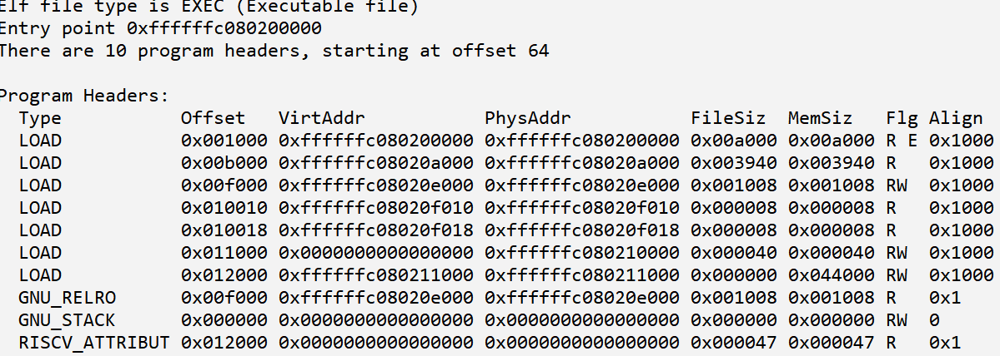

# 手册目的

在开发ArceOS及其扩展时，经常会因为程序缺陷或者配置问题触发CPU异常，而导致内核崩溃。例如下面的情况：


其中，红色“panicked at ...”提示，因为某种原因触发了意外的CPU异常，导致内核崩溃。

上述情况只是现象，我们需要以异常表象信息为源头，逐步分析定位导致该问题的具体的根本的原因。


**手段作用**：从表现出来的内核异常表象，查询可能的原因，并给出可以参考的实际案例，包括分析工具、方法和过程。

# 基本工具

ArceOS本身和工具链提供了一些获取和分析信息的工具手段。按照重要程度和使用频率列举如下：

## 工具1 - Qemu日志

模拟器qemu支持跟踪和记录运行时指令、异常等信息，并且ArceOS已经集成到自身的Makefile中，由环境变量QEMU_LOG启用。

命令行示例：

```shell
make run QEMU_LOG=y
```

运行后在将在ArceOS的根目录下产生qemu.log，需要重点注意的是异常（或中断）触发前的指令序列本身和地址，异常的详细信息等。

qemu.log的示例：


注意三点：

1. 异常触发之前最近的几条指令，尤其是紧邻的前一条指令情况通常是最重要的线索。结合体系结构指令集手册，确定该指令的具体意义和作用，所属的指令集有无特殊要求，涉及的寄存器是否有特殊性，该指令操作的目标内存地址等。尽可能收集这些信息作为进一步分析的基础。
2. 该日志中会记录更详细的CPU异常发生时的信息，包括原因、导致异常的指令地址、操作的内存地址等。例如，在aarch64体系结构下发生CPU异常时，ArceOS只是笼统的报告发生了同步或异步异常，而qemu.log中会详细记录是何种异常，涉及的地址和状态等，如上图所示的情况。
3. 可以根据指令地址，结合工具2 - 反汇编，确定运行指令与反汇编指令的一致性。

## 工具2 - 反汇编

反汇编内核的静态程序文件，一方面用于确定编译后的代码是否与预期的一致，另一方面与qemu.log做对比。qemu.log所记录的是CPU实际运行的指令和产生的状态，而对内核程序文件反汇编获得是编译后的静态指令序列，二者对比可能发现地址对齐、地址空间映射错误等情况。

最常用的反汇编工具是objdump，包含在各主流发行版的开发工具链中。示例：

```shell
riscv64-linux-gnu-objdump -D ./examples/shell/shell_riscv64-qemu-virt.elf
```

注意两点：

1. 针对ELF格式的文件进行分析：ArceOS编译后的内核包括\*.bin和\*.elf两种格式，其中ELF格式包含信息丰富，对分析有利。虽然通过增加额外参数也可以直接分析BIN格式文件，但一般不建议。
2. 由于汇编指令可读性差，一般不会直接去查看反汇编结果，通常是作为辅助备查文件。例如，与qemu.log做对比；或者知道某个函数的地址后，可以在反汇编文件查看它对应的二进制指令。

## 工具3 - 查询符号地址

分析过程中的原始信息大多来自汇编层面，为了更好的定位原因，我们经常需要结合源代码，函数和变量符号对应表是二者之间的重要桥梁。比较常用的工具是nm，示例：

```shell
riscv64-linux-gnu-nm ./examples/shell/shell_riscv64-qemu-virt.elf
```

可以看到内核包含的各种符号地址。


注意几点：

1. 除了符号地址外，符号类型可以用来确定符号是函数还是全局变量。例如T代表代码符号，也就是函数；D代表数据符号，也就是全局变量，等等。
2. 对照LDS文件可以确定代码或者数据是否被编译到正确的位置。

## 工具4 - 程序段布局

查看构成内核的各个段的起始地址范围、读写权限、对齐等情况。示例：

```shell
riscv64-linux-gnu-readelf -lW ./examples/shell/shell_riscv64-qemu-virt.elf
```

显示具体的各段情况：



该工具一般用于辅助符号的定位，作用弱于前几个工具。

## 工具5 - 调试Qemu代码

总是优先在模拟器qemu上调试和复现缺陷问题。对于可以在qemu复现的问题，终极办法是调试qemu代码。在模拟器中，各种CPU异常都是程序逻辑，按照一般软件的调试跟踪方法，就可以定位到触发异常的根本原因。

但是该方法的代价比较大，仅作为最终手段。

# 通常步骤

### 步骤1 - 通过最简配置复现异常的方法

首先要找到可以稳定复现异常的环境和配置，然后从中寻找最简复现方案。

1. 在hypervisor或宏内核出现的异常，要优先确定是否在ArceOS本身可以复现。
2. 在减少参与组件和减少Features的情况下，观察能否复现，直至找到最小化配置。

### 步骤2 - QEMU_LOG定位异常详情

从QEMU LOG确定异常的详细信息和触发异常的指令。

根据异常原因，需要进一步重点跟踪异常指令本身或者异常指令访问的目标地址。

### 步骤3 - 反汇编对比QEMU_LOG

反汇编内核文件，对比静态指令与QEMU_LOG的运行指令，确认一致性，尝试发现问题。

### 步骤4 - 根据符号地址定位查看源代码

基于内核符号表，从异常指令地址反向定位源代码中对应的函数和操作对象，从源码层面分析异常。


# Aarch64体系结构

## 异常1

现象描述：在aarch64架构下ArceOS内核崩溃，显示Unhandled synchronous exception。


### 原因1

ArceOS内核中包含了simd指令，但是在启动时，没有启用'fp_simd'这个feature对CPU进行初始化设置，触发异常。

#### 案例1

分析过程：

1. 在axvisor集成lwext4之后发现该问题，然后发现在ArceOS就可以复现。以ArceOS自带的shell应用作为基础进行分析。

2. 在ArceOS中打开QEMU_LOG，运行产生qemu.log。从中发现触发异常的指令包含向量寄存器q0，得知是simd指令。

   

   可以看到异常是Undefined Instruction，且触发异常的指令是ldur q0, XXX

3. 已知ArceOS对simd已经有支持的feature，是fp_simd，查看是否启用。

4. 经确认没有启用，所以直接改代码强制启用观察结果，运行成功，说明确实是该问题引起。

5. 进一步通过异常触发的指令地址，确定触发指令来自于lwext4。

   

6. 确认musl C编译器默认会产生simd指令。因此，最终的解决方法是，引入lwext4时必须依赖fp_simd这个feature。

### 

# Riscv64体系结构

## 异常1

### 原因1

#### 案例1