# JenkinsCI配置

参考链接：https://github.com/kern-crates/testing/blob/main/README.md

### Jenkinsfile文件配置

 根据需要测试的仓库链接以及Jenkins配置来填充

```Bash
environment {
    // 主仓名
    mainRepoName = "lkmodel"
    // 提交仓名
    currentRepoName = "${GIT_URL.substring(GIT_URL.lastIndexOf('/')+1, GIT_URL.length()-4)}"
    NODE_BASE_NAME = "ui-node-${GIT_COMMIT.substring(0, 6)}"
    JENKINS_URL = "http://49.51.192.19:9095"
    JOB_PATH = "job/github_test_lkmodel_new"
    REPORT_PATH = "allure"
    GITHUB_URL_PREFIX = "https://github.com/lkmodel/"
    GITHUB_URL_SUFFIX = ".git"
    //根据内置变量currentBuild获取构建号
    buildNumber = "${currentBuild.number}"
    // 构建 Allure 报告地址
    allureReportUrl = "${JENKINS_URL}/${JOB_PATH}/${buildNumber}/${REPORT_PATH}"
    FROM_EMAIL="bityk@163.com"
    REPORT_EMAIL="1445323887@qq.com, YJQ980314@outlook.com"
    // 将GA_TOKEN(GA = Github Access)替换为在 Jenkins 中存储的 GitHub 访问令牌的凭据 ID
    GA_TOKEN = credentials("lkmodel")
    // 仓库名
    GA_REPO_OWNER = 'lkmodel'
    GA_REPO_NAME = "${currentRepoName}"
    // 动态获取当前构建的提交 SHA
    GA_COMMIT_SHA = sh(script: 'git rev-parse HEAD', returnStdout: true).trim()
}
```

### Github端配置

（Web页面：https://github.com/kern-crates/${repo}） 整体流程1：Repo Left Settings -> Webhooks -> Payload URL:http://49.51.192.19:9095/github-webhook/ -> Send me everything -> 保存

(1) 点击红色箭头色位置的设置

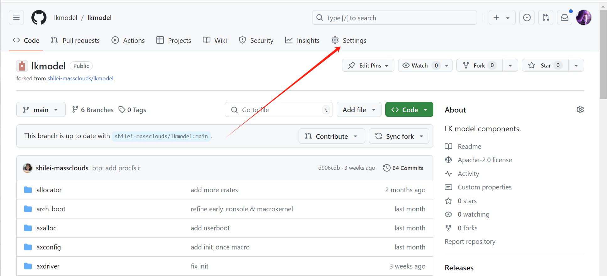

(2) 点击左侧的webhook进入界面后，点击右侧的Add webhook选项

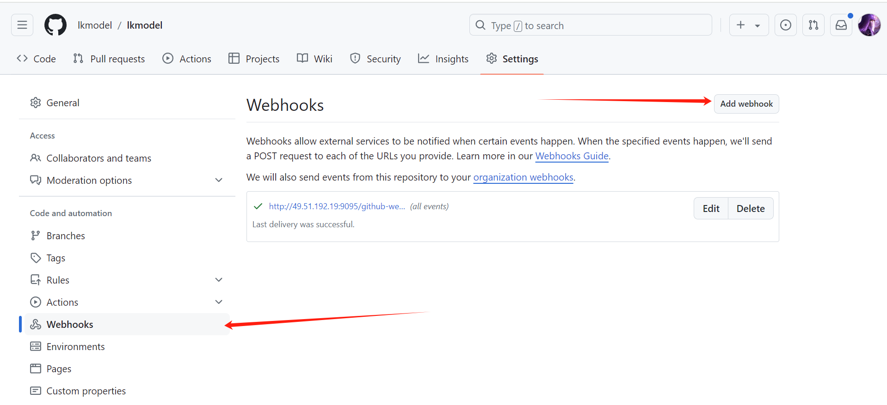

(3) 按照图中的内容填写，之后保存。

注：Payload URL: http://49.51.192.19:9095/github-webhook/

​      Send me everything选项

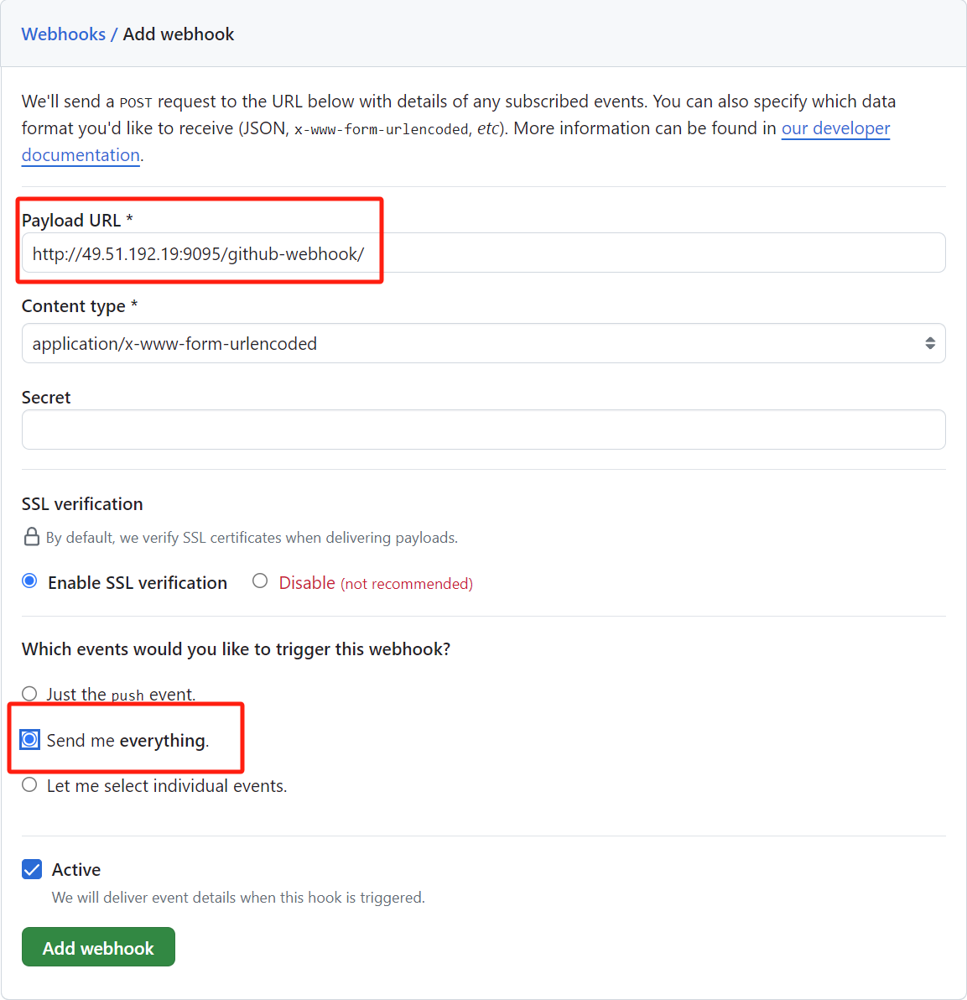

整体流程2：User Right Settings -> Developer Settings -> Personal access tokens -> Tokens(classic) ->     Generate （勾选repo与admin:repo_hook选项）-> 保存

(1) 点击页面左侧的头像出现如图所示的界面，点击Settings。

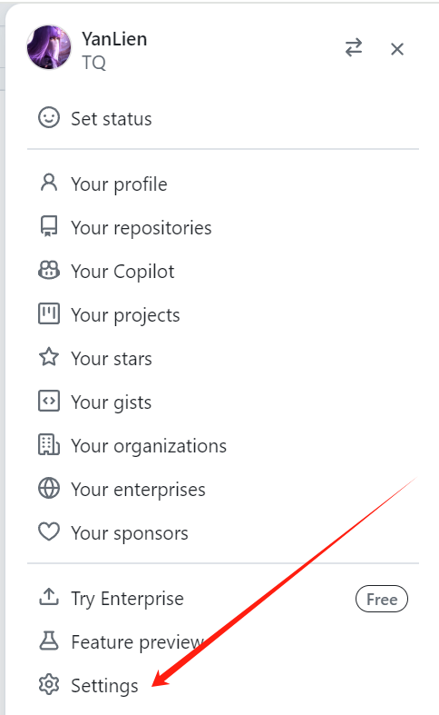

(2) 进入设置界面后、选择左侧底部的Developer Settings，进入下图所示的界面，之后分别点击左侧箭头标注的Tokens(classsic)、右侧的generate new token。

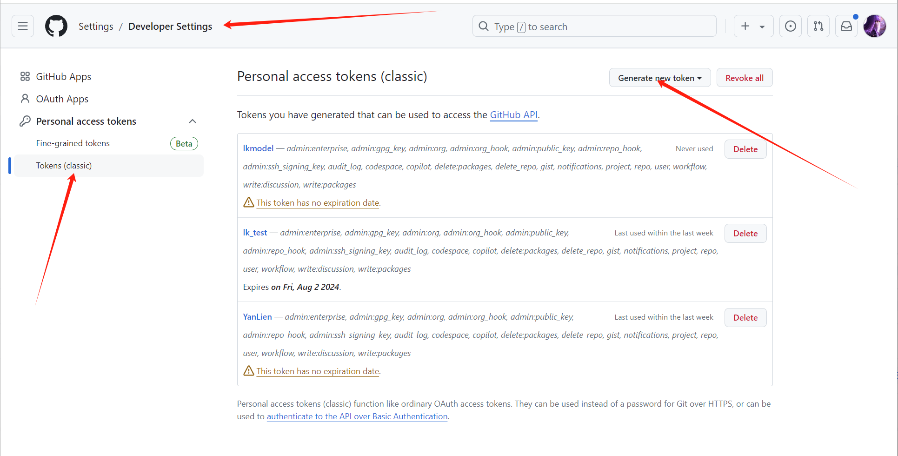

(3) 点击generate new token后，进入下图所示界面，

注：注意token的ID（图中的note）跟仓库名称最好保持一致

 国汽智联那边推荐勾选repo与admin:repo_hook选项。在刚开始测试过程中，我印象中勾选了这两项，但是测试中有问题，所以我全部勾选了。

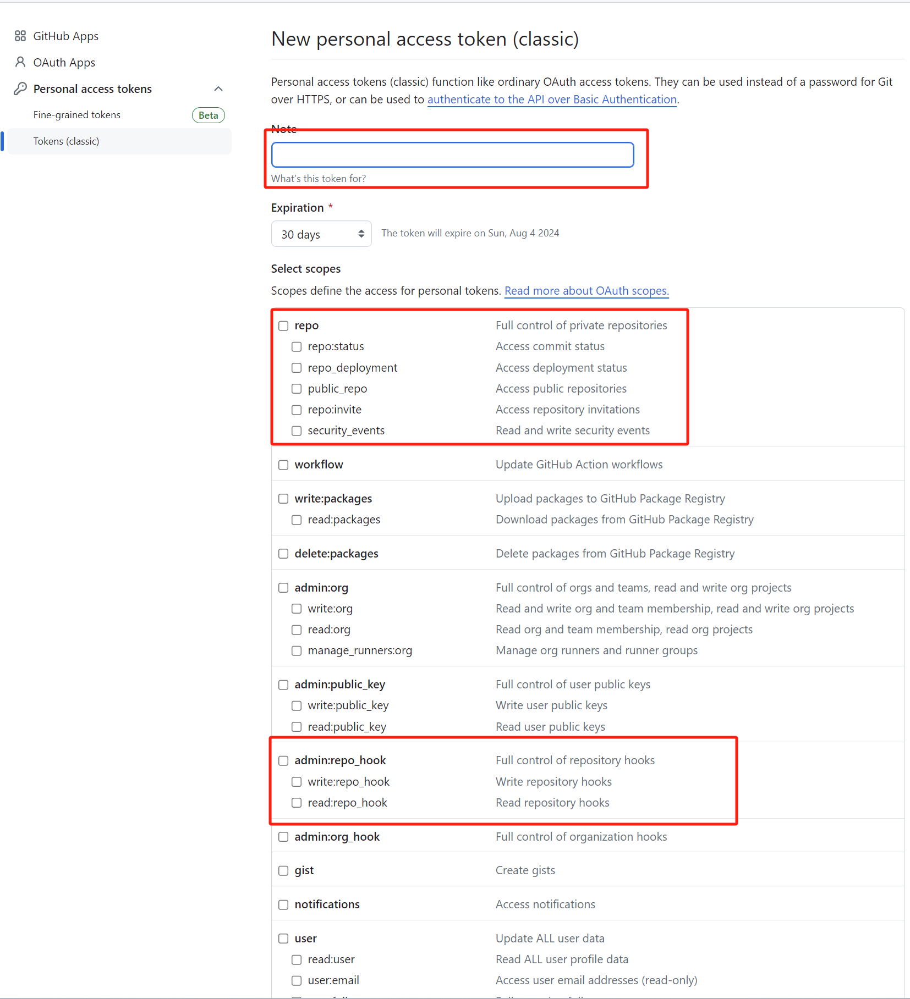

### Jenkins端配置

（Web页面：http://49.51.192.19:9095）： 整体流程1：Dashboard -> 系统管理 -> 凭据 -> 系统 -> 全局凭据 (unrestricted) -> Secret Text -> 填入上步中Generate的Token -> ID命名为"GithubAccessToken"（示例） -> 保存

（1）Dashboard -> 系统管理

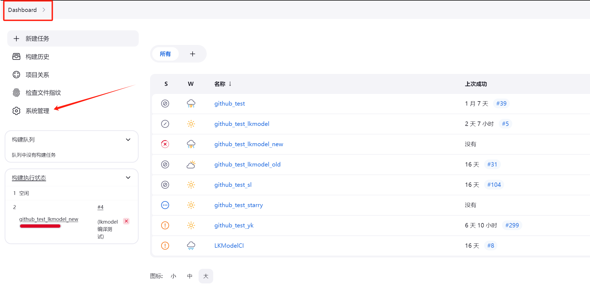

（2）安全 -> 凭据管理

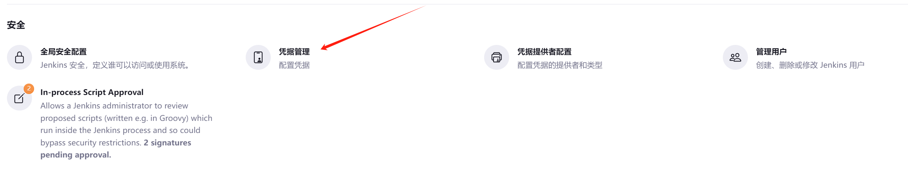

（3）注：进入之后需要随便点击一个用户的域选项就可以看见右上的Add credential

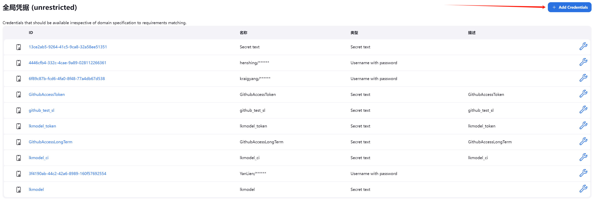

选择Secret Text -> 填入上步中Generate的Token -> ID命名为"GithubAccessToken"（示例） -> 保存

注：在Jenkinsfile中引入的时候也跟ID和名称一致 

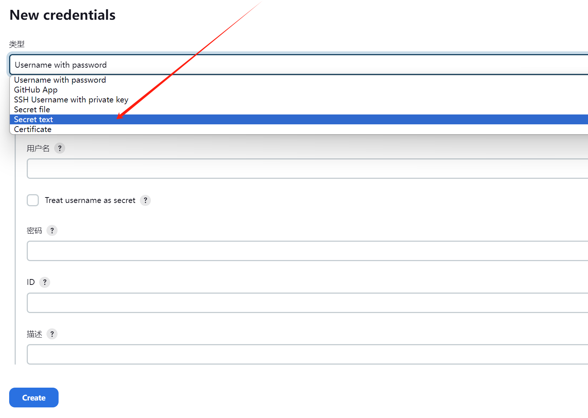

整个流程2：Pipeline -> Configuration -> 构建触发器（Github hook trigger for GITScm polling）-> 流水线（Pipeline script from SCM） -> Add CI monitored repo1/credentials1 -> Add CI monitored repo2/credentials2  ...  -> Add CI monitored repoN/credentialsN -> 保存

  (Notes: Repo URL中末尾的斜杠必须删掉)

想换个仓库接入CI的话最好重新建立一个流水线 

(1) 点击右侧新建任务

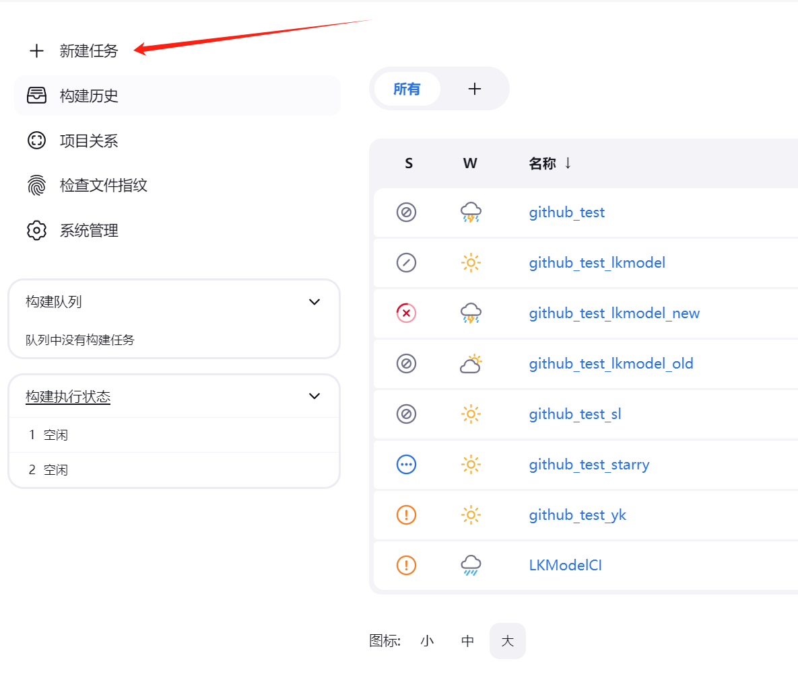

(2) 任务名称可以随意标注，

注：新建任务下面有个复制选项可以复制已有流水线配置，节约一些配置的时间 

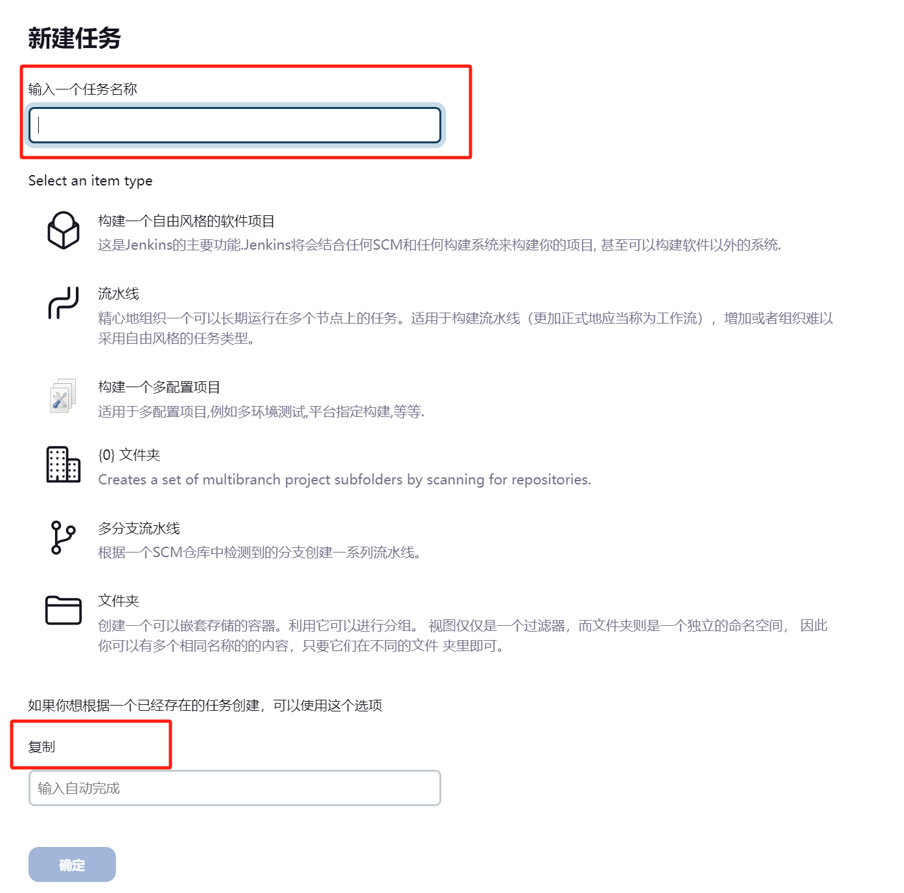

(3) 有两种方式进入这个配置：一是在复制之后点击确定后会直接跳转到；二是在Dashboard点击任务名称，然后点击图中红色箭头标记的配置。

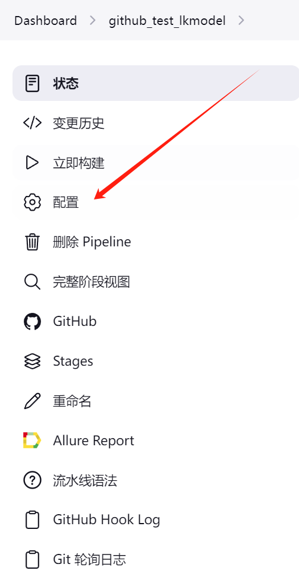

(4) 按照需测试的仓库的内容进行填写。构建触发器（Github hook trigger for GITScm polling），目的是在每次push的会触发。

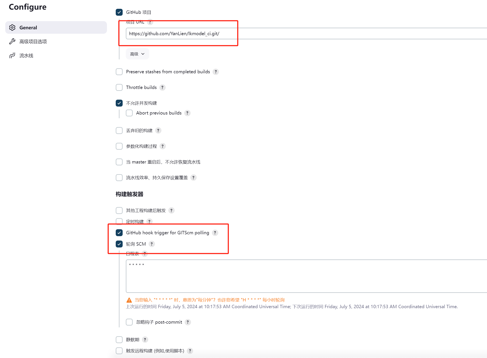

(5) 按照需测试的仓库的内容进行填写。  

(Notes: Repo URL中末尾的斜杠必须删掉)

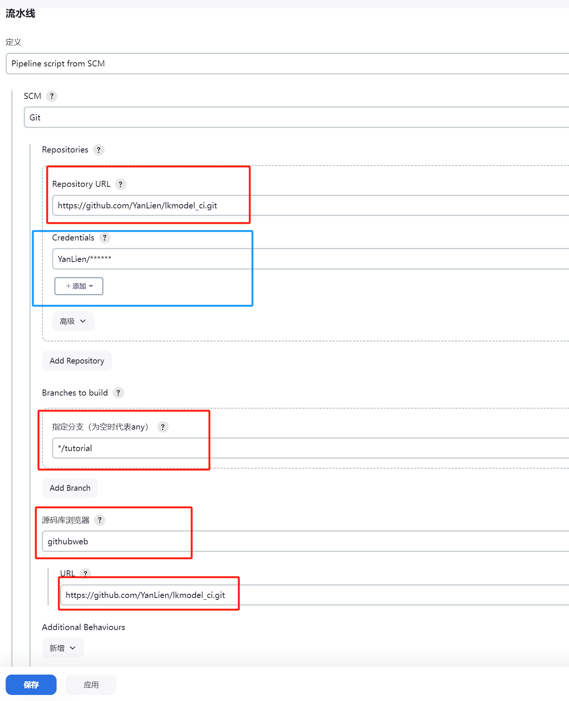

上图中的蓝色位置需要添加credinetial，点击上面的添加，按照自己的Github账号填写，密码是生成的Token

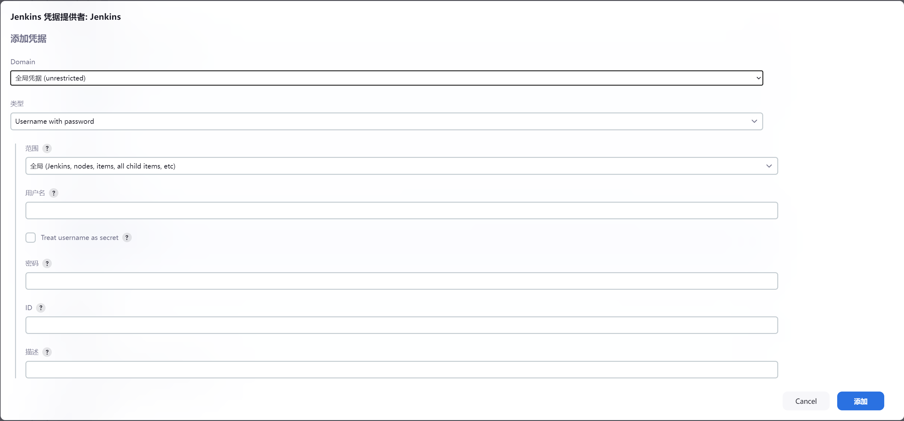

补充：

如果查看Conosle output出现以下情况，可以断定为token的问题或者是设置中的pipeline脚本路径最后加了“/”

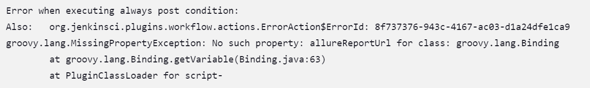

**因为我们已经建好了流水线任务，后续如果在这个流水线任务中添加测试用户可能只需要添加配置中的credentials以及上面的secure text凭证**