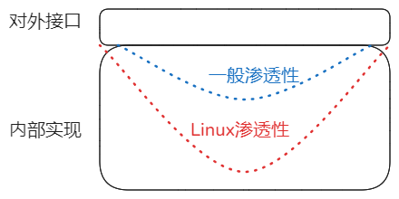
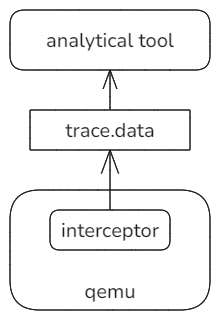
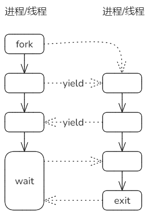
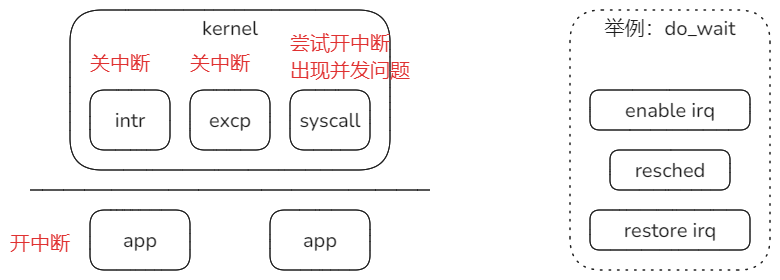
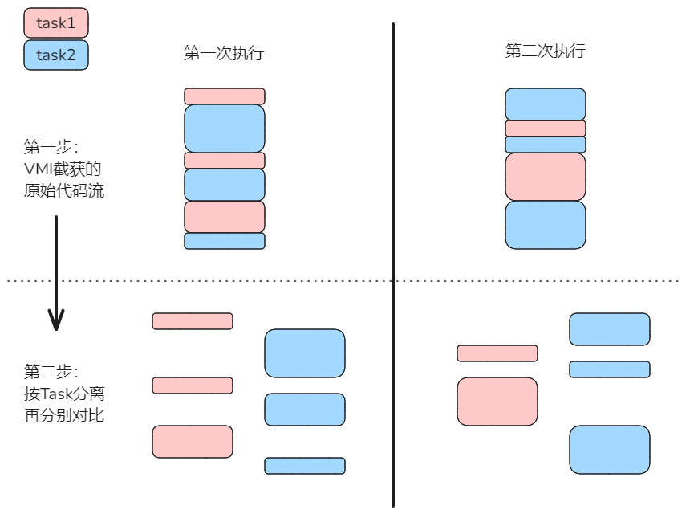
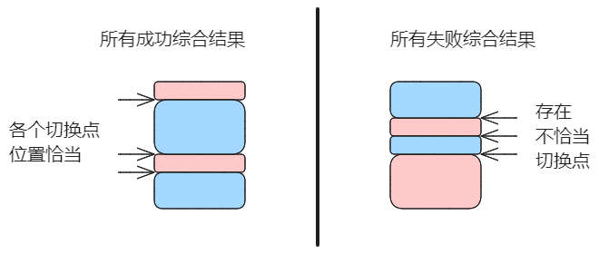
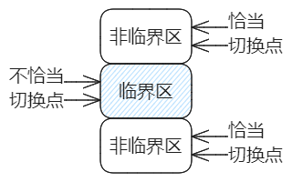

### 内核态检查用户态指针参数的有效性和Fixup机制

系统调用从用户态进入内核态时，通常需要检查用户态传入参数的有效性。

例如：write系统调用的ubuf参数，它是指向用户空间一段缓冲区的指针，缓冲区重保存的是待写入的数据。

一般来说，进入内核态之后，该缓冲区仍然是有效的，但是也有例外，所以write系统调用先检查其有效性，具体方式：

通过get_user_xxx一类函数，对缓冲区包含的每一个页，尝试读这个页的第一个字节，正常能够读到，否则就会触发page fault。

Linux在内核态处理该异常的流程是一个短路径，与用户态直接触发的长路径有所区别。这个短路径通过fixup机制实现，把原本完整的异常处理流程，缩短为一次内核空间内的函数调用，返回错误码EFAULT。


Fixup的大致过程：

1. 内核先为可能触发#PF的指令注册相应的fixup代码，指令地址和fixup代码地址作为key/value记录到ex_table段。
2. 如果正常访问，就不会触发异常处理；如果目标地址异常，触发异常响应机制。前半程与完整过程相同，但在刚刚进入异常响应例程时，例程首先拿着触发异常的指令的地址去ex_table中查表，找出对应的fixup code地址。
3. 如果找到匹配的fixup，就会进入到短路径，仍在内核态去直接调用fixup。
4. fixup的通常逻辑是：把返回寄存器的值设置为EFAULT，然后在触发异常的指令后面接着运行，如同执行了一次函数调用，在失败时返回EFAULT。

Linux采取这种方式的原因：缩短和简化调用路径，省略后半程的软硬件切换；失败时直接返回错误EFAULT，让内核自己决定如何进行后面的处理，这样更灵活。


### 重新实现arceos_ramfs

ramfs文件结点的原来实现是基于Vec\<u8\>来维护文件内容，有两个问题：

1. 文件不支持“空洞”。例如：当fseek到文件的某个位置写入时，该位置之前即使为“空”，也会要求Vec通过alloc库申请内存并占用。
2. vec的容量不足时，每次扩展请求的大小都要求翻倍，观察到16M -> 32M -> 64M，基本需要扩展到64M时，就会导致alloc库报内存溢出。例如ltp/write01就会暴露这一问题。

现在改进为用BTreeMap来维护页，建立稀疏数组，解决上述问题。


这个改进主要为了下面的改进做准备。


### 为实现文件结点Inode地址空间做准备

目前Linux在inode下维护一个地址空间作为缓存层，无论是read/write/mmap都会经过这一层，所以操作效率很高。

准备在ramfs改进的基础上，实现这一缓存机制。


计划第一步先考虑实现读缓存，写穿透，以简化实现。


### 仿照Linux实现一个简单的PipeFS

参照Linux的原理，基于RamFS实现一个简单的实现，大致如下：


只是通过几个简单测例，仍有大的完善空间。


# 单向依赖的新问题和思考

### 问题的缘起

procfs以前是临时机制，并未加到FileSystem体系中。现在作为文件系统实现后，就出现了违背单向依赖的问题。


procfs是一种伪文件系统，位置与其它文件系统平级，同样需要实现VfsOps和VfsNodeOps接口。

但是procfs又比较特殊，它的后端并不是块设备，而是整个内核系统的动态信息，典型的就是task进程维护的信息，由此就产生了从procfs -> task的反向依赖。

从这个问题，引发了进一步对单向依赖的思考。

1. dyn Trait（或类似的间接机制）虽然效率低，但不可省略。

2. dyn Trait与单向依赖原则的关系是什么？


### VFS组件的相对位置与Spec模式

spec模式：以dyn Trait形式对接口规格specification进行定义和约束，组件和调用者不再是上下级依赖关系，实际变成平级关系。


上面最后一个图的确切表示如下：


这个模式里有三个组件，分别是调用者(UserMod)，被调用者(Service Mod)以及接口约束(Spec)。

UserMod和ServiceMod对Spec存在直接依赖，要遵循单向原则；而它们二者之间**不**存在直接依赖关系，可以认为是分属不同体系，可以称为间接调用关系。


内核系统中的组件间关系表示如下：


左右都是比较极端的情况，更符合实际的应该是中间情况。

内核系统中可以分为多个垂直体系，每个体系内部保持直接的单向依赖，体系之间为间接调用，即上述的spec模式。

在Rust实现中，直接依赖体现为静态分发，调用者在编译时直接知道被调用组件的具体类型，可以在编译时深度优化，性能很高，但是灵活性不够，且耦合性很强，必须受制于单向原则；间接调用（spec模式）的表现是dyn Trait动态分发，特点是耦合度低、更灵活，不受单向限制，但是本质上是运行时的间接调用，性能较差。

目前考虑，内核实现是上述两种的综合和权衡。现在先把FileSystem独立出来作为单独体系，与原有体系之间通过dyn trait交互。


# 差分的相关问题

## 差分的定义（个人理解）

对于目标系统与参照系统，在相同环境下采取相同方式采集信息，对信息和信息变化趋势进行对比，发现系统间行为和状态的差异，分析差异的根源。

差分包括两个步骤：

1. 对单一系统（目标或参照）信息的截获和分析
2. 对目标和参照系统的分析结果再进行对比，发现差异性

第1步是独立的，可以单独执行以进行分析；第2步依赖于第1步的结果，再进行对比。

## 宏内核与Linux差分的必要性

实现兼容Linux ABI的宏内核，**需要**进行与Linux的各层面的精确差分，层面包括从界面到内部实现。目前考虑的必要性：

### Linux ABI接口定义对内部实现具有很强的约束性

接口对内部实现的约束性或称影响，称之为“**渗透性**”。



一般软件设计中，接口对实现的约束力较小，内部的实现机制原理具有很大的自由度和灵活性。

但**Linux**比较特殊，原因主要应该是对效率的关注。

Linux ABI包括syscalls以及通过procfs等伪文件系统暴露的查看操作方式。

其中，procfs最典型。procfs几乎是Linux内部实现机制和数据结构的对外展示，如果我们设计的机制、数据结构与Linux有明显差异，将不得不引入复杂的**适配层**去适应procfs的规格要求。

其实很多syscall也有类似的影响。

这种**高“渗透性”**导致我们不仅在界面层面，进而在内部实现的很多层面上也要与Linux保持较高的一致。

所以，差分应该是会起到十分重要的作用。

### 从Linux积累的实现细节中获取经验

Linux很大一部分复杂性源于实现细节，例如典型的体系结构相关的问题，具体例子：

1. 内存屏障barrier（尤其引入SMP之后）
2. 快表刷新tlb flush

这些方面导致的往往是**低概率**问题，测试难度大，定位难度大。这可能是内核系统随着复杂性增加对其失控的一个重要原因。

无论是经典操作系统教科书，还是体系结构手册，虽然对这类问题都有提及，但没有那个资料会明确的把所有该实现的地方都列举和标记出来。我们能够获得的最好参考就是Linux实现，并且它的这方面实现源于多少年实践的积累，是十分宝贵的部分。

通过差分，把这些地方识别出来，以检查和匡正我们的实现。

### 差分工具的构成

由两部分构成，qemu的内嵌的截获模块interceptor和独立的分析工具 analytical tool。



截获模块interceptor mod运行在qemu中，截获信息被dump为二进制形式的trace.data；分析工具analytical tool负责解析trace.data，按照操作者的要求输出各类形式的分析结果。

### 图形化展示分析结果

目前差分记录和分析的数据粒度是系统调用和信号，但要想提高分析的有效性，应该能够展示多进程/线程之间的流程和相互关系。



考虑基于分析工具能够导出上面形式的关系图(by mermaid)，配合文字版进行参照分析。


# 中断的处理方面发现的问题

目前宏内核lkmodel对中断采取的处理方式：

1. 从内核态准备好上下文，准备切换到用户态之前，SR_SPIE**置位**，即用户态应用运行期间开中断。

2. 从用户态进入内核态时，对于中断和异常引起的切换，都默认**不**开中断。只对syscall依照SR_SPIE决定是否开中断，由于第1点提到，用户态应用总是在开中断状态下，所以只要进入syscall处理，都会开中断。

   ```rust
   // axtrap/axtrap/src/arch/riscv/mod.rs
   fn handle_linux_syscall(tf: &mut TrapFrame) {
       debug!("handle_linux_syscall sstatus {:#x}", tf.sstatus);
       if (tf.sstatus & SR_SPIE) != 0 {
           enable_irqs();
       }
       syscall(tf, axsyscall::do_syscall);
       signal::do_signal(tf, EXC_SYSCALL);
   }
   ```


**但是**，按照第2点即使只针对syscall阶段开中断，开始出现了一定概率的并发问题。表现为ltp的大约50个测例有一定概率失败，且具有随机性。取消第2点回退后，问题消失。确定是syscall阶段开中断引发。目前仍保持syscall期间关中断，仅在resched前后开/关中断。

目前的处理方式如下：



# 通过纵向差分定位并发问题的思路

当存在并发时，对内核多次执行同一组测试用例，结果出现随机性，直接差分对比的难度很大。所以，目前差分的步骤分两步：

第一步通过VMI获取原始信息，第二步按Task ID分离后，再分别对比。这样可以显著**消除**并发带来的**随机性**。



现在设想主要基于第一步截获的**VMI原始信息**，通过对比多次运行结果，来定位并发问题，思路如下：



存在并发问题时，对于同一组测试用例，概率性的出现两种结果：成功和失败。通过分别综合统计成功和失败的切换点分步情况，可以推断出**临界区**。如下：



恰当与不恰当的切换点分别构成**连续**的区域，由此推断出临界区的边界。
