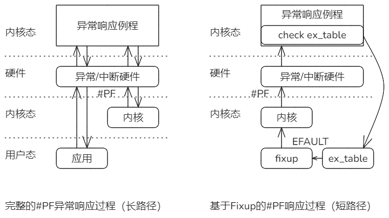
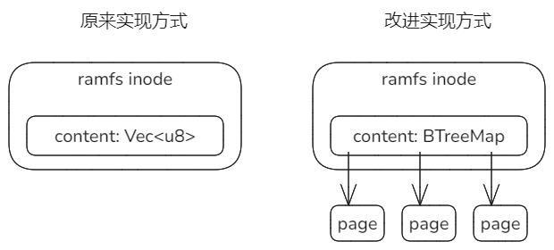
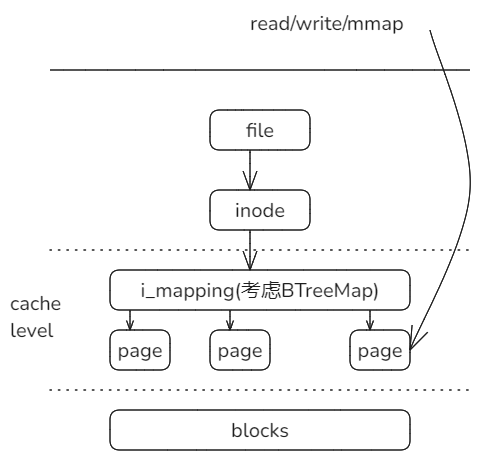
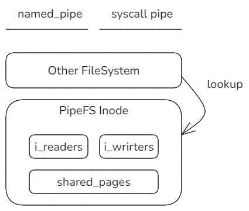
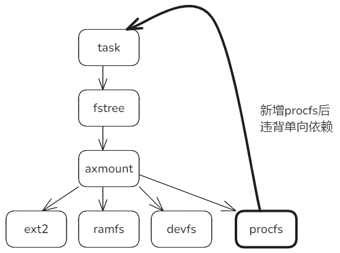
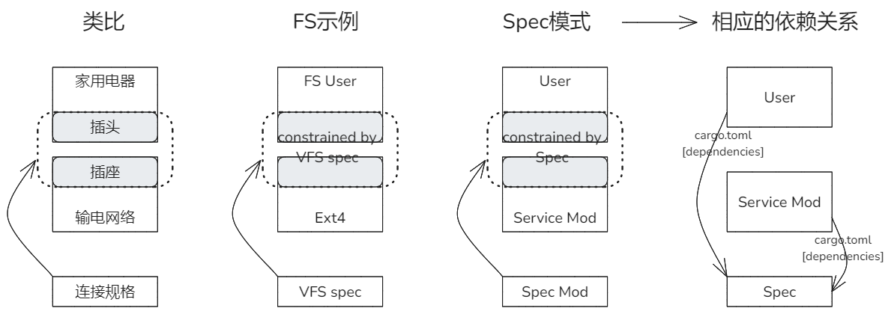
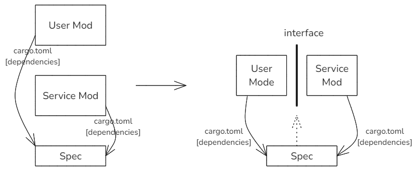
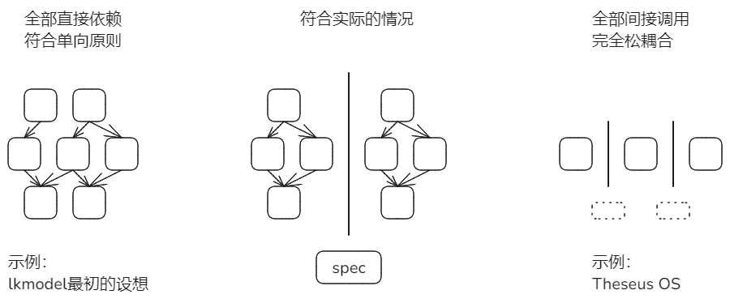

### 内核态检查用户态指针参数的有效性和Fixup机制

系统调用从用户态进入内核态时，通常需要检查用户态传入参数的有效性。

例如：write系统调用的ubuf参数，它是指向用户空间一段缓冲区的指针，缓冲区重保存的是待写入的数据。

一般来说，进入内核态之后，该缓冲区仍然是有效的，但是也有例外，所以write系统调用先检查其有效性，具体方式：

通过get_user_xxx一类函数，对缓冲区包含的每一个页，尝试读这个页的第一个字节，正常能够读到，否则就会触发page fault。

Linux在内核态处理该异常的流程是一个短路径，与用户态直接触发的长路径有所区别。这个短路径通过fixup机制实现，把原本完整的异常处理流程，缩短为一次内核空间内的函数调用，返回错误码EFAULT。

Fixup的大致过程：

1. 内核先为可能触发#PF的指令注册相应的fixup代码，指令地址和fixup代码地址作为key/value记录到ex_table段。
2. 如果正常访问，就不会触发异常处理；如果目标地址异常，触发异常响应机制。前半程与完整过程相同，但在刚刚进入异常响应例程时，例程首先拿着触发异常的指令的地址去ex_table中查表，找出对应的fixup code地址。
3. 如果找到匹配的fixup，就会进入到短路径，仍在内核态去直接调用fixup。
4. fixup的通常逻辑是：把返回寄存器的值设置为EFAULT，然后在触发异常的指令后面接着运行，如同执行了一次函数调用，在失败时返回EFAULT。

Linux采取这种方式的原因：缩短和简化调用路径，省略后半程的软硬件切换；失败时直接返回错误EFAULT，让内核自己决定如何进行后面的处理，这样更灵活。

### 重新实现arceos_ramfs

ramfs文件结点的原来实现是基于Vec\<u8\>来维护文件内容，有两个问题：

1. 文件不支持“空洞”。例如：当fseek到文件的某个位置写入时，该位置之前即使为“空”，也会要求Vec通过alloc库申请内存并占用。
2. vec的容量不足时，每次扩展请求的大小都要求翻倍，观察到16M -> 32M -> 64M，基本需要扩展到64M时，就会导致alloc库报内存溢出。例如ltp/write01就会暴露这一问题。

现在改进为用BTreeMap来维护页，建立稀疏数组，解决上述问题。

这个改进主要为了下面的改进做准备。

### 为实现文件结点Inode地址空间做准备

目前Linux在inode下维护一个地址空间作为缓存层，无论是read/write/mmap都会经过这一层，所以操作效率很高。

准备在ramfs改进的基础上，实现这一缓存机制。

计划第一步先考虑实现读缓存，写穿透，以简化实现。

### 仿照Linux实现一个简单的PipeFS

参照Linux的原理，基于RamFS实现一个简单的实现，大致如下：

只是通过几个简单测例，仍有大的完善空间。

# 单向依赖的新问题和思考

### 问题的缘起

procfs以前是临时机制，并未加到FileSystem体系中。现在作为文件系统实现后，就出现了违背单向依赖的问题。

procfs是一种伪文件系统，位置与其它文件系统平级，同样需要实现VfsOps和VfsNodeOps接口。

但是procfs又比较特殊，它的后端并不是块设备，而是整个内核系统的动态信息，典型的就是task进程维护的信息，由此就产生了从procfs -> task的反向依赖。

从这个问题，引发了进一步对单向依赖的思考。

1. dyn Trait（或类似的间接机制）虽然效率低，但不可省略。

2. dyn Trait与单向依赖原则的关系是什么？

### VFS组件的相对位置与Spec模式

spec模式：以dyn Trait形式对接口规格specification进行定义和约束，组件和调用者不再是上下级依赖关系，实际变成平级关系。

上面最后一个图的确切表示如下：

这个模式里有三个组件，分别是调用者(UserMod)，被调用者(Service Mod)以及接口约束(Spec)。

UserMod和ServiceMod对Spec存在直接依赖，要遵循单向原则；而它们二者之间**不**存在直接依赖关系，可以认为是分属不同体系，可以称为间接调用关系。

内核系统中的组件间关系表示如下：

左右都是比较极端的情况，更符合实际的应该是中间情况。

内核系统中可以分为多个垂直体系，每个体系内部保持直接的单向依赖，体系之间为间接调用，即上述的spec模式。

在Rust实现中，直接依赖体现为静态分发，调用者在编译时直接知道被调用组件的具体类型，可以在编译时深度优化，性能很高，但是灵活性不够，且耦合性很强，必须受制于单向原则；间接调用（spec模式）的表现是dyn Trait动态分发，特点是耦合度低、更灵活，不受单向限制，但是本质上是运行时的间接调用，性能较差。

目前考虑，内核实现是上述两种的综合和权衡。现在先把FileSystem独立出来作为单独体系，与原有体系之间通过dyn trait交互。
