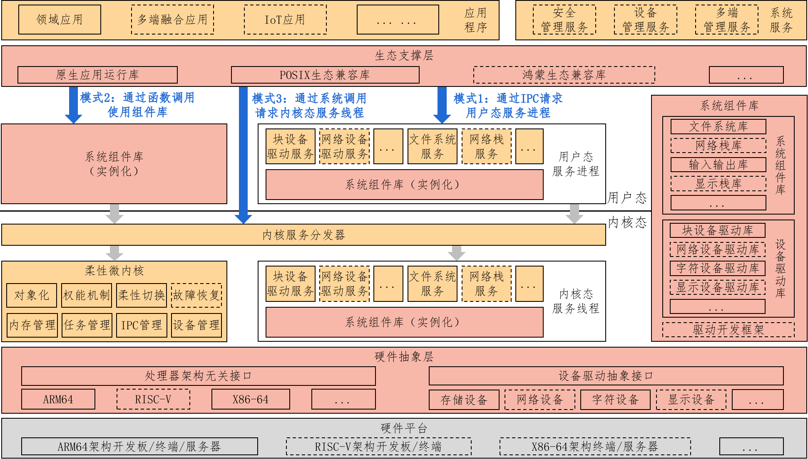
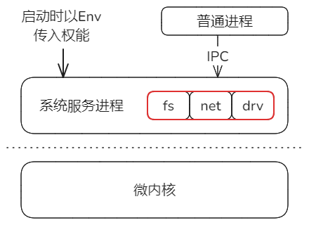
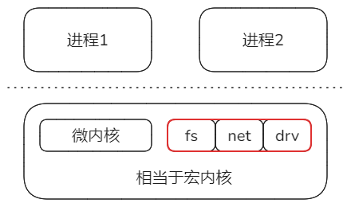
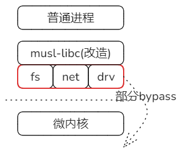

## 项目的自我陈述

kycore麒麟如意内核以微内核为基础，吸收融合了宏内核、外核等技术特征，涵盖了运行于内核态及用户态的诸多核心组件，最终形成一个为上层应用提供基础支撑的广义内核，并对应用提供编程接口（例如POSIX）。内核架构如下图所示，图中黄色为可执行实体（有独立的栈），红色为组件库（提供功能函数）。核心包括一个柔性微内核，提供内存管理、任务管理、IPC管理等功能，并基于对象化和权能机制实现，支持文件系统、设备驱动等系统功能模块运行模式的柔性切换。功能模块以组件库的形式构建，可根据用户需求配置，使用三种模式运行：

* 模式1：构建用户态服务进程，通过IPC为应用提供IO、网络、显示等功能，类似微内核。适用于有安全风险应用或驱动使用。
* 模式2：直接链接至应用软件，通过函数调用实现功能，类似外核。适用于性能敏感应用使用。
* 模式3：构建内核态服务线程，通过系统调用实现上述功能，类似Windows内核。适用于一般应用默认使用。




## 对kycore架构的重新描述(个人理解)

kycore的基础就是一个微内核。而微内核的关键特点：

1. 把文件系统服务、网络协议栈、多数设备驱动等都委托给用户态系统服务处理，以实现内核的最小化
2. 通过权能机制Capability来控制各个进程的权限和能力，以实现安全性

kycore把文件系统服务、网络协议栈、多数设备驱动等称为组件库kycomp，把它们独立出来，分别于内核、用户态系统服务以及普通应用链接到一块，以支持所述的三种模式，达到不同的效果。关于权能机制，应该与传统微内核的设计区别不大，它的实现方式是：在通过create_process系统调用来启动系统服务时，通过环境变量传入权能参数，以控制系统服务的权限能力。

### 模式1 - 微内核

就是最基本的微内核模式。



fs、net、drv链接在系统服务进程中，并且在启动时，给系统服务进程赋予权能。

但是从代码看，这部分还只是体现了权能控制的意图，目前实现不到位。

### 模式2 - 宏内核

把fs、net、drv与微内核链接在一块，相当于宏内核。



在微内核启动的最后阶段，通过一个内核线程来初始化fs/net等，这个就与一般宏内核的设计是一致的。

### 模式3 - 外核

本质上就是改造并扩展了musl-libc。

保持musl-libc对应用的接口不变，但是把后端改成了对fs/net/drv等组件的直接调用。



效果是，对文件系统、网络协议栈的部分操作转移到用户进程中，即这部分操作有可能不经过内核，bypass了。

具体实现包括三层：

1. 修改后的musl

   示例：./musl/arch/x86_64/syscall_arch.h

   ```C
   long ky_syscall(long n, long a, long b, long c, long d, long e, long f);
   
   static __inline long __syscall0(long n)
   {
       return ky_syscall(n, 0, 0, 0, 0, 0, 0);
   }
   
   static __inline long __syscall1(long n, long a)
   {
       return ky_syscall(n, a, 0, 0, 0, 0, 0);
   }
   
   static __inline long __syscall2(long n, long a, long b)
   {
       return ky_syscall(n, a, b, 0, 0, 0, 0);
   }
   ```

   这样musl对syscall的调用就被统一替换成为对ky_syscall的调用。

   但是实际上ky_syscall不是基于硬件的特权级切换系统调用，而是由kylib库提供的函数调用。

2. 由kylib封装kycomp组件

   kylib就是一个简单的中间封装层，它把kycomp各个组件的功能封装为ky_syscall形式，暴露出来。

3. kycomp组件包含fs/net/drv等功能，还包括对微内核的系统调用封装

   kycomp的组件分为两种情况：

   一是fs/net/drv等实现，它们基本上绕过微内核，这也是成为所谓外核模式的原因。示例：

   二是一些涉及进程之类的功能，例如procss组件，它们必须访问微内核。示例：./kycomp/kycall/src/task.rs

   ```rust
   pub fn ky_proc_create(
       url: &str,
       name: &str,
       elf: &[u8],
       flags: TaskFlags,
       args: Option<Vec<String>>,
       envs: Option<HashMap<String, String>>,
   ) -> Result<(usize, usize), KycoreError> {
       ... ...
       let (ret0, ret1) =
           sys_proc_create(url_ptr, name_ptr, elf_ptr, flags.bits(), args_ptr, envs_ptr);
       ... ...
   }
   ```

   其中sys_proc_create就是对微内核发起系统调用。