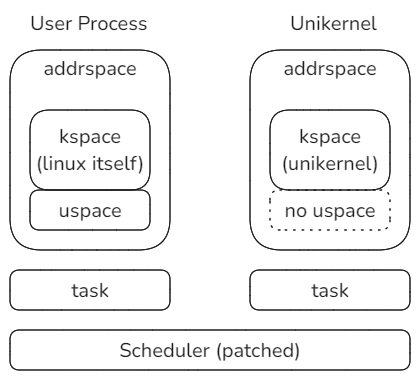
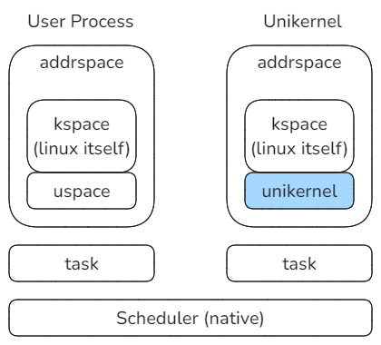
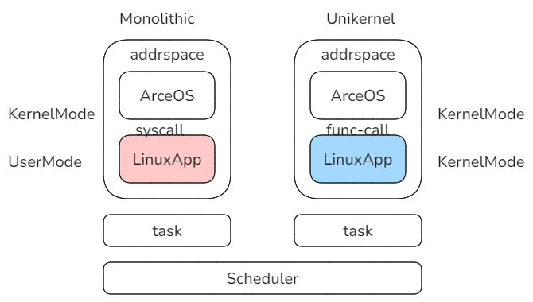

# 问题1

能否在Linux中嵌入运行Unikernel，形成双内核。且二者是协调关系？

> 1. 默认Unikernel是ArceOS。
> 2. 参考北邮的RROS。

## 方式1 - 基于xenomai做简化改造

北邮的RROS是基于xenomai，所以针对xenomai进行初步学习。xenomai的基本原理：

xenomai是在Linux Kernel的基础上打补丁，以支持实时内核。它在现有Linux机制的基础上，主要解决三个方面问题：

1. 调度：能够同时调度普通进程和实时进程。我理解就是利用了Linux原有调度器原理，把实时进程作为fifo/rr调度类型，如此Linux调度器总是优先调度实时进程，以支持实时性。
2. 中断：加入了ADEOS这个抽象层，管理和分发中断，并能够形成一个中断响应链。从另一方面保证实时性。
3. 面向实时应用的用户库：libcobalt可以分发应用的请求，根据情况分发到不同的内核。

我们的方案一是在该框架的基础上，把实时内核替换为Unikernel。

但是由于Unikernel没有实时性要求，可以省略libcobalt，同时可以对ADEOS层简化中断分发的实时性要求。

## 方式2 - 直接改造Linux Kernel

基本思路是参照加载和运行用户应用的方式来运行Unikernel。方式如下：

Linux kernel为每一个用户应用开启一个Task，并分配独立的地址空间，其中低端是应用的地址区域，高端是Linux Kernel本身。

对于Unikernel，仿照该方式，在独立的Task中运行，并且有自己的地址空间。特殊之处是，该地址空间不使用低端地址区域，而高端区域加载Unikernel，例如加载ArceOS。

这样带来的问题是，由于高端地址区域被Unikernel重置，如果下一个被调度的任务是Linux内核线程，它就无法借用高端地址区间，因为那个不是Linux Kernel。所以必须适当修改Scheduler以适应这种改变。

## 方式3 - 对方式2的调整

调整方式2，不须修改scheduler，但是需要修改Unikernel的地址空间设置。方式如下：

把Unikernel放置在低端内存区域，但是设置页表时，把低端区域也设置为内核页面。

但是代价是必须修改Unikernel对地址空间的设置，例如对ArceOS，对地址空间的相关配置都必须相应的改到低端区域，并且保证不能触及破坏高半区。这样有可能修改的地方比较多。

# 问题2

能否扩展ArceOS直接支持宏内核和Unikernel模式下同时运行LinuxApp？

### 方式 - Unikernel支持LinuxApp结合宏内核

目前所做的实验Unikernel支持LinuxApp仍然是一种Unikernel模式，它可以与宏内核模式结合。

这样同样会形成一种混合了宏内核和Unikernel的双内核模式。

对于同样的应用Image，我们可以选择两种加载和运行方式，应用的运行效果相同，但是效率不同，安全性不同。