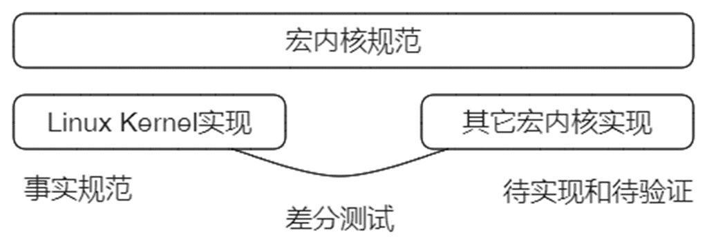
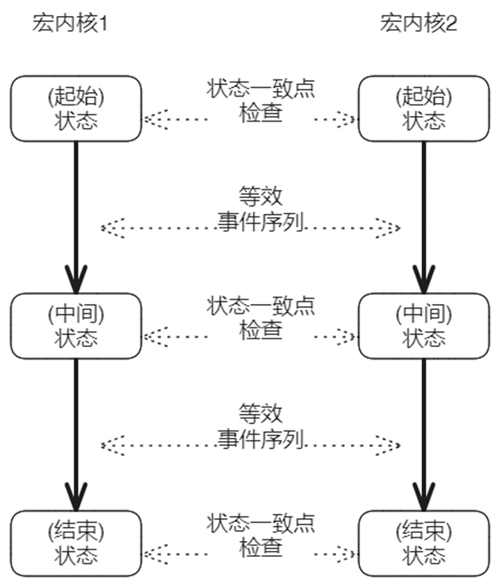
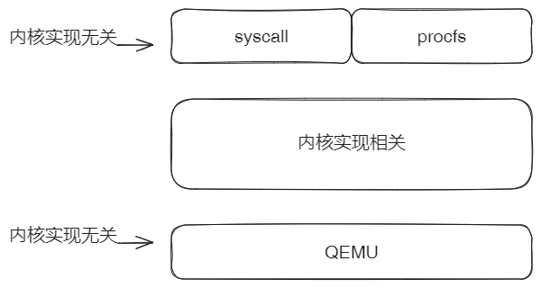
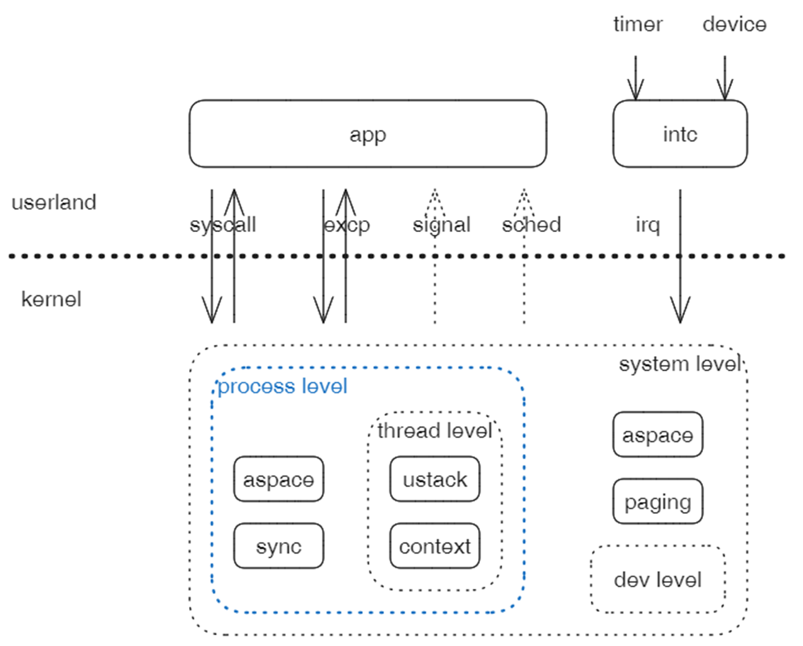
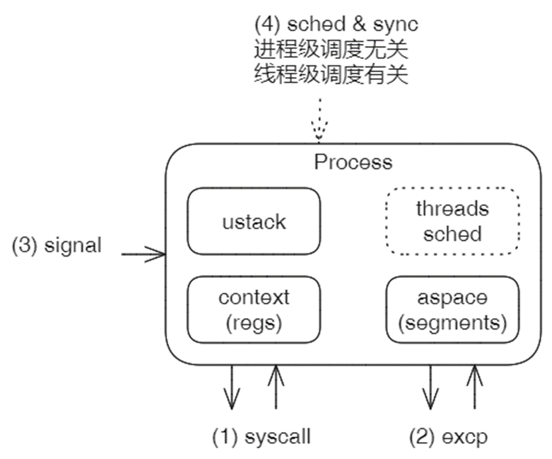
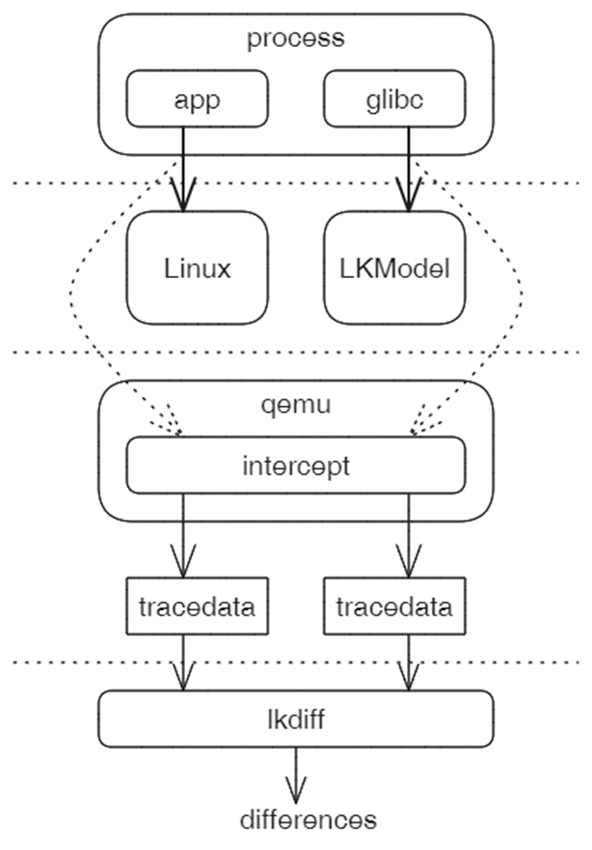
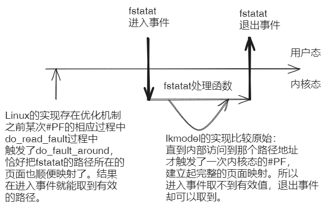
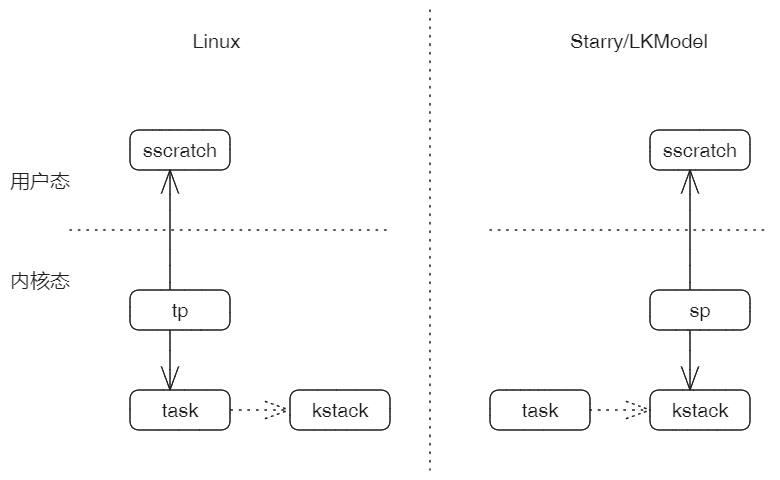
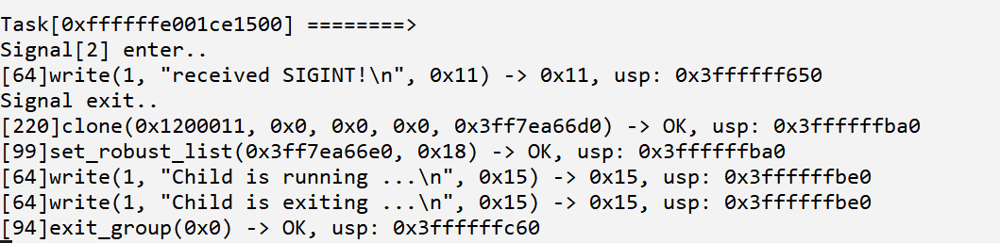
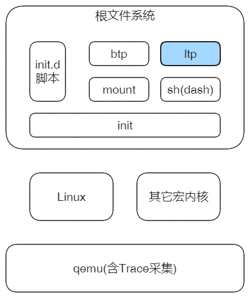

### 差分测试（Differential testing）

定义：交叉引用同一功能（或规范）的多个实现，比较它们的输出，识别差异，发现问题。

> 假定有规范函数F(x)以及该规范的两个实现f1(x)和f2(x)。对于适当输入空间的所有x，期望f1(x) == f2(x)。
>
> 如果发现不相等，说明至少有一个函数错误的实现了规范。(用函数来描述宏内核应该不恰当，用状态机较合适)

核心：测试等效性和识别差异是差分测试的核心。



### 面临的问题和解决办法

宏内核应该视为**状态机**，输出决定于输入和**当前状态**。

对比的**不是**孤立事件的输入输出。

具体办法：

* 起始于等效的开始状态，中间存在一系列的状态一致点，最后确认最终状态一致。
* 状态检查点之间存在一系列事件（数量>= 1），不同实现之间的事件序列是等效，不要求完全一致。
* 监控于对比目标：以一致点状态为主，事件序列为辅



### 监控手段

监控手段：以内核实现无关机制为主，期望本差分测试工具和方案具有更好的通用性，尽量不要求内核修改实现来配合。



如上图，主要从平台（QEMU）和系统调用规范入手，它们与内核的实现机制无关。具体手段属于虚拟机自省VMI。


### 监控事件和状态

监控事件（5类）

1. 系统调用
2. 异常(除了系统调用)
3. 信号
4. 进程/线程调度
5. 中断

前2种是确定性事件，后3种是随机性事件。


监控级别和状态（4类）

1. 系统级
2. 进程级
3. 线程级
4. 设备级

每一级需要关注不同的状态，高等级涵盖低等级状态。

当前从进程级入手，原因是：系统级 关注的信息多且复杂；而线程级 要求监控手段精细。进程级正好适中。



### 进程级 - 差分测试

从进程级入手的原因：除了难度适中，还因为进程与外界具有天然的**隔离性**。所以在进程的对外界面上进行监控和分析比较有利。

进程级差分测试只需要关注4类事件：

1. 系统调用（必须）
2. 异常（必须）
3. 信号
4. 调度和同步相关

实际上，只有前2种是必须的，后面2种次要。

需要关注的状态：

1. context(regs) 必须
2. aspace 必须。其实只需要关注部分段变化。
3. ustack用户栈，仅起到辅助作用。
4. threads sched state，次要状态。



### 基本框架和工具



相同的应用和glibc库。改造qemu以支持截获trace数据。配合lkdiff工具进行差分对比。

对Linux施加配置，约束随机性；待对比内核要求，需要明确！


### 实现路线图

前三步采取虚拟机自省方式 - 从GuestOS之外监控它的内部信息。

第一步：监控和对比syscall事件。syscall返回那个点是状态检查点

第二步：syscall + excp。机制同上。

第三步：syscall + excp + signal。机制同上。

第四步：syscall + excp + signal + thread sched。

第五步：设备状态监控和差分测试。

第六步：宏内核系统差分测试。


当前先实现第一步，这步建立最基本的差分测试框架，是基础。


### qemu截获Guest信息位置改进

在qemu截获Guest信息有两个层次：

1. 获取系统调用的编号和参数，或者是异常的类型和参数

   这个非常直接也很简单。

2. 如果某参数是一个指针，还需要进一步解析该指针指向的值。

   例如fstatat(AT_FDCWD, 0x0x3fffffefb0, ...)，第二个参数指针指向一个路径的字符串，而该字符串是保存在用户空间中，需要解析。

   这个实现过程中发现较多的问题。

原始方案是：在syscall的进入事件中记录输入指针参数指向的值，在syscall退出事件中记录输出指针指向的值。

下图是原始方案的问题：



所以改进后的方案是，进入事件只作为标记，而在退出事件中统一处理指针类型的输入输出参数取值问题。


### Linux优化机制对我们工作的影响

Linux的缓冲和预读等优化机制，很好的利用了时间和空间局部性，但是比较复杂，我们不太可能也没有必要完全实现它的机制 ，这样导致差分对比时，对比结果上很难完全一致。所以后面还是要引入宽松度：做范围匹配、模糊匹配之类。


### 差分测试工作期望目标

1. 准备阶段：应用的运行实验和宏内核参考实现

   单独对Linux应用时，可以展示系统调用、异常等事件序列，与strace的效果类似。

   参照Linux环境的应用运行效果，帮助我们正确实现宏内核，兼容Linux ABI。

   > 这个作用不显著，用strace也可以达到。差分工具只是可以与strace结果相互印证。

2. 开发与测试阶段：发现差异和分析原因

   与Linux环境运行效果有差异，不代表一定是实现错误，但需要明确原因。部分情况是理解错误或实现错误，也有部分情况是实现程度不同。前者需要参照修正，后者可以设置差分的容忍度。

3. 测试用例生成器

   差分测试框架针对目标运行环境截获的一系列事件，理论上可以自动转化为一组符合目标规范要求的测试用例。且这些测试用例可以脱离差分测试框架，加入到自动测试中用于将来的回归测试。


### 实验过程

#### 当前系统环境

wsl下的ubuntu2204

```bash
$ uname -a
Linux LAPTOP-6ASNOUHM 5.15.153.1-microsoft-standard-WSL2 #1 SMP Fri Mar 29 23:14:13 UTC 2024 x86_64 x86_64 x86_64 GNU/Linux
$ lsb_release -a
No LSB modules are available.
Distributor ID: Ubuntu
Description:    Ubuntu 22.04.4 LTS
Release:        22.04
Codename:       jammy
```

#### 预先准备

```bash
$ sudo apt-get install gcc-riscv64-linux-gnu # 编译linux源码时需要
$ sudo apt-get install colordiff # 将lkdiff的输出进行彩色比对
```

克隆lkmodel仓库

```bash
$ git clone git@github.com:shilei-massclouds/lkmodel.git
# 切换到os-tour分支
$ git checkout os-tour
# 编译lktool
$ cd tools/lktool
$ cargo build
$ cd ../..
```

把lktool加入到环境变量，并采取短名称lk（使用`~/.bashrc`持久化）

```bashrc
export PATH=$PATH:~/lkmodel/tools/lktool/target/debug # lkmodel的路径
alias lk='lktool' # 缩写别名
```

配置好环境变量后，运行一次宏内核（这一步产生`btp`目录）

```bash
$ lk chroot rt_macrokernel # 使用宏内核作为根组件
$ lk config riscv64 # 选择riscv64体系结构
$ lk prepare # 准备disk.img
$ lk run # 运行宏内核
```

如果正常，最后会打印

```bash
...
[userland]: Hello, Init! Sqrt(1048577) = 35190 
```

#### 流程

1. 下载修改后的qemu并编译（我在其中加入了trace功能）

```bash
$ git clone --branch trace git@github.com:shilei-massclouds/qemu.git # clone trace分支
$ cd qemu # 进入qemu目录
$ mkdir build && cd build # 创建build目录并进入
$ ../configure --target-list=riscv64-softmmu 
$ make -j6
```

build目录下生成qemu-system-riscv64，是我们要用的模拟器，能够dump出trace数据文件。

```bash
$ ls | grep qemu-system-riscv64
qemu-system-riscv64
qemu-system-riscv64.p
```

2. 从Linux Kernel官网下载linux-5.15.135源码，消除其随机性，然后编译

```bash
# 使用wget通过http下载
$ wget https://mirrors.edge.kernel.org/pub/linux/kernel/v5.x/linux-5.15.135.tar.gz 
# 解压源代码压缩包并进入源代码文件夹
$ tar -zxvf linux-5.15.135.tar.gz && cd linux-5.15.135
```

修改源代码中`mm/memory.c`的第117行(改源码是因为没有在menuconfig找到对应控制)

```c
// 源代码为
int randomize_va_space __read_mostly =
#ifdef CONFIG_COMPAT_BRK
					1;
#else
					2;
#endif
// 修改为
int randomize_va_space __read_mostly = 0;
```

然后在linux根目录下添加`.config`文件(menuconfig，当前环境配置目录下的config文件就是该文件)后,进行编译

```bash
$ make ARCH=riscv CROSS_COMPILE=riscv64-linux-gnu- -j $(nproc)
$ mkdir -p output
$ make ARCH=riscv install INSTALL_PATH=./output
$ make ARCH=riscv modules_install INSTALL_MOD_PATH=./output
```

3. 通过Linux kernel运行默认应用helloworld

在linux内核根目录创建payload目录，包含sbin目录、lib目录和mk_disk.sh脚本

- `payload/sbin`目录下面是从lkmodel拷贝过来的init(helloworld程序)
- `payload/lib`目录下面是init依赖的glibc的各个动态库，与lkmodel一致

```bash
# 在linux内核根目录创建payload目录
$ mkdir payload && cd payload
# 从lkmodel下复制payload/sbin
$ cp ~/lkmodel/btp/build/riscv64/sbin -r ./sbin
# 创建lib目录，并将glibc的各个动态库依赖复制到lib目录中
$ mkdir lib
$ cp /usr/riscv64-linux-gnu/lib/ld-linux-riscv64-lp64d.so.1 ./lib/
$ cp /usr/riscv64-linux-gnu/lib/libc.so.6 ./lib/
$ cp /usr/riscv64-linux-gnu/lib/libm.so.6 ./lib/
$ cp /usr/riscv64-linux-gnu/lib/libresolv.so.2 ./lib/
```

创建mk_disk.sh脚本,并执行一次

```bash
$ vim mk_disk.sh
# 向其中添加如下脚本内容
rm -f ./disk.img

dd if=/dev/zero of=./disk.img bs=1M count=256
mkfs.ext4 ./disk.img

mkdir -p ./mnt
sudo mount ./disk.img ./mnt
sudo mkdir -p ./mnt/lib
sudo mkdir -p ./mnt/sbin
sudo mkdir -p ./mnt/bin
sudo mkdir -p ./mnt/tmp
sudo mkdir -p ./mnt/testcases
sudo cp ./lib/* ./mnt/lib/
sudo cp ./sbin/* ./mnt/sbin/
sudo cp ./testcases/* ./mnt/testcases/
ls ./mnt/lib
ls ./mnt/sbin
ls ./mnt/testcases
sudo umount ./mnt
rm -rf ./mnt
```

在linux内核根目录创建`start.sh`脚本，其中的内容如下

```bash
$ vim start.sh
# 向其中输入
QEMU=~/qemu/build/qemu-system-riscv64 # 编译安装的qemu路径

${QEMU} -m 128M -smp 1 -machine virt \
-bios default -kernel ./output/vmlinuz-5.15.135 \
-device virtio-blk-device,drive=disk0 -drive id=disk0,if=none,format=raw,file=./payload/disk.img \
-nographic -append "earlycon=sbi root=/dev/vda rw console=ttyS0" -D qemu.log -d int
```

启动脚本

```bash
$ bash start.sh
```

4. 通过lk run启动lkmodel，运行同样的应用helloworld

将lkmodel下`scripts/make/qemu.mk`中的`QEMU`修改为流程1下载的qemu
修改位置位于`scripts/make/qemu.mk`的第三行

```makefile
# 修改前
QEMU := qemu-system-$(ARCH)
# 修改后
QEMU := ~/qemu/build/qemu-system-$(ARCH) # 此处请填写你安装的qemu路径
```

再次通过`lk run`运行宏内核，当前目录下生成`lk_trace.data`

5. 下载工具lkdiff

（目前只是实现了解析，输出格式类似strace，对比通过colordiff）

```bash
# 首先克隆仓库
$ git clone git@github.com:shilei-massclouds/lkdiff.git
$ git checkout dev
```

目前使用方式

```bash
# 在lkdiff目录
$ cargo run ../lkmodel/lk_trace.data > lkmodel_trace # 此处填写需要解析的lkmodel路径下的lk_trace.data
$ cargo run ../linux-5.15.135/lk_trace.data > linux_trace # 此处填写需要解析的lkmodel路径下的lk_trace.data
$ colordiff lkmodel_trace linux_trace # 色彩比对
```

#### 可能遇到的问题

在流程1的`../configure --target-list=riscv64-softmmu`中可能出现如下错误

```bash
$ ../configure --target-list=riscv64-softmmu
python determined to be '/usr/bin/python3'
python version: Python 3.10.12
mkvenv: Creating non-isolated virtual environment at 'pyvenv'
*** Ouch! ***
found no usable tomli, please install it 
```

这个错误提示表示在创建虚拟环境时缺少tomli库，因此使用pip安装tomli库。

```bash
pip3 install tomli
```


###  线程级 - 差分测试方案

对riscv64架构，通过sscratch寄存器来区分线程的VMI方式。



对于Linux，用户态时该寄存器保存的是内核态tp，即内核中task结构指针，每个task对应一个线程；

对于lkmodel/starry这些基于ArceOS的内核，用户态时该寄存器保存的是内核态sp，即内核中task的栈指针，每个task包含独有栈；

因此，虽然sscratch在用户态的语义不同，但可以作为区别线程的标志。


###  识别信号Signal

目前的识别策略是：发现syscall返回时的epc地址不是进入地址+4，且syscall不是exec系统调用，就是在处理信号。结合sigreturn系统调用识别出信号处理的开始和结束。对btp/signal.c的分析效果如下：



开始信号处理`Signal[2] enter..`，方括号中的2指示信号的编号，是SIGINT；

结束信号处理`Signal exit..`；

中间过程是信号的处理逻辑，打印信息。


### 面向LTP的差分测试框架

主要以ltp为测试用例，进行差分测试。



根文件系统中除了ltp之外，其它应用先自己简单实现，后面替换为busybox或者debian/ubuntu的发行版应用。

1. init：解析并顺序启动init.d/rcS中的各个应用
2. init.d/rcS：至少包含mount -a和sh
3. mount：支持通过-a参数解析/etc/fstab，挂载文件系统。至少能够处理proc文件系统。
4. sh：优先考虑dash(Ubuntu的默认shell)，支持交互
5. ltp：首先能够运行ltp本身（执行 runltp），然后能够逐步支持ltp的各组syscall用例。


要求：对于不同的内核，根文件系统的格式可以不同，但是内容应该一致，以支持差分。
