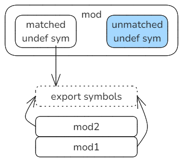
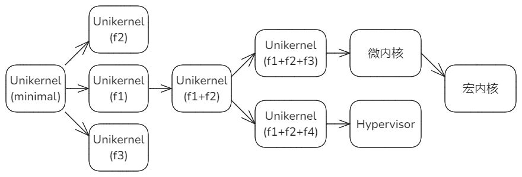

# 写在前面（2024总结）

## 2024工作和学习的过程

2024年这一年基本都是在实验基于ArceOS去扩展实现宏内核。大概过程是：

1. 春节前后分析了Starry，又复习了Linux，提出了一个组件化宏内核模型lkmodel，在内部做了几次报告。这个期间发现了自己对Linux原理和机制理解不够，对Linux源码和参考书又进行了重新学习。总体是眼高手低的状态。
2. 在3月和4月，基于ArceOS的组件进行扩展去搭建lkmodel。当时想延用以前cLinux的经验，建立逐级构建内核的机制，目的是把构造内核的过程分解，形成逐级构造的单调过程，以内核构建复杂性“分而治之”。但做这个的基础是，组件间必须是“**单向依赖**”的关系，当时在改造ArceOS组件相互关系方面消耗了很多时间和精力，但是加深了对内核中各资源对象间相互关系的理解。
3. 在5月和6月，以ltp为主要测例，对lkmodel进行了扩充实现。当时想验证的是，采取逐级构建和测试的方法能否降低构建过程的复杂性和难度？组件间已经建立的单向依赖关系在代码规模增长时是否能够保持住？即能否继续保持低耦合性？当时工作的总体进展很慢，一方面是个人在写代码和调试能力方面比较弱，另一方面ltp测例的检查比较细，要求对Linux原理机制有比较好的理解，又暴露了个人的基础问题。但是根据个人体会，逐级构建内核的方法在降低构建复杂性和定位问题方面是有帮助的，单向依赖对于降低耦合性，提高维护性方面是有利的，之前确立的内核组件间层次依赖关系是基本合理的。此外，5月和月参加了春节训练营的教学工作。
4. 从7月到9月，发现了很多由于并发引起的问题，尤其是启用内核抢占之后。当时提出了通过“**VMI差分**”来定位问题的方法，并根据应用的效果逐步做了改进，能够分进程和分线程对syscall和signal进行差分对比，可以通过横向（与Linux）以及纵向（与历史版本）进行差分对比。通过差分发现了不少问题，说明该方法在内核开发和定位问题方面是有用的，但是当时的实现程度也存在局限性，主要问题是差分粒度太大，只能做到在系统调用和信号这个层面差分。要想继续提高该方法的有效性，我认为需要达到内部的组件级，以支持逐步缩小缺陷范围的定位方式。但是一方面lkmodel目前与Linux内部构成存在较大差异，另一方面VMI方法也存在局限性，还无法做到组件级差分，限制了该方法的作用。此外，在7月至9月间，基于lkmodel写了一个宏内核的tutorial和相应实验。
5. 从10月至12月，参与泉城实验室的结题材料工作，主要是写了组件化内核设计的技术报告，其中总结了组件间依赖关系、逐级构建内核的层次化方法、内核差分工具的部分。阅读了一些论文，分析了一些开源内核项目，其中蚂蚁的Asterinas对我们的参考意义较大，我们可以考虑这种TCB+Rust的设计方式。为秋季训练营第3阶段 - 组件化内核，重新组织了教程ppt和相关实验，这些实验尝试基于Unikernel扩展出宏内核和Hypervisor。通过这个过程，学习了Hypervisor的一些基本原理。本次训练营新组织的材料和实验在宏内核和Hypervisor方面有很多欠缺的部分，有待于ArceOS主仓库对宏内核和Hypervisor扩展的进度，这样补充实验会比较简单。

## 组件化宏内核开发的体会和想法

要找到一种方法，让我们开发的宏内核快速达到生产强度，可以替换Linux内核。所谓“方法”是笼统的说法，这其中包括路线规划、设计方法、测试方法、评估方法、架构设计、协作方式等等，包括让我们能够达到目的的所有要素。

那么这种方法应该具有以下特点：

1. 渐进式。开发过程是由一系列连续的迭代过程构成，每次只需要关注一个很小的问题域。
2. 容易评估。每一个迭代步骤都可以对功能、性能、安全性等指标进行评估，且手段简单。
3. 容易分工和合并成果。可以适应多人团队的并行协作，相互不冲突，且结合第2点的评估手段，可以简单快速的合并成果。
4. 具备快速定位缺陷的能力。支持逐步缩小范围的定位方式，具有有效的工具。
5. 最大程度的继承Linux经验。尽量继承Linux Kernel在发展过程中积累的解决实际问题的经验和机制。
6. 建立约束，尽量减少内存安全和并发安全问题的发生。
7. 可操作性。针对以上的所有的特点，都能找到切实有效的方法逐步实现。

基于目前的经验和认识，这种方法可能包含的必要的基础手段：

1. 内核的组件化设计。
2. 迭代式逐级构造内核与评估。
3. 与Linux的差分对比方法和工具。
4. TCB设计结合Rust语言。
5. 对Linux Module的二进制兼容。
6. 对LTP等精确测例的应用。

## 未来工作的重点

侧重组件化**宏内核**构造方法与实践，重点工作内容：迭代式逐级构建内核、差分方法和工具、与Linux模块的二进制兼容、Rust结合TCB的分层设计等。在实践基础上，完善Tutorial和相关实验。


# 总体目标和拟解决的问题

研究可替代Linux Kernel的宏内核的构造方法，给出一个生产级的宏内核参考实现，提供与Linux对比的量化工具。

新内核相当于对Linux Kernel的重新实现。既要克服Linux Kernel的缺陷，又要继承它积累的宝贵资产，需要解决以下问题：

1. 克服内核复杂性随着规模增长而膨胀的问题
2. 克服内核在内存安全和并发安全方面的问题
3. 直接接管Linux原始的应用、驱动等资产，解决生态兼容问题
4. 采用可操作性方法，保留和继承Linux所积累经验，加快成熟速度

## 内核复杂性膨胀

内核开发和维护面临的最大挑战是复杂性问题，并且这种复杂性会随着功能演进、代码规模的增长而持续膨胀，导致维护成本越来越高，定位缺陷的难度越来越大，最终超出开发者的掌控能力，其结果就是这个内核要么进行完全重构，要么消亡。该问题是“软件危机”在内核领域的体现，只是相对于大部分的应用软件，内核在这方面的问题尤其突出。过去的几十年的实践经验说明，软件工程在解决此类问题方面是存在很大局限性的，所以我们希望找到实践上有效可行的方法，控制内核复杂性膨胀的速度，增强内核的可扩展性和可维护性，延长内核的可维护周期，降低维护的成本和难度。目前看，迭代式逐级构建内核和多层次差分可能是基本的控制复杂性的手段。

## 内存安全和并发安全

根据近两年的个人直观体验，基于Rust开发内核时，在编码和编译上确实受到很大程度的约束和限制，但是只要编译通过，在测试过程中就发现内存缺陷和并发缺陷都明显减少了，所以用Rust代替C后，总体上发挥了很大的正向作用。目前的主要问题是，内核开发中Unsafe Code是无法避免的，如何最小化？如何约束？蚂蚁的Asterinas提供了一个比较好的思路和范例，即我们可以先制定一些基本原则，然后定义一个TCB，这样就把内核划分为TCB和非TCB两个层次，一方面把Unsafe代码封装在TCB之内；另一方面由TCB对上层非TCB部分提供受控的访问系统资源的方式，那么上层非TCB部分就可以完全采取Safe编程，并被Rust检查规则所约束。

## 与Linux生态兼容

新内核在投入实际应用环境时，还要面临的另一个重大挑战 - 生态问题。挑战现有生态，去建立新生态是非常困难的，无论是应用的迁移还是驱动的适配，都要付出高昂的代价，所以兼容已有的生态是相对现实的方案。将来很长一段时间内，Linux生态仍将在大部分的IT领域中占据主导地位，该生态链中包含大量成熟的应用和驱动。通过兼容Linux生态，让新内核具备直接接管Linux原始应用和驱动的能力，是目前能够看到的让内核快速进入生产环境的现实途径。

当前开展的工作主要是针对北向资产 - 应用系统的ABI兼容，包括针对syscall、procfs等向应用暴露的接口。下一步还要开展面向Linux Module的ABI兼容，以直接接管支持原始的Linux驱动、文件系统之类的模块。先兼容再逐步替换，是将来的基本思路。

## 保留继承Linux积累的经验

实际上，目前在开发阶段已经发现了很多难以定位和调试的缺陷，总结起来大约有两大类：

1. 与并发有关的缺陷：主要是引入内核抢占和SMP之后导致的各种异常。
2. 与体系结构有关的缺陷：内存屏障barrier和快表刷新tlb flush语句遗漏导致的异常，硬件特殊设计与特性引发的异常。尤其从qemu转为实际硬件环境之后，这些问题更多的凸显出来。

这些方面导致的往往是**低概率**问题，测试难度大，定位难度大。这可能是内核系统随着复杂性增加对其失控的一个重要原因。无论是经典操作系统教科书，还是体系结构手册，虽然对这类问题都有提及，但没有那个资料会明确的把所有该实现的地方都列举和标记出来。我们能够获得的最好参考就是Linux实现。

更重要的是，包括内核在内的任何软件，在投入实际环境应用之后，都会经历一个缺陷的爆发期。很多实际情况是在实验室中无法完全预计的，只有到了实际环境中才会暴露出来，并且修复和改进也要经过实际环境的检验。我们开发的内核将来也必然要经历这样的痛苦阶段，这会严重阻碍内核达到生产强度的步伐。缩短这一阶段的有效手段是参考Linux。Linux经过多年的发展，积累了很多宝贵的经验资产，但是体现这些经验的往往是直接的代码形式。如何才能尽量的保留和继承Linux积累的经验？

目前想到的主要通过两种方式，一是把原始的Linux分解为组件然后逐个替换，二是通过细粒度的差分来检查和匡正我们的实现。

# 总体思路和工作构成

针对总体目标和各项具体问题，规划一组工作任务。其中核心工作是形成组件化内核框架模型和组件规格，给出宏内核实现，以实现总体目标。2024年基于ArceOS、LKModel、Asterinas的分析和实践，已经为核心工作建立了基本原型。今年围绕核心工作，新增6项工作任务，希望再用3年时间实现总体目标。所有工作任务之间相互配合来解决问题，以达成总体目标。


核心工作中**组件化的内核框架模型**是各项任务的基础。

内核复杂性膨胀问题主要通过任务1来实现对复杂性的分解，并通过任务2来提高缺陷定位能力。

内核的内存与并发安全问题主要通过任务3来解决。

与Linux生态兼容问题通过任务4实现，并由任务2提供保证。

继承Linux经验的途径是任务0，对原始Linux内核分解组件并逐个替换，并在每次替换前后进行对比评估，尽可能保留解决问题的经验。

任务5是基于宏内核组件化框架，裁剪后向其它内核模式扩展。

总结一下思路，首先明确要达成的目标和要解决的具体问题，然后提出思路落实成任务，细化任务的执行过程和步骤形成可执行的路线图，沿着路线图一步一步实践推进，最后得到一个具体的内核实现。提出定量方法，对新内核与Linux等内核进行对比评估，证明解决问题办法的有效性。我们的贡献首先是提出了设计办法，然后是给出一个具体实现作为参考示例，并提供评估工具。

# 组件化内核框架模型

目前的组件化内核框架模型是面向宏内核模式，其中描述了内核的层次、各层次的关键组件以及组件间的关系。这个模型主要来源于lkmodel实验项目实践，lkmodel是在ArceOS基础上所做的面向宏内核扩展的尝试。通过对Rust标准库设计和对Asterinas内核设计的分析理解，增加了TCB设计的思想。作为一种框架设计，预期它的层次划分、组件构成、组件之间关系在宏内核整个生命周期的演进过程中能够**保持稳定**，即，只可能出现两种变化，一是增加新的组件，二是更新已有组件的内部实现但不影响其对外接口。


自底向上共分为5层，构建基础Base，TCB库KLib，框架层Frame，操作层Ops和接口层Interface。层间的调用与依赖关系只能是自上而下，各层内部的组件间依赖关系也必须是单向。

组件化内核模型是一个“栈”式结构，栈上的每一层对应于不同的抽象层，即它们是对同一个内核在不同层次上的描述。或者从另一个角度，内核在“栈”的不同层次上表现为不同的形式。

> 当前模型的主要问题是Ops和Frame这两个层次的定位问题，命名体现了定位。
>
> 目前的命名和定位是延用了LKModel的经验，下层是结构Frame，上层是操作Ops，便于实现单向依赖。
>
> 但是根据目前的认识，下层Frame应该是相对较低级的抽象，例如Task任务，而上层Ops应该是较高级的抽象，比如UserProcess、KThread等等，命名上改为LowerLevel和HigherLevel。这样才更符合“栈”的设计思想。

## 基础层Base

构造内核有三个基础条件，硬件平台、编译器和配置。在它们共同作用下，内核从源码形式转化为二进制形式的Image文件，再从静态形式转化为动态运行的形式。


编译器把内核从源代码形式转化为二进制形式的静态Image镜像，Image的布局由LDS配置文件决定。

配置包括两个部分：

1. 控制编译的选项：LDS控制Image中各个段的布局，条件编译控制代码是否引入。Rust中的条件编译主要是Features形式。
2. 全局的常量参数：由外部配置，被源码引用的命名值。这部分与源码被合并编译。

对配置的处理参考Linux，由MenuConfig生成和修改.config文件，然后该文件被转化为两种形式，MakeFile的环境变量和定义常量的头文件。

硬件平台为内核的运行提供支撑和准备，BootLoader提前把内核Image加载到内存的特定位置，并让CPU的pc寄存器指向内核入口，让内核开始运行，初始化sp寄存器指向内核栈。

* CPU的pc + sp代表了内核最初的执行流，将来在更上层会被抽象表示为主任务对象init_task。
* Bus反映的是初始的物理的总线地址空间，分别针对物理内存和外设I/O端口分配了区域。等MMU启用后会形成内核的初始虚拟地址空间，虚拟地址空间映射以总线物理地址空间为基础，将来在更上层会被抽象表示为第一个地址空间对象init_mm。
* 启用IOMMU后，可以让外设作为主设备时看到虚拟地址而非物理地址。这一特性对内核驱动的安全控制有重要作用。

## TCB层KLib

KLib应当发挥如下作用：

1. 封装所有Unsafe的部分，通过接口向上层提供充分的调用服务，框架的上面各层可以仅使用Safe编程模式。
2. 屏蔽架构和平台差异，即HAL的作用。
3. 屏蔽编译器的差异，包括版本差异。

KLib首先参照了Rust Std库的设计，它们的对比：


Rust的标准库主要包含两大部分，硬件相关部分 - 包括体系结构&&平台，Rust语言及编译器相关部分。其中，硬件相关部分其实就是HAL的设计。

KLib的构成参考Rust Std，能够比较好的适应Rust开发的需要，同时也为兼容从Linux拆分的C组件提供一个组件设计参考模型。对于来自Linux的C组件：

1. compiler_builtin：封装编译器内嵌的基本函数，参照Rust组件就是memcpy，memset之类的函数。
2. core：把Linux的include和lib两个目录进行封装作为core组件。
3. alloc：封装slab，提供字节分配的接口。既包括按长度，也包括按类型。
4. collections：把Linux Kernel中的各种基本数据结构定义归入此类，各数据结构可以单列为独立组件，例如：rbtree、xarray等。

此外，参照Asterinas的处理方式，引入TCB的思想。把KLib作为TCB，完全控制系统资源，上层只能通过它提供的受控接口访问部分系统资源，不允许绕过。由项目的核心维护人员严格控制和实现KLib，其他人员主要参与上层代码的扩展，比如syscall扩展等。这样可以在保证内核质量的前提下，充分发挥各方面人员的力量。

## 框架层Frame (Lower Level)

框架Frame这个命名不确切，这层包含内核的低级基础对象。分为四个子系统：


1. 内存子系统

   核心组件aspace代表内核的内存地址空间，或者按照Linux惯例采用mm命名。mm管理的是分页后的虚拟地址空间，因此它基于KLib层的Paging组件；所有的mm地址空间的高端区域是共享的内核空间，基于KLib的内核Segment Layout来初始化。

   组件buddy提供页帧分配的服务，不仅面向应用，也面向设备和文件提供页帧缓冲区。

   组件slab负责字节分配的服务，它还需要向KLib的alloc组件注册，以支持Rust GlobalAllocator的功能。

2. 任务子系统

   核心组件task代表被调度的任务单元，任务是低级对象，不负责资源管理的功能。

   locking主要针对自旋锁，附加操作包括两类，开/关中断和启用/禁用抢占。

   sched包括runq、waitq组件，对它们的操作就是put和pick任务，如何选择下一个任务基于外部可选的调度策略组件。

   sched还负责提供接口，支持通过yield主动让出CPU，或者由抢占触发被动让出CPU，但真正的上下文切换实现是由KLib的context组件提供。

3. 设备子系统

   包括对设备的发现probe，驱动对象和设备对象的维护以及二者之间的关联初始化。

   概念Bus在系统内对应两类组件，一类是能够提供probe发现设备功能的总线，例如PCI、MMIO等；另一类是作为Group维护设备对象和驱动对象，每当新的设备或驱动注册到Group中，就会触发对所有设备或驱动的遍历以尝试关联。

   驱动涉及的中断支持由KLib的irq组件提供。

   另外，考虑借鉴Asterinas的机制，在KLib中强制启用IOMMU，以提高设备驱动开发的安全性，同时也可以赋予驱动开发者相对宽松的操作约束，因为启用IOMMU后，设备可见的地址空间也是经过映射的虚拟区间，至多只能破坏自身的运行。

4. 文件子系统

   包括文件抽象，目录树的缓存和inode三类核心组件，它们代表的是最基本的文件系统构成元素。

   文件系统包括两类，基于块设备的文件系统和基于内存的伪文件系统。

在四个子系统中，内存子系统和任务子系统是各种内核模式中最基础的部分，即内核至少要包含内存管理和任务管理，单任务可以视为任务管理的特例。因而，内存子系统和任务子系统在本层次中处于相对较低的位置上。

## 操作层Ops (Higher Level)

暂时命名为Ops操作层，实际是包含内核中比较高级的对象，它们有时涉及多个低级对象的封装。


进程process是最核心的组件，一方面基于task作为可以被调度的单元，另一方面管理各类从属的资源对象。

ipc包括一组支持进程间通信的组件，signal、shm等。

还有一组负责在文件和内存之间关联映射的组件，包括filemap和mmap。

命名空间namespace也是一类组件，最典型的是mnt_namespace，负责建立进程对文件系统的视图。

## 接口层Interface

响应外部请求或事件的三个组件，系统调用、异常和中断。

# 内核组件的规格

组件规格通过组件对外接口进行描述。

需要为每个识别出来的组件建立明确的接口规格，形成内核组件的规格说明。

# 任务0 - Linux内核组件化分解与替换

## 任务目标

对一个Linux Kernel版本进行组件化，渐进式的获得组件化内核框架模型和组件。渐进式可以在解决Linux原有问题的基础上，尽量的保留和继承Linux经验。新获得的组件化内核框架模型与当前的框架模型相互印证并完成调整和融合。作为一项基础任务，可以为任务2和任务4提供支持。

针对任务2：本任务获得一个与原始Linux基本对应的实现，并且是组件粒度上的对应，可以相对容易的进行组件级差分。

针对任务4：本任务以渐进方式始终与Linux的应用和驱动保持兼容，已经完成了任务4的大部分前期工作。

## 基本思路

首先选择一个Linux Kernel的版本，对其进行组件化分解；然后用Rust实现的组件逐个替换C组件，可以对每次替换前后的内核进行功能和性能的对比，并修正和优化新实现；最后完成对Linux Kernel的重新实现。


这个思路可以用忒修斯之舟来描述：对于一艘船，当我们采取逐块木板替换的方式时，最终将得到整体外观与功能上与原船完全一样的船，但是整个的翻新过程是由一系列微小的替换步骤构成的，每一块木板替换后，整船都可以出海航行以验证本次替换的影响。这个过程虽然没有起一个Theseus的名字，但可能更符合那个忒修斯之舟故事的想法。

重新实现的组件化内核继承保留了原始Linux Kernel的功能特性，有利于后续的差分对比和兼容生态资产的工作。

## 可行性

之前基于cLinux实验，对Linux v5.9进行组件化分解。实验约束是：限于riscv64体系结构，以启动一个原始的用户态的HelloWorld应用为目标，分解出最小的组件集合。所有组件是单向依赖关系。总共获得51个组件。

参照前面描述的组件化内核框架模型的标注，这些组件的分类：

* core：lib include kobject

* alloc：kalloc

* collections：rbtree radix_tree bitmap scatterlist xarray iov_iter hashtable workqueue bio
* hal：intc plic early_dt
* fs：ext2 vfs ramfs rootfs procfs
* file：dcache readahead
* mm：memblock buddy slab pgalloc vma mempool
* bus：of of_irq platform of_serial virtio virtio_mmio
* sched
* process：fork gup sys filemap ioremap
* dev&&drv：devres backing_dev block genhd virtio_blk
* interface：irq soft_irq

通过对各个分组组件依赖关系的分析，它们大致与目前的组件化内核模型定义的组件位置及关系对应。

## 执行步骤

首先把Linux Kernel组件化，然后把C组件逐个替换为Rust组件，最后得到基于Rust的Linux内核的重新实现。


包括两步：

1. 分解原始的Linux Kernel，实现完全组件化。

   在组件化基础上，把Linux Kernel的构建过程分解为一系列的连续的内核构建过程。从简单内核逐步过渡到复杂内核，最后得到一个组件化的、与原始Linux Kernel等价的内核实现。

1. 对于每个组件，逐个替换为Rust组件。

   每替换一个组件，对替换前后的内核版本进行功能、性能、可靠性等指标的对比和调整，保证整个替换过程是平缓渐进的过程。当Rust组件占比超过总量一半时，从以C语言为中心的优化转为以Rust语言为中心的优化。

## 探测组件依赖性的方案

Linux的内部耦合性较高，即使我们把每个.o文件都看作是一个组件，它们之间也可能出现复杂的环形依赖关系。我们的目标是打破环。

基本思路如下：



已经加入组件仓库的组件（mod1和mod2）提供已经定义的符号，export symbols作为一个符号表。对每一个待加入组件库的组件（例如mod），它的undef符号在与export symbols匹配后，可能会剩余未能匹配的undef符号（蓝色部分）。

我们可以把所有待加入组件库的组件按照未匹配undef符号数进行排序，数值越小说明对其它组件依赖越小，可以优先处理。典型的，如依赖数为0，说明可以直接加入组件库，那么它自身定义的符号可以扩充export symbols。

我们通过工具可以发现“环”，有两个典型的示例：

1. kalloc/kfree是很多基础类型组件所需要的依赖的符号，但是定义它们的组件slab本身就是由很多基础类型组件构造的，这样出现了“环”型依赖。
2. printk等输出和日志打印依赖vsprintf一类符号，而vsprintf对各种类型有转化为字符串的处理，各种类型本身又可能会调用printk之类的方法，这样形成了“环”。


最根本的解决办法是，通过注册回调机制在环上找一点切断环。


## 风险和后备方案

之前基于cLinux做过一次对Linux的组件化分解，但是执行的很仓促，期间为了快速达到目标，裁剪了大量的特性，损失了Linux的很多重要特性，这与本次尽量继承保留Linux经验的目标是不符的。所以，需要重新进行一次分解，尽量保留原始特性，这样会加大难度。

如果本次分解过程中，遇到难以克服的问题，或者发现周期过长，就暂时放下全部组件化的方案，采取后备方案，执行下面的工作：

1. 针对Linux Module与当前的组件化框架模型做融合，即直接把模块组件化，这样方便把原始驱动继承过来，对任务4有支持。
2. 参照目前的组件化内核框架模型，在Linux中找到关键点插桩，便于后续任务2中的组件级差分。

# 任务1 - 迭代式构建内核过程

## 任务目标

应对内核复杂性随着功能演进和代码规模增长而快速膨胀的问题。

把指数曲线控制为近似的常数曲线。

## 基本思路

复杂性无法消灭，但可以分解。复杂内核可以看作是从简单内核一步步演进过来的，演进过程是渐进式的。演进路线上的每一级内核，都是在上一级内核的基础上通过实施增量性的工作获得的。增量以组件为单位，工作内容主要是通过引入新组件对上一级内核进行升级扩展，以及相应的分析、测试和验证工作。这就把复杂内核的构建过程，转换成一系列连续的、单调增量的迭代过程，每一次迭代都只需要在上一次迭代基础上，关注和完成有限范围的工作。通过“分而治之”的策略解决问题。

## 可行性

在LKModel中已经做过初步的实验，可以达到的效果：迭代路径上的每级内核都是在上一级内核基础上建立的，本级只关注增量工作。


1. 复杂高级的内核形态是由简单低级的内核形态一步一步迭代形成的，分别称为高阶和低阶。迭代的增量单位是组件。
2. 在一条演进路线上，低价内核的构建过程是高阶内核构建的前置阶段，那么高阶内核可以直接承认演进路线上低价内核的成果。在低阶内核上所做的静态分析、测试、验证等工作，对高阶内核来说，都不必重复做，而是直接作为已有基础。高阶内核只需要考虑增量的工作，即加入新组件后新增的工作。
3. 这种构建方式把复杂内核的构建工程分解为一系列连续的、渐进式的增量构造过程，降低了每一步工作的难度。

## 执行步骤

1. 以终为始，自顶向下分解目标内核系统，形成构造内核的路线图。
2. 按照路线图的每一步，逐级构造内核。具体的，每一级都是在通用框架的基础上，增加核心组件的方式完成的，高级系统可以基于低级系统。

## reloc符号的重定位

重定位（relocation）是把符号引用和符号定义链接在一起的过程。编写程序的时候只需要调用目标符号，但是这些符号所在的位置是未知的。只有运行时才能知道，符号定义的位置用虚拟地址表示。重定位fixup符号引用的位置，重置成符号定义的实际位置。

在编译后（*.o）中包含一个reloc表，包含offset + info + addend字段，offset指示需要被fixup的符号引用的位置，info指示重定位计算的方式，addend是附加的参与计算偏移的数值。可以用readelf -r xxx.o来查看重定位表reloc。

例如：`riscv64-linux-gnu-readelf -r ./fs/ext2/ext2.o`

显示信息：

```sh
Relocation section '.rela.text' at offset 0x18ee8 contains 2824 entries:
  Offset          Info           Type           Sym. Value    Sym. Name + Addend
00000000000e  07a100000013 R_RISCV_CALL_PLT  0000000000000000 rb_first + 0
00000000001a  001d00000017 R_RISCV_PCREL_HI2 0000000000000000 .LC0 + 0
00000000001e  001e00000018 R_RISCV_PCREL_LO1 000000000000001a .L0  + 0
000000000022  075100000013 R_RISCV_CALL_PLT  0000000000000000 _printk + 0
```

## 不支持的重定位符号

使用Ubuntu24.04的工具链gcc-13，会出现很多无法链接的符号，是因为缺了部分选项。

```c
diff --git a/scripts/Makefile.build b/scripts/Makefile.build
index 79a35ef..58adc87 100644
--- a/scripts/Makefile.build
+++ b/scripts/Makefile.build
@@ -12,8 +12,10 @@ OBJCOPY := $(CROSS_)objcopy

 INCLUDES := -I./include/ -I./target/
 CFLAGS := -nostdinc -fno-PIE -mabi=lp64d -march=rv64imafdc \
+       -fno-asynchronous-unwind-tables -fno-unwind-tables \
        -fno-common -fno-stack-protector -mcmodel=medany -D__KERNEL__
 AS_FLAGS := -nostdinc -fno-PIE -mabi=lp64d -march=rv64imafdc \
+       -fno-asynchronous-unwind-tables -fno-unwind-tables \
        -fno-stack-protector -mcmodel=medany -D__ASSEMBLY__
 LDFLAGS := -melf64lriscv --build-id=none --strip-debug
 OBJCOPYFLAGS := -O binary -R .note -R .note.gnu.build-id -R .comment -S
```


## 扩展组件的原则

组件之间的关系以嵌套为主，堆砌为辅。对现有组件的特性进行扩展时，有两种可选的方式。

1. 保持现有组件不变，新建一个父组件包装该组件，然后在父组件中扩展新特性。下图的左侧方式。
2. 直接修改现有组件，以features条件编译方式新增代码来扩展新特性。下图的右侧方式。


方式1即通过组件嵌套的形式来实现系统扩展，符合对扩展开放，对修改封闭的*开放封闭原则*，是优先考虑的组件扩展方式。

方式1不改变原有的组件，因而保持了对原有组件所有测试验证的有效性。并且在可读性和维护代价方面也优于方式2。

以地址空间ASpace为例：

在开发基础内核模式Unikernel时，封装一个针对内核地址空间的组件ASpace，然后对该组件进行充分测试以确保其可靠性。

向宏内核模式扩展时，ASpace组件的功能依然需要，只是在此基础上需要扩展出针对用户地址空间的特性与操作。

同理，向Hypervisor扩展时，需要在ASpace组件原有功能的基础上，扩展出针对虚拟机物理地址空间的特性与操作。

参照上述原则，可以给出如下的设计：


# 任务2 - 与Linux组件级差分

## 任务目标

从内核级到组件级可以逐级对进行差分，符合逐步缩小范围来分析和定位缺陷的基本方式。

## 基本思路

定位和修复内核缺陷是内核维护过程中面临的最大挑战之一。内核的很多缺陷往往要到实际应用环境中才会暴露出来，对缺陷的修复、对内核机制的改进也必须在实际应用环境中去验证。Linux Kernel无疑是在这些方面积累最多的开源内核，它的很多实现原理和机制都是经过长时间和实际环境验证过的。仅仅通过阅读理解Linux代码，然后在新内核中实现的方式，很难充分利用这些积累。与Linux Kernel进行差分是目前能够想到的最好方式，通过发现、对比和分析差异性，帮助我们在开发和维护阶段定位新内核的实现缺陷。

目前已经可以在进程和线程级进行差分，但是该粒度对我们的工作仍然是不够的。接口对内部实现的约束性或称影响，称之为“**渗透性**”。


一般软件设计中，接口对实现的约束力较小，内部的实现机制原理具有很大的自由度和灵活性。但**Linux**比较特殊，原因主要应该是对效率的关注。Linux ABI包括syscalls以及通过procfs等伪文件系统暴露的查看操作方式。其中，procfs最典型。procfs几乎是Linux内部实现机制和数据结构的对外展示，如果我们设计的机制、数据结构与Linux有明显差异，将不得不引入复杂的**适配层**去适应procfs的规格要求。其实很多syscall也有类似的影响。这种**高“渗透性”**导致我们不仅在界面层面，进而在内部实现的很多层面上也要与Linux保持较高的一致。之前已经在LKModel中进行了内核级差分的实验，在任务0基础上，可以进一步建立组件级的差分。

## 当前基础

目前能够在内核与进程的界面上，通过截获系统调用、异常和信号进行差分。


## 实施方式

之前的工作中，内核级差分是通过VMI方式截获信息流中的关键事件。组件级差分这样实施的难度很大，考虑有两种实施方式：

1. 自己实现“插桩“：在新内核与Linux在组件/模块层面基本对应，各个组件/模块的接口基本一致的情况下，自己实现基于这些组件级接口的信息截获应当相对容易。
2. 基于eBPF：有可能是更通用的方案，需要进一步学习以了解其优劣势。

# 任务3 - Rust结合TCB的分层设计

## 任务目标

按照TCB思想把内核分为两层，TCB作为内核安全的基础，控制核心的系统资源；上层只能通过TCB提供的受控接口访问系统资源。

基于TCB接口，上层可以完全基于Rust的Safe模式编码，可以开放给更多的项目开发者。TCB的实现主要由项目核心团队维护。

## 基本思路

“栈”式层次化设计，把内核分层：TCB和非TCB两层，把对它们的开发分配给不同层面的开发者。


1. 内核不是单一层次，而是两个相对独立和相互隔离的层次，开发、维护、打包都是两个部分。
2. 所有的资源都是由TCB控制的，但是对不同资源采取了不同的策略，核心资源是完全封闭在TCB的内部处理的，外部无法接触到；非核心资源也是TCB控制的，但是以受控的方式对上层服务暴露了接口。
3. 上层服务无法绕过TCB去访问系统的资源，只能通过TCB暴露的接口，在受控方式下操作部分资源。
4. TCB和上层服务是两类开发者。TCB开发者承担了主要的安全职责，减轻了上层服务开发者负担。

## 可行性

当前的实验基于ArceOS，ArceOS的HAL已经具备了一些TCB的特征，有封装Unsafe的考虑。后面主要是参照Asterinas的原则，制定我们的TCB划分原则，在KLib这一层实现TCB控制。

# 任务4 - ABI兼容Linux应用和驱动

## 任务目标

直接接管继承Linux原始的二进制形式的应用和驱动，快速建立起一个完整的宏内核运行环境，便于后续的分析、对比、替换和验证。

## 基本思路

Linux资产主要包括两类：

* 第一类是各种基于Linux的应用系统、中间件、系统库等等，通常需要适配libc或者syscall。
* 第二类是以module形式存在的已经模块化的驱动、文件系统以及其它功能扩展，需要适配module接口。


第一类资产称为北向资产，即应用，之前主要工作都是实现它们的二进制兼容；第二类资产称为南向资产，并未直接兼容，导致目前在驱动方面比较匮乏。如果能够对第二类资产也能够不加修改的直接接管，将能够显著提升新开发的内核在各种硬件平台的移植能力。

对于第二类资产，也就是驱动类的总体思路是，先接管兼容，再逐步替换。

# 任务5 - 组件化支持其它内核模式

## 任务目标

基于宏内核模式的成果，能够重新组合组件形成其它各类模式的内核或Hypervisor。

## 基本思路

从宏内核模式入手，完善组件化内核的框架模型，并获得基础组件仓库。

1. 宏内核模式可以看作是一个各种内核模式的”超集“，Unikernel则可以看作是各种内核模式的”交集“。之前工作以Unikernel作为起点的做法是”做加法“，已经建立起一个基础的框架模型，并获得了一些组件。目前的思路是再以宏内核为起点”做减法“，与之前的工作汇合，找到一个”中间点“，获得具有各类模式共性特点、适合向各类模式扩展的框架模型。
2. 本任务与任务1可以相互结合。基于任务1的思路，复杂内核是由简单内核逐级构建的。可以看到，最初各阶段的内核模式实际都是Unikernel的实例。整个构建过程反映了各种内核模式的进化演进路径。

## 可行性

LKModel验证了基于同一组件仓库可以构成一组Unikernel和宏内核。



## 执行步骤

1. 分别从Unikernel和宏内核两个角度，融合形成组件化内核框架模型
2. 分析其它内核模式的特点，补充专用于特定模式的组件
3. 通过自动化编排机制，优化构造内核的方法和工具


