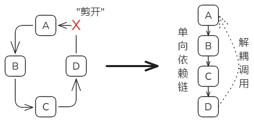

# 第一章 前言

组件化的设计思想，对于开发针对泛在计算应用定制的操作系统内核仍具有很大的吸引力。然而，如何更好地进行组件的设计、定制与组合，还存在许多需要深入思考的挑战性问题。例如，以什么粒度划分组件？如何减少组件间的耦合？应用如何选择组件？如何在组件化的同时保证性能？如何让组件更好地被其他系统重用？如何让组合方式具有高表达能力以形成不同形态的内核？如何兼容已有应用？设计良好的组件化操作系统应具有以下特点：

• 功能按需定制。只包含应用程序所需要的功能，而尽量不包含应用不需要的功能，以缩减镜像大小、提升启动速度、减小攻击面。

• 组件可替换。提供一系列完成某一功能，但具有不同实现的组件，使得应用可根据自身对安全与性能的需求，灵活选择不同的组件。

• 组件可重用。组件不应该与特定内核的设计和实现绑定，需要能够方便地被其他应用或内核重用。

为此需要深入理解不同类型和架构的操作系统内核的共性特征和差异性，从操作系统内核的分层架构、组件功能、组件接口定义、组件组合方式出发，充分利用Rust语言提供的特性，把Unikernel架构作为基础骨架，并通过将进一步的内核功能组合，可逐步扩展出宏内核、微内核、虚拟机管理程序等多种内核形态。

本文是对组件化操作系统研究进展的技术总结，包含以下部分：


1. 系统设计：提出组件化操作系统内核的一般性设计框架，在实践中总结和提炼了一组核心组件，形成了基础的组件仓库，给出了实验评估的方法并证明了组件化设计的可行性与对比优势。系统设计为后续各个具体方向的研究和实践准备了必要的基础条件。
2. 组件设计：在组件化操作系统的设计框架下，分析组件间协作与依赖关系，兼顾系统低耦合性和高性能的目标，提出组件及组件间的关系的设计约束，提出若干可供选择的设计模式，为组件化设计实践提供参考。
3. 构建方法：基于内核框架设计和组件设计，研究基于组件分解内核复杂性和层次化逐级构建稳固内核的方法，指导内核开发的实践工作，并为系统和组件设计提供反馈。
4. 辅助工具：研究适用于内核开发的差分方法，为内核与组件功能的开发提供有效的缺陷排查手段和正确性验证工具。


上层研究工作为下层工作提供条件和约束，下层的实践为上层工作提供反馈和辅助支撑。各层工作形成整体上的闭环，以迭代方式推进。


# 第二章 组件化操作系统架构

## 1. 背景

除了绕过内核、消除系统调用的上下文切换开销外，专用的操作系统也是微虚 拟机提升性能的重要途径。专用化（specialization）通过对功能进行按需实现，以 及针对不同的场景选用不同的实现，形成极简的、可定制的操作系统， 以获得最佳 性能。

然而，现有的微虚拟机操作系统，在专用化的效果与效率上存在不足。它 们一般采取以下三种方法： 一是在已有通用操作系统的基础上进行裁剪与改造，但是因为原系统模块的紧耦合性，专用化程度不够高；二是从头开发新的专用操作系统，但是需要大量的专家知识与开发成本，效率不高；三是采用组件化的设计方法对功能进行组合，但是在组件的易用 性与可重用性上仍有待提高。

另一方面，现有微虚拟机操作系统在接口设计上难以同时兼顾性能与兼容性。 POSIX 接口为应用程序提供了最大程度的兼容性，但在单地址空间的微虚拟机场 景下存在许多冗余的调用路径，无法获得最佳性能。而使用针对性能进行优化的 接口，又会导致难以兼容已有应用。

本章认为，是编程语言阻碍了操作系统的专用化发展。现有的通用操作系统 或微虚拟机操作系统，大多采用 C 语言编写，导致功能模块紧耦合，难以裁剪、改 造、替换与重用。近年来新兴的 Rust 语言，具有诸多高级语言的特性，以及与 C 相媲美的性能，非常适合用于实现专用化的微虚拟机操作系统。然而， 目前虽然 也有不少用 Rust 语言实现的微虚拟机操作系统[22,164]，但是它们并没有充分发挥 Rust 以及微虚拟机的优势，在性能上反而不如用 C 编写的系统。

为了更好地利用专用化提升微虚拟机的性能，本章提出了 ArceOS 微虚拟机操 作系统。ArceOS 利用Rust 语言的特性，针对微虚拟机的特点，在组件化设计与接 口设计两方面进行了优化。在组件化设计中， ArceOS 通过将组件划分为操作系统 相关与操作系统无关两类，来减少组件对操作系统设计理念上的依赖，以降低耦 合性，提升可重用性， 同时也借助 Rust 语言提供的机制实现了操作系统功能的灵活定制。ArceOS 还利用组件化设计带来的灵活性，不 仅可以作为一个 Unikernel 运行于特权态微虚拟机中，还能形成宏内核、虚拟机管理程序等多种内核形态。

在接口设计中，ArceOS 借用了Rust 标准库的接口，提供了快速路径，避免了微虚拟机场景下使用 POSIX 接口带来的冗余路径，提升了性能。同时还能直接支 持已有的 Rust 应用，提供了足够的兼容性。

目前，ArceOS 提供了 30 多个可重用组件与 10 多个松耦合模块，实现了多核、多线程、网络、文件系统、图形显示等基本内核功能， 支持 x86_64、RISC-V、 AArch64 等主流处理器架构，QEMU/KVM 、x86 服务器、树莓派、黑芝麻等多种 硬件平台，以及 Virtio 、Intel 82599 万兆网卡等设备驱动（均可根据应用需求进行 灵活定制）， 总代码量达 3 万多行。实验结果表明，ArceOS 的组件化设计方便了 操作系统功能的定制，ArceOS 的 API 快速路径设计比使用 POSIX 的接口快 50%  以上（文件读写）。ArceOS 同时兼容已有 C 应用程序，与 Linux 相比，使 Redis 的 延迟降低了 33%。

本章的主要贡献如下：

1. 提出了一种基于设计理念相关性的组件化操作系统设计方法，能够降低组件 间的耦合性，并提供良好的可定制性与可重用性。
2. 提出了一种基于 Rust 语言特性的 API 快速路径设计，专门针对微虚拟机场 景进行了性能优化，同时也不失兼容性。
3. 实现了一系列可重用的组件，能够快速搭建出满足应用需求的多形态操作系 统，支持已有的 C 或 Rust 典型应用。
4. 通过实验展示了组件化以及 API 快速路径的优化效果，并与 Linux 以及已有 的类似工作进行了细致的对比。


## 2. 研究动机

专用化是提升操作系统性能的重要途径。本章先介绍利用微虚拟机实现专用 化的基本方法，以及面临的挑战，然后讨论了如何利用组件化的设计方法以及新 型编程语言来应对这些挑战，最后给出了本章系统的设计目标。

### 2.1  操作系统专用化

微虚拟机只运行一个应用程序，而且可以在应用中实现部分操作系统的功能， 非常适合根据应用与场景的特点，对操作系统的功能进行深度定制，从而获得最 大的性能。这种专用化主要体现在两方面：

1. 极简性

   即只实现必须要实现的功能，去除任何不需要的功能。这不仅可 以减小镜像大小、提升启动速度、减小攻击面， 还能避免过多地考虑通用性，简化 实现方式，带来更多优化机会。例如， 对于只运行单个应用的微虚拟机，应用与内 核的特权级隔离、地址空间隔离都是多余的；对于事件循环驱动的单线程服务器应用，抢占与调度是多余的；对于基于 UDP 的低延迟网络应用，完整的 TCP 协议 栈是多余的，而且还可以通过消除 VFS 层的多态性来缩短调用路径 。

2. 可定制性

   即提供同种功能的多种实现。即使是同一功能，在不同的场景 下，使用不同的算法或实现方式，也会有不同的性能表现，这使得应用程序能够 根据需要选择最佳的实现。例如，本文第 3 章重点关注的任务调度，在不同的任 务负载下有各自适合的调度策略；不同的内存分配算法也对应用的性能有很大影响；对于设备驱动，也可以根据应用的需要进行配置，在性能更高的轮询模式 与 CPU 利用率更高的中断模式之间进行取舍。

### 2.2  实现专用化的挑战

专用化的终极目标是能够以很小的代价为每个应用快速生成出一个专用的操 作系统。然而，即便是在微虚拟机这样的轻量场景下，实现以上目标也绝非易事。 本节分析了其中的一些关键挑战。

操作系统模块紧耦合。为了实现专用化，操作系统的功能模块需要能被方便 地移除或替换。然而，在以宏内核为代表的传统操作系统设计中，各个功能模块 间存在错综复杂的函数调用与数据访问关系。如果要删除其中一个模块，或替 换为另一种实现，必须仔细考虑这些依赖关系，确保其他模块不受影响。因此难 以对它们进行专用化改造。

现有的一些微虚拟机操作系统基于对已有通用操作系统的改造，但 因为原系统模块的紧耦合性，专用化程度不够高，例如只能做到去除特权级分离 与多地址空间，其余大部分功能仍保留原系统的设计。

操作系统模块难以重用。另一条实现专用化的途径是从头开发新的操作系统。 但是操作系统的开发门槛较高，不仅需要掌握相关软硬件技术，还要考虑诸多实 现细节，这对于只为了运行某个应用的普通用户来说难以接受。另一方面，虽然 开发操作系统的工作量大，但是过程具有重复性。例如，几乎所有的操作系统都 要实现页表操作、内存分配等基本功能，或是链表、平衡二叉树等基础数据结构。 在开发新操作系统时理应可以重用其他系统中的相关代码，以减少开发代价。

然而，由于传统操作系统的自包含性，其功能模块只考虑了为自己服务，很难 被其他软件重用。再加上传统操作系统模块的紧耦合性，如果要将一个模块拆出 给其他软件使用，就不得不处理模块间复杂的依赖关系。

已有一些微虚拟机操作系统，重用了成熟操作系统的部分代码，但是这种重用的粒度较大，如完整的网络协议栈或驱动程序，使得其中仍保留大量原 系统的影子，专用化程度不够高。还有一些工作采用组件化的设计方法，通过对内 核组件的组合来形成满足需求的专用操作系统，从而减少开发代价，但是这些组件与原系统的设计较为耦合，难以被广泛重用。

接口设计难以兼顾性能与兼容性。另一个阻碍专用化效果的因素是接口的设 计。现有的许多微虚拟机操作系统，为了能够兼容已有的应用程序，选 择使用 POSIX这样的原通用操作系统中的接口。然而，这些接口原本是为宏 内核而设计的，考虑了诸多宏内核下的特点，如地址空间隔离，在微虚拟机场景下 存在冗余的调用路径，从而限制了从应用到内核端到端的功能专用化。但如果使 用面向性能的专用接口，又会面临应用兼容性的问题。

### 2.3  编程语言的考虑

为解决以上挑战，采用组件化的操作系统设计方法仍是一个值得深入研究的 方向。为了更好地实现一个组件化的操作系统，需要重新思考操作系统的架构设 计，乃至使用的编程语言。先前的工作难以实现专用化，或存在一些不足，在很大程 度上可以通过使用更现代的编程语言代替原来的 C 语言而解决。近年来，Rust [96] 语言越来越流行，而且在编写操作系统等底层软件上很有吸引力。本文认为 Rust 语言非常适合用于实现微虚拟机场景下的专用操作系统。本节先分析 C 语言在操作系统专用化方面的不足，然后介绍Rust 语言在该方面的优势。

**C** 语言的不足。C 语言具有简洁、高效、灵活等特点， 被认为是编写操作系统 的首选语言。然而，也正是因为 C 语言的高度灵活性，导致这些操作系统中存在 许多混乱的、不利于维护的代码， 例如类型强制转换、随意访问其他模块的函数或 数据等。正是这种过度的灵活性导致了软件模块的紧耦合，特别是对于操作系统 这样的大型软件来说。此外， C 语言也没有提供一些现代高级语言的特性，如面向 对象、模块封装、泛型、包管理器等，使得用 C 语言编写的功能模块难以被其他 软件重用。C 语言的简单数据类型也限制了模块间接口的设计。更不必说 C 语言 在类型、内存、并发等方面的不安全性，容易导致缓冲区溢出、use-after-free、数 据竞争等种种安全漏洞。

**Rust** 语言的优势。 Rust 语言最具特色的机制是基于所有权的内存安全管理， 使得无需垃圾回收等运行时开销，就能实现自动内存管理与安全检查，从而提供 与 C/C++ 相当的性能。此外，Rust 还具有许多高级语言的特性，如类型安全、泛 型与接口、函数式、枚举模式匹配等等， 可以带来极大的开发便利性。同时， Rust  对底层代码的控制能力，使得它非常适合用于编写操作系统等底层软件。下面主 要介绍 Rust 有助于实现专用的微虚拟机操作系统的几大特性。

1. 良好的包管理机制

   Rust 通过包（crate ）的形式组织代码模块，每个包都 有一个配置文件，指定了其所依赖的其他包。开发者还可以从官方的包发布平台中寻找与下载自己所需的包，或将自己开发的包发布出来供其他软件使 用。目前 crates.io 中已有超过十万个包。Rust 的包管理机制为组件化的操作系 统设计提供了便利，可以将操作系统的功能模块以包的形式组织，从而显式指定 它们的依赖关系，避免随意调用，降低耦合性。此外， 包发布平台也方便组件的重用。

2. 灵活的条件编译

   Rust 可在配置文件中，为每个包指定一组特性（feature）。 特性可在编译时选择是否启用，从而决定是否编译某段代码。特性还能用于配置 包的依赖关系，或者通过包的依赖关系进行传递。对于专用操作系统，这种灵活 的条件编译机制，既能方便根据需求选择性启用某些功能，又能方便在同种功能 的多种实现间进行切换。

3. 基于高级类型的库函数接口

   Rust 在 std 标准库中提供了对操作系统级 功能的访问，例如线程、文件、网络等。与 C 的文件描述符不同，Rust 的标准库接口 使用专门的数据类型对这些系统资源进行封装，并通过资源获取即初始化（RAII） 机制，由编译器保证这些资源在其生命周期结束时被释放。这种接口既避免了文 件描述符转换的开销，又避免了资源泄漏或多次释放。然而， 在 Linux 等通用操作 系统上，Rust 仍会依赖 libc 库（使用POSIX 接口）实现对系统级资源的访问，反 而增加了开销。但在微虚拟机场景下，可以完全利用这套接口代替传统的 POSIX  接口，既能提供更好的性能与安全性，又能直接支持已有 Rust 应用。

### 2.4  本章设计目标

本章的总体目标是能够快速定制出满足应用需求的高性能高安全微虚拟机操 作系统。为此， 本章认为，使用组件化的设计方法是实现这一目标的关键。为了解 决已有组件化设计存在的问题，本章希望能够基于 Rust 语言的优势，结合微虚拟 机场景的特点，重新思考组件化操作系统的设计方法。本章具体的目标包含以下 三方面：

1. 组件可重用：组件不应该与特定内核的设计和实现绑定，需要能够方便地被 其他应用或内核重用。
2. 组件灵活定制：应用程序需要能够对组件的功能与组合方式进行方便地配置， 以实现专用化所需的极简性与可定制性。
3. 接口专用化：应用程序调用内核的接口也需要专用化以提供最佳性能，但同时还要保证足够的兼容性。


## 3. 框架设计

本节先介绍 ArceOS 微虚拟机操作系统的整体架构，然后介绍 ArceOS 的设计 细节，包括基于操作系统设计理念相关性的可重用组件化设计、灵活的组件功能 定制方法、基于 Rust 语言特性的 API 快速路径优化，最后演示了利用组件化设计 实现的另一特色功能：构建多种形态的内核。

### 3.1  整体架构

ArceOS 以特权态微虚拟机作为基本形态，即 Unikernel，仅支持一个应用程序， 应用与内核在构建时被链接在一起生成单个镜像，共同运行在客户机特权态，可 以直接管理特权硬件资源，而依赖底层的微虚拟机管理程序进行安全隔离。通过 不同的配置选项，ArceOS 可以构建为其他形态的内核，如宏内核或虚拟机管理程 序，直接运行在裸机上。不失一般性地，ArceOS 的设计思想与优 化技术也可用于用户态微虚拟机。


如图描述了 ArceOS 的系统架构。根据依赖关系， 自底向上，ArceOS 可划分 为以下几个层次：

• 元件层：与操作系统的设计无关的部分，可方便被其他系统软件复用。

• 模块层：与操作系统的设计相关的部分，它们与 ArceOS 的设计较为耦合，不 太容易被其他系统软件复用。元件层与模块层集中了 ArceOS 的大部分组件， 可认为是传统意义上的 “内核”，用来管理硬件并为应用提供服务。

• **API** 层：将模块层的功能封装为 API 的形式，以供应用程序调用。ArceOS 为 Rust 和 C 语言编写的应用程序分别提供了不同的 API，并针对语言的特点做 了快速路径优化。

• 用户库层：通过对 API 层的进一步封装，提供对已有用户库的兼容（如 Rust 标准库、libc 库），以便应用程序的移植。

• 应用程序层：目前 ArceOS 提供了对 Rust 和 C 这两种语言编写的应用程序的 直接支持。


### 3.2  可重用组件化设计

传统的操作系统，虽然大多也采用 “模块化” 的思路进行功能单元的组织。但 这种模块的划分粒度较大，并没有清晰的边界，使得模块间可以随意调用，耦合程 度严重。而且这些模块也难以被其他软件重用。例如， 为 Linux 实现的设备驱动大 量依赖 Linux 的内核 API，如果要将其移植到其他系统，需要在其他系统中也支持 这些 API，这几乎覆盖了 Linux 的所有子系统。

为了让操作系统的功能单元具有更广泛的适用范围，需要从模块的划分方式 入手重新设计。ArceOS 的基本设计思路是按照更小的粒度，以及是否与操作系统 的设计理念相关这两个依据进行功能划分。本文将这些粒度较小的、为了可重用 性设计的功能单元称为组件。

操作系统无关与操作系统相关。ArceOS 为提升组件可重用性的重要方法是根 据与操作系统的设计理念的相关性进行组件划分。操作系统虽然种类繁多，实现 各不相同，但是有的功能单元是几乎所有的操作系统都需要实现的，而且无论操 作系统具有什么形态与设计理念，都不会对这些功能单元做太多调整，本文称它 们为操作系统无关的组件。这些组件位于依赖关系的底层，对其他组件的依赖较 少，但可能会有大量其他组件依赖它。例如，像链表这样的基础数据结构，或各 种调度算法的实现。除此之外，本文称剩余的功能单元都是操作系统相关的组件， 它们为某个特定的操作系统而打造，并与其设计理念绑定，当用于其他操作系统 时可能需要进行重大修改，因此可重用性相对较差。这些组件位于依赖关系的较高层，一般是对其他组件的组合，以实现更复杂的功能。例如，实时操作系统有 自己特有的任务管理方式，以满足高实时性要求，但不一定适用于其他操作系统。 下表总结了这两类组件的区别，并例举了一些组件示例。

| 类别 | OS相关/无关 | 依赖 | 可重用 | 举例                                                         |
| ---- | ----------- | ---- | ------ | ------------------------------------------------------------ |
| 元件 | 无关        | 底层 | 好     | 基础数据结构与算法  硬件相关操作 具体设备驱动 具体文件系统 网络协议栈 |
| 模块 | 相关        | 高层 | 差     | 系统配置与初始化 异常与中断处理  任务管理与调度  虚拟文件系统抽象 设备驱动层抽象 |

在 ArceOS 中，把操作系统无关的组件称为元件，把与操作系统相关的组件称 为模块，元件层与模块层共同构成传统意义上的内核，提供操作系统的基本功能。 ArceOS 利用Rust 语言的包管理机制来实现组件化，组件都以 Rust crate 的形式提 供，具有清晰的边界与依赖关系。此外，Rust 语言的单一所有权机制，以及对可 变全局变量的使用限制（除非使用 unsafe 代码），使得状态都是组件私有的，不 会在组件间共享，容易实现组件的拆分与替换。通过 Rust 的包管理平台 crates.io， 可以方便实现组件的重用与被重用。

元件层在设计上需要更多地考虑可重用性，仔细设计对外的接口，减少对其 他组件的依赖，并避免与 ArceOS 的设计产生耦合。ArceOS 的最终目标是让整个 操作系统都是由可重用的元件构成的，然而，由于元件设计上的复杂性，一些功能 暂时无法与操作系统的设计理念解耦，就需要暂时以模块的形式存在。因此，一 种循序渐进的开发方式是，逐步将操作系统的功能从模块拆解到元件中，减少模 块的数量，增加元件的数量。

有序的组件依赖。影响组件可重用性的另一因素是组件间的依赖关系。这种 依赖关系包括在另一组件中实现的函数、定义的数据结构。由于在重用一个组件 时，需要同时包含其依赖的所有组件，混乱的依赖关系容易导致引入过多无关紧要的组件，不仅违背了专用化的极简性原则，也导致了 “牵一发而动全身” 的情况。 例如 C 语言没有提供语言层面的组件概念，可以通过外部函数声明的形式调用任 意函数，造成了无序的跨组件调用，难以重用。为此， ArceOS 规定组件间需形成 有序的依赖关系，即遵循以下原则：

1. 明确定义依赖关系。一个组件可调用的组件列表，以及可使用的功能（函数 或数据结构）需要被明确给出，不能随意调用不在列表中的功能。
2. 无反向依赖：下层组件不能反向调用上层组件（如元件层不能调用模块层）。
3. 无循环依赖：组件不能相互依赖，整体的依赖关系需要形成有向无环图。

在 ArceOS 中，组件的依赖关系通过 Rust crate 的配置文件（Cargo.toml）指定， 只能调用在依赖列表中的组件的功能（或 Rust 核心库 core），可以避免随意进行 跨组件调用。ArceOS 通过规定元件只能调用元件，模块只能调用元件或模块来避 免反向依赖，防止重用下层组件时需要同时包含上层组件。此外，Rust 的包管理 机制也明确禁止了循环依赖，使得依赖关系清晰。

然而，由于操作系统固有的复杂性，有些时候仍然难以避免一些反向或循环 的组件依赖。例如， 自旋锁的实现与操作系统的设计关联不大，应该被放到元件 层。一个实现正确的自旋锁需要在进入临界区前关中断或关抢占，并在出临界区 时重新打开，以防当前线程在临界区被调度走而影响正确性。但是，“关抢占” 这 一操作无法在元件层单独实现，因为需要依赖模块层中的线程管理功能，而线程 管理模块与操作系统的设计理念较为相关，不适合移入元件层中。

为此，ArceOS 专门提供了一个元件 crate_glue，用于在不得已时提供接口定义 明确的反向或循环调用。该元件将依赖双方分为功能的调用者与实现者，位于下 层的调用者会声明一套所需功能的接口，位于上层的实现者会对其声明的接口进 行具体实现。两者只需依赖 crate_glue 元件，而无需直接形成反向或循环的依赖。 这种方式，虽然在本质上还是存在组件的循环依赖或反向依赖，但对这些调用关 系进行了特殊标记，避免了开发者的滥用与不经意的使用，有利于日后的分析与 检查。表4.2列出了目前 ArceOS 使用 crate_glue 解决反向或循环依赖的情况。

表 4.2  ArceOS 组件间不可避免的反向或循环依赖关系

| 功能调用者          | 功能实现者          | 调用关系     | 功能描述             |
| ------------------- | ------------------- | ------------ | -------------------- |
| axlog（日志输出）   | axruntime（运行时） | 模块  - 模块 | 输出带时间的日志     |
| axhal（硬件抽象层） | axruntime（运行时） | 模块  - 模块 | 中断与异常处理例程   |
| axhal（硬件抽象层） | 应用程序*           | 模块  - 应用 | 宏内核形态的系统调用 |
| axfs（文件系统）    | 应用程序*           | 模块  - 应用 | 应用自定义的文件系统 |
| 自旋锁              | axtask（任务管理）  | 元件  - 模块 | 线程抢占的关闭与开启 |
| 互斥锁              | axtask（任务管理）  | 元件  - 模块 | 线程的睡眠与唤醒     |

> *指运行于内核态的 ArceOS 应用程序层，而非传统的运行于用户态的应用程序


### 3.3  组件灵活定制

专用化要求能根据应用的需求构建出最简的、可定制的操作系统。 ArceOS 利 用 Rust 的 “特性”（feature）机制，提供组件的可选择性与可替换性，以实现专用化。

基于 “特性” 的组件定制。下图展示了通过特性对组件定制的一个例子。在 ArceOS 的 allocator 组件（内存分配）的配置文件中，可以指定三种特性，分别对应 不同的内存分配算法（TLSF[168] 、slab[169]、伙伴系统[170]）。内存分配算法的具体实现在 allocator 的依赖组件中，并可通过启用不同的特性来进行选择。在allocator 的代码实现中，也会根据特性来条件编译，分别使用相应的依赖组件实现不同内 存分配算法间的切换。这些依赖组件都是可选的，只要不启用相应的特性就不会 对它们进行编译，从而不被包含进最终的镜像中。此外，特性还可以通过组件的 依赖关系进行传递，如图的第 5 行可以通过 allocator 组件的特性来启用其依赖的 rlsf 组件的特性。


Rust 的编译工具链会根据所启用的特性，选择相应的组件（同时进行条件编 译）进行组合，来形成最终的操作系统镜像。为了提供最佳性能， 组件的选取与组 合在编译期间静态完成，无运行时的开销。Rust 编译器会对软件栈上的所有组件 进行编译，包括应用程序、用户库、被选择的模块与元件， 生成一系列静态库（rlib 格式）。最后， 由链接器将这些组件静态链接，生成最终的统一镜像，并支持链接 时优化（LTO）。

基于组件灵活定制的专用操作系统演示。下面以最简单的 helloworld 应用程 序为例，演示 ArceOS 是如何使用最少的组件，组装出一个仅支持输出功能的最简操作系统。然后演示当应用的功能增加时，如何通过修改配置文件，快速构建满 足应用需求的最简操作系统。


图中是一个最简单的 helloworld 应用程序，仅完成输出一行字符串的功 能。为了支持该应用程序的运行，需要针对运行的平台准备相应的执行环境，并 提供 “输出” 的功能（如串口）。如图a所示，ArceOS 最少需要四个模块层的 组件来支持该应用的运行，这四个模块也是支持应用运行的最小组件集合。其中， 最主要的是模块是 axruntime 与 axhal 。axruntime 用于为应用建立执行环境，对引 入的各组件进行初始化。axhal 是硬件抽象层，为各种硬件相关操作提供了统一的 接口。此外， axconfig 定义了平台相关常量与内核参数，如物理内存范围、内核加 载基地址、栈大小等。axlog 用于输出内核日志消息。

模块层的组件还会调用元件层的组件。如 axhal 会使用 x86_64 、x2apic 这样 的对具体硬件进行操作的组件；axhal 和 axlog 都会调用 spinlock 来使用自旋锁； spinlock 还会调用 kernel_guard 进行关中断或关抢占。

当应用程序的功能需求增加时，会引入更多的组件，如图b中的应用需要 动态内存分配功能才能完成字符串拼接操作。为此， ArceOS 提供了一个 “alloc” 特 性，应用在配置文件中启用该特性后，会引入一些额外的组件来实现动态内存分 配功能（如图b 中的 axalloc 等）。类似地， 如果应用需要使用多线程功能（图c），则可以启用 “multitask” 特性，并额外引入 axtask 等组件（图 c）。其 他可选组件还有设备驱动（axdriver）、网络（axnet）、文件系统（axfs）等。


应用程序通过指定不同的特性，来选择同一功能的不同实现。如图b右 侧，应用可在配置文件里启用不同的特性来指定相应的内存分配算法，并引入相 应的组件依赖（图b）。图c也展示了应用对不同调度算法的配 置及相应的组件依赖。

### 3.4  API 快速路径

ArceOS 利用了 Rust 的高级语言特性，为 Rust 应用程序调用内核的功能提供 了快速路径，以缩短传统接口的调用路径，提高性能。

传统接口的不足。传统的通用操作系统，或一些微虚拟机操作系统，为了兼容 已有应用，仍使用 POSIX 这样的接口作为应用程序调用内核的接口。POSIX 接口 为宏内核而设计，考虑了诸多宏内核下的特点，但在微虚拟机场景下限制了灵活 性，也存在许多冗余的调用路径。例如，宏内核的应用与内核处于不同地址空间不同特权级，应用需要通过系统调用访问内核。由于隔离性，系统调用的参数不能通过栈来传递，因此对参数的数量有限制（一般不超过 6 个），使得接口的参数与数据类型不能太复杂。此外，宏内核对安全性的要求也使得内核不得直接访问 存储在应用内存中的数据，因此内核在给应用返回一个对象时，需要使用一个整 数编号作为抽象（如线程编号 pid 或文件描述符 fd），带来编号分配与查找的开销。 另一方面，为减少系统调用次数，许多 POSIX 接口都提供了批处理的版本（如向 量读写 readv、writev），这在微虚拟机场景下也是不必要的。反之， 如果完全 抛弃 POSIX 接口，重新设计一套针对微虚拟机优化的接口，又会导致无法兼容已 有应用，带来不小的移植代价[19,22,26] 。

以文件读写为例，如图 [4.5(a)](#bookmark13)所示，在 Linux 上 C 语言编写的应用程序要读取 一个文件的内容时，使用文件描述符作为内核文件对象的中间表示。这不仅需要 内核为每个进程维护一份文件描述符表，还会在文件描述符的分配与查找时带来 不小开销，特别是在多核场景下严重影响可扩展性[8] 。


针对 **Rust** 应用的 **API** 快速路径。 ArceOS 希望能够提供一套接口，既能针对 微虚拟机的特点进行优化，又能带来足够的兼容性。为此， ArceOS 借用了Rust 的 标准库 API，作为 Rust 应用访问内核服务的接口。如图[4.5(b)](#bookmark13) 所示，Rust 应用在 进行文件操作时，采用了资源获取即初始化（RAII）风格的接口，在打开文件时会 创建一个文件对象，并在其生命周期结束后自动释放以关闭文件。这不仅消除了 文件描述符带来的间接开销，还让开发者无需自行考虑文件的关闭，避免了资源 泄漏或多次释放。

在传统的宏内核下，难以将此类接口直接作为应用访问内核的接口。因此， 现 有的通用操作系统或微虚拟机操作系统，对 Rust 应用的支持都是通过 libc 实现的， Rust 标准库在内部仍会调用 libc 的库函数，使用传统的 POSIX 接口来访问内核， 反而使 Rust 应用的调用路径比 C 还长。但微虚拟机让直接使用这样的接口成为可 能。由于应用程序与内核处于同一地址空间，能够相互调度与访问各自的所有函 数与内存，因此可以让 File::open 直接返回内核的文件对象，保存在应用的栈 上，允许应用直接对其进行操作。

除了能消除 POSIX 接口带来的冗余路径外，使用 Rust 标准库的 API 还能利用 Rust 的众多高级语言特性。仍以图 [4.5(b)](#bookmark13) 中的文件操作为例，Rust 的所有权机制 确保了该文件对象只能在同一个线程中被访问，因此可以在编译期间检查出并发 访问的缺陷，无需在内核中进行额外的运行时检查。此外， 可以使用闭包、泛型等高级数据类型作为接口的参数，以及使用带 async 关键字的异步函数[153]，为应 用提供更多灵活性，并且无接口转换的开销。使用 Rust 风格的函数作为 API，还 能实现从应用程序到用户库，再到内核的端到端 Rust 调用，中间不存在外部语言 接口（FFI）的转换，不会丢失参数的类型信息，便于 Rust 编译器进行全局优化与 安全检查[22] 。

使用 Rust 标准库的接口还能一定程度解决应用兼容性的问题，因为可以直接 支持已有的 Rust 应用程序。由于现在越来越多的新应用开始使用 Rust 语言编写， 也有不少旧应用使用 Rust 语言进行重写[171] ，这种方式可以带来足够的兼容性。

针对 **C** 应用的 **API** 快速路径。除了面向 Rust 应用的快速 API 外，ArceOS 也 支持 POSIX API，以兼容已有的 C 应用程序。ArceOS 为 C 语言也提供了一定程度 的快速路径，但由于 POSIX 接口的限制，效果不如 Rust。

以线程创建为例，当 C 应用程序要创建线程时，在 Linux 或一些 POSIX 兼 容的微虚拟机操作系统上都是通过 libc 的 pthread_create 接口实现的，其 内部会先使用 sys_mmap 系统调用分配线程的私有内存（栈与 TLS），再调用 sys_clone 完成线程的最终创建。然而， 这些系统调用为了通用性，其参数类型 与 pthread_create 存在较大差异，使得需要对传入的参数进行层层处理，延 长了调用路径，带来了额外的开销（见第 [4.5.2](#bookmark14)节的实验评估）。

ArceOS 通过使用库 函数级别 的接 口（API）代 替系统调用级别 的接 口 （ABI），以缩短 C 应用程序对内核服务的调用路径。ArceOS 的用户库提供了与 pthread_create 接口一致的 sys_pthread_create，来直接创建一个线 程， 而不再使用 sys_clone 系统调用。库函数级别的接口还有助于简化用户库 的实现。例如，对于 libc 中的 malloc接口，可通过 sys_alloc 直接调用内核的分配器实现动态内存分配，而无需在用户库中自行实现堆的管理（使用 sys_brk 或 sys_mmap）。

在本节的最后，总结了 ArceOS API（分别针对 C 与 Rust 应用）与 Linux 系统 调用接口的几处典型差异，如表 [4.3](#bookmark15)所示。

### 3.5  多内核形态构建

组件化设计带来的灵活定制能力，可以让 ArceOS 不止是一个微虚拟机操作系 统（Unikernel），还能形成其他形态的内核或系统软件，比如具有用户内核隔离的 宏内核，或是能运行虚拟机的虚拟机管理程序。本节将对这两种内核形态的支持 进行详细介绍。

由于微虚拟机单特权级的特点，ArceOS 采用以应用为中心的设计思想，通过 在应用程序层（仍处于内核态）实现特权功能，以扩展为不同形态的特权软件，同 时避免对原有架构与性能的破坏。为了便于区分 ArceOS 的应用程序层与宏内核中 运行在用户态的应用程序，本节称 ArceOS 的应用程序层为内核应用（仍为内核的 一部分），运行用户态的应用程序为用户应用。本节先分析这两种内核与 Unikernel 的差异，然后分别提出相应的内核应用设计方案。图 [4.6](#bookmark16)给出了利用 ArceOS 的组 件实现的这三种内核的架构。

宏内核。 ArceOS 宏内核的目标是能二进制兼容已有的 Linux 应用程序。与 Unikernel 不同，宏内核不信任应用程序，因此需要采取种种措施，提供应用与内 核以及应用间的隔离，以防应用程序破坏内核与其他应用。其次，宏内核一般也 需要提供多应用的支持[②](#bookmark18)。具体来说，宏内核与 Unikernel 的差异主要体现在以下 几方面：

• 接口。Unikernel 中，应用程序通过函数调用直接访问内核服务，而宏内核中 需要通过系统调用，存在特权级的切换。使用系统调用接口的优势是容易实 现对已有应用的二进制兼容，而不需要基于专门的用户库重新编译。不过也 因此无法使用第 [4.3.4](#bookmark4) 中介绍的 API 快速路径。

• 进程。Unikernel 中没有进程的概念，或者内核和应用整体可视为一个进程， 而宏内核一般提供多进程的抽象。进程可认为是共享相同资源的线程集合， 多进程间需要有资源的隔离（例如地址空间、打开的文件等）。这些资源在 Unikernel 中可全局只维护一份，但在宏内核中需要为每个进程都维护一份。 此外，宏内核还需提供进程间通信（IPC）的机制，例如信号、共享内存等。

• 地址空间。宏内核的应用程序不再与内核共享同一地址空间，需要为每个进 程创建单独的地址空间，并在进程切换时进行切换。多地址空间还影响应用 程序的内存布局与系统调用时参数的传递，例如需要额外将用户参数拷贝到 内核地址空间以防 TOCTOU（time-of-check to time-of-use）攻击。

• 应用程序加载方式。为了支持运行多个应用， 需要实现动态加载，而不能再 将内核与应用静态链接在一起作为一个单独镜像。此外， 在为新应用准备资 源时，可能需要利用写时复制、延迟分配等虚拟内存技术来加速应用启动。

ArceOS 提供了一个内核应用 app_monolithic，其中包含了宏内核相比于 Unikernel 需要额外实现的部分，例如进程创建、用户应用加载、系统调用实现 等（图 [4.6](#bookmark16)(b)）。对于系统调用，由于宏内核无法利用 ArceOS 提供的 API 快速路 径，需使用模块层提供的功能接口对 Linux 系统调用进行忠实实现。此外， 原有的 模块也需新增一些接口来实现与 Linux 兼容的系统调用，如增加线程克隆接口以 实现 sys_clone。对于进程， ArceOS 宏内核沿用了Unikernel 形态的线程管理组 件（axtask），只是在线程控制块中多了一个额外的字段（以下称资源控制块），用 于存放地址空间、文件描述符表等不与其他进程共享的资源（图 [4.7](#bookmark19)）， 并在切换 线程时进行切换。此外，还需新增一些组件用于实现宏内核特有的功能，如各种 IPC 机制、虚拟内存管理等。

虚拟机管理程序。本节讨论的是类型一的 hypervisor，即 hypervisor 管控所有 硬件资源，拥有最高特权级，无需依赖主机操作系统。此时的 hypervisor 可认为是 一种特殊的内核，只是需要额外考虑虚拟机的状态管理与事件处理，包括：

• 处理器状态。hypervisor 通常使用传统内核中的线程来包装虚拟处理器 （vCPU），以支持多核虚拟机。因此， 需要在线程上下文中维护 vCPU 的状态， 并实现相应的切换流程。

• 虚拟机抽象。类似于宏内核中的进程，hypervisor 需要为每个虚拟机维护一个数据结构，即同一个虚拟机使用的资源，可在该虚拟机的所有 vCPU 间共 享，但在不同虚拟机间相互隔离。例如地址空间（GPA 到 HPA 的映射）、虚 拟机设备列表等。

• 虚拟机退出的处理。类似传统内核的异常处理，hypervisor 需要注册一个虚 拟机退出处理例程，该例程主要用于实现虚拟设备的模拟，包括 I/O 指令的 模拟、中断注入等。

ArceOS 提供了一个元件层组件 hypercraft，其中封装了基本的虚拟化功能，例 如不同架构下的 vCPU 抽象、嵌套页表实现、虚拟机退出例程的注册等。其余与 hypervisor 的功能紧密相关的部分实现在应用程序层（app_hv），例如客户机物理 内存的管理、虚拟机退出的处理、虚拟机设备的模拟等（图 [4.6](#bookmark16)(c)）。与宏内核类 似，此时的线程控制块仍需维护额外的资源控制块，其中包含 vCPU 的状态、线程 所属的虚拟机等不在虚拟机间共享的资源（图 [4.7](#bookmark19)）。ArceOS 通过将资源控制块的 具体结构交给其他组件来定义（这里指内核应用 app_monolithic 和 app_hv），使得 可以不改模块层的 axtask 的代码，只改应用程序层的代码，就能扩展出满足不同内核需求的线程控制块。

## 4. 典型组件的实现

本节将详细介绍 ArceOS 中几个核心模块与元件的设计与实现。ArceOS 目前 实现了多核、多线程、网络、文件系统、图形显示等基本内核功能， 支持 x86_64、 RISC-V 、AArch64 等主流处理器架构，QEMU/KVM 、x86 服务器、树莓派、黑芝 麻等多种硬件平台，以及 Virtio 、Intel 82599 万兆网卡等设备驱动（均可根据应用表 4.4  ArceOS 组件列表需求进行灵活定制）， 总代码量达 3 万多行。表 [4.4](#bookmark20) 给出了 ArceOS 目前在各个层 次的核心组件列表及代码量。

| 层次  （组件总数） | 组件            | 代码 行数b                             | 描述                               |
| ------------------ | --------------- | -------------------------------------- | ---------------------------------- |
| 元件层（33）a      | linked_list     | 445                                    | 支持常数时间删除的链表c            |
| crate_glue         | 167             | 提供跨组件调用机制                     |                                    |
| kernel_guard       | 175             | 创建关中断或关抢占的临界区             |                                    |
| spinlock           | 301             | 内核自旋锁                             |                                    |
| percpu             | 213             | CPU 私有数据的定义与访问               |                                    |
| scheduler          | 388             | 具有统一接口的多种任务调度算法         |                                    |
| allocator          | 551             | 具有统一的接口的多种内存分配器         |                                    |
| slab_allocator     | 423             | 基于 slab 的内存分配器                 |                                    |
| page_table         | 401             | 针对不同硬件架构的通用页表结构         |                                    |
| page_table_entry   | 423             | 多种硬件架构下的页表项定义             |                                    |
| driver_virtio      | 316             | 各类 Virtio 设备的驱动程序             |                                    |
| axfs_vfs           | 404             | 虚拟文件系统接口                       |                                    |
| axfs_ramfs         | 349             | 内存文件系统                           |                                    |
| ⋯                  | ⋯               | ⋯                                      |                                    |
| 小计               | 7,724           | —                                      |                                    |
| 模块层（11）       | axruntime       | 284                                    | 应用运行时                         |
| axhal              | 3,318           | 硬件抽象层                             |                                    |
| axalloc            | 208             | 全局内存分配器                         |                                    |
| axtask             | 917             | 任务管理模块                           |                                    |
| axsync             | 187             | 同步互斥模块                           |                                    |
| axdriver           | 895             | 设备驱动模块                           |                                    |
| axnet              | 1,203           | 网络模块                               |                                    |
| axfs               | 1,529           | 文件系统模块                           |                                    |
| ⋯                  | ⋯               | ⋯                                      |                                    |
| 小计               | 8,882           | —                                      |                                    |
| API  层（2）       | arceos_rust_api | 532                                    | 为Rust 应用程序提供的 API          |
| arceos_posix_api   | 3,662           | 为  C 应用程序提供的 API（POSIX 接口） |                                    |
| 用户库层（2）      | axstd           | 1,066                                  | 为 Rust 应用程序提供的精简版标准库 |
| axlibc             | 9,460           | 为 C 应用程序提供的精简版 libc 库      |                                    |
| 合计（48）         | —               | 31,326                                 | —                                  |

> a: 不包括其他开发者提供的已发布到 crates.io 中的组件
>
> b: 不包括配置文件
>
> c: Rust 核心库提供的链表不支持该操作。

 

### 4.1  核心组件

本节从组件的角度，介绍 ArceOS 中一些最核心的、几乎会被所有应用都使用 的组件（模块层）。

应用运行时（**axruntime**）。该组件负责对内核所启用的几个功能模块进行统 筹管理与初始化，会在系统及硬件平台初始化完成后（由 axhal 实现），进入应用 程序的主函数之前被执行。axruntime 会根据应用指定的特性，选择性依赖其他模 块层组件，并通过条件编译选择性对它们进行初始化。此外，由于它作为所有应 用都必须包含的模块，管控着所有其他模块，所以也会注册一些全局处理例程，如 向其他模块分发中断与异常，注册 Rust 的崩溃（panic）处理例程等。

硬件抽象层（**axhal**）。该组件封装了不同平台的硬件相关操作，并向上提供了 统一的接口，使得其他模块在调用时无需关心具体的硬件细节，只需实现硬件无 关的代码。ArceOS 支持多种硬件平台，不同平台有着不同的启动流程、处理器状 态以及平台相关设备[②](#bookmark22), 均在 axhal 中完成配置与初始化。当系统启动后， 首先会 在 axhal 中执行硬件相关的初始化流程，再跳转到 axruntime 中执行硬件无关的初 始化流程。此外， axhal 也提供了对架构相关指令与结构的封装，如开关中断、切 换页表等指令，以及页表、异常与中断的向量表与上下文等结构， 并实现了发生异 常与中断时的状态保存与恢复。

由于硬件平台的多样性以及硬件操作的繁琐性，axhal 可能因此变得十分臃 肿与复杂。幸运的是，其他开发者已经提供了众多封装好的硬件相关操作（通过 crates.io 发布），例如 x86_64 、x2apic 、aarch64-cpu 等 Rust 包，也包括 ArceOS 元 件层的一些组件，axhal 可以重用这些组件而大大简化自身的实现。

动态内存分配（**axalloc**）。该组件主要包含了两个内存分配器：页分配器与字 节分配器。其中页分配器只能返回一个或多个连续的且对齐的内存页（4KB），用 于物理页帧或 DMA 内存的分配。字节分配器即一般的堆分配器，可以返回一块任 意大小的内存。axalloc 的页分配器基于位图（bitmap）来实现，而字节分配器根据 应用程序指定的特性，可选 slab、TLSF、伙伴系统等多种分配算法。此外， axalloc 还提供了查询各分配器已用的内存、剩余的内存等接口。

在初始化时，axruntime 会向axalloc 提供所有可用的物理内存段，先将它们全 部用于页分配器，并将字节分配器设为空。当后续按字节分配失败时，会请求页分配器分配一段连续的物理页，将它们添加进字节分配器，然后再次尝试字节分 配直到成功。字节分配器每次扩充的容量下限为当前容量，使得每次扩充都会让 容量至少翻一倍。

axalloc 还负责将字节分配器注册为 Rust 的全局内存分配器，使得应用程序与 内核共用一个分配器。其他所有用到动态内存分配或释放的操作（如使用 Box<T>、 Vec<T> 等类型），均会被重定向到全局分配器中。

### 4.2  任务管理

ArceOS 的任务管理功能实现在 axtask 组件中。在微虚拟机操作系统的设计 中，一般只有线程而没有进程的概念（事实上可将整个微虚拟机看做一个进程）， ArceOS 将线程作为最基本的调度单元，并称为一个任务[①](#bookmark23)。

该组件实现了多任务的调度以及任务生命周期的管理（创建、退出、睡眠、唤 醒、切换）， 并支持通过特性指定不同的任务调度算法。最简单的是 FIFO 协作式 调度，只有当任务主动让出时才会发生任务切换，适合基于事件循环的运行到完 成式的应用。其他支持的调度算法还有时间片轮转、完全公平调度等，它们都是 抢占式的调度算法，适合对延迟或公平性有要求的应用。该组件会从 axruntime 接 收时钟中断，并决定是否要进行抢占。此外， 在 axtask 中还实现了等待队列，用于 为上层模块提供基本的线程同步机制。例如 axsync 基于axtask 的等待队列实现了 互斥锁、信号量、条件变量等更多高级同步原语。

axtask 也可用于本文第3 章提出的库操作系统，作为 Skyloft 用户级线程库的 实现，以进一步提高组件的可重用性。

### 4.3  设备驱动

ArceOS 的 axdriver 组件中实现了对设备驱动层的抽象。该组件提供了对各类 设备的抽象与封装，目前 ArceOS 支持三种设备的抽象：网络设备、存储设备、图 形显示设备，它们分别具有一组统一的接口，用于实现类型相同但型号不同的设 备驱动组件。例如， 对于存储设备，接口主要是数据块的读写，对于网络设备则是 数据包的收发以及数据包缓冲区的分配与释放。

axdriver 会注册几种支持的设备型号，应用程序可通过特性在已注册的设备中 选择要使用的具体设备。axdriver 只负责将选定的设备驱动进行组合，而驱动的具 体实现会拆分到元件层的组件中。表 [4.5](#bookmark24) 列出了 ArceOS 目前支持的设备型号，其 中大部分是 Virtio 设备[84]。此外，应用程序也可通过特性指定设备的探测方式，如 通过 PCI 总线还是设备树。

如果应用程序指定了多个同一类型的设备，axdriver 需要将它们放入一个列表 中，并通过统一的接口进行访问。然而， 不同的设备在实现时会被组织为不同的数 据类型，在进行功能调用时会涉及数据类型的动态分发[173]（例如通过虚函数表）， 带来一定的调用开销，且无法使用内联优化。为此， axdriver 提供了一种特性配置， 可通过限制同一类型只能有一个设备，从而使用静态分发以提供最佳性能。如不 启用该特性则仍为多设备动态分发。

表 2.5  ArceOS 设备驱动列表

| 设备类型 | 设备型号                           | 描述                                             |
| -------- | ---------------------------------- | ------------------------------------------------ |
| 存储     | ramdisk  virtio-blk  bcm2835-sdhci | 内存模拟磁盘 Virtio  块设备  树莓派  SD 卡控制器 |
| 网络     | virtio-net ixgbe                   | Virtio 网卡  Intel 82599 万兆网卡                |
| 显示     | virtio-gpu                         | Virtio 显卡                                      |


### 4.4  网络栈

ArceOS 的网络功能实现在 axnet 组件中。该组件不仅是对网卡驱动与网络协 议栈组件的组合， 还为应用程序提供了基于套接字（socket）的网络接口。ArceOS  引入了已在嵌入式与实时系统中被广泛使用的 smlotcp [174]（Rust 编写）和 lwip[175]  （C 编写）作为网络协议栈，两者都以元件层组件的形式提供。这两个组件都提供 了各自的网卡设备抽象， 通过为 axdriver 中的网卡驱动实现该接口，可将驱动与协 议栈结合。axnet 在这两个协议栈提供的套接字接口上再封装了一层，使得接口统 一且与 POSIX 接口更接近，例如提供 TCP 套接字的 connect、bind、listen、 accept、send、recv 等操作。除了 TCP ，axnet 还提供了 UDP 套接字、DNS  解析等多种网络功能。

为了给应用提供最佳性能，目前 ArceOS 的网络访问是基于轮询的。在每次调 用套接字操作后，都会轮询网卡，将收到的数据包传入协议栈以推进状态机，或发 送已在协议栈发送缓冲区的数据包。此外，网卡驱动也使用一组零拷贝的接口进 行数据包的收发。例如， 在接收数据包时，会预先分配一堆数据包缓冲区，并放入 网卡的接收队列。当网卡收到数据包后，会直接将该缓冲区传递给协议栈以避免 拷贝，协议栈处理完成后将缓冲区再次放入接收队列。


### 4.5  文件系统

文件系统也是操作系统中一个容易被解耦的功能，因此它们需要尽可能被实 现为一个元件，便于被其他系统重用。ArceOS 通过一个元件层组件axfs_vfs 定义 了虚拟文件系统层，提供对文件系统、文件节点的接口定义。在实现具体的文件系 统时，只需为其包装一层该组件提供的接口，就可被 ArceOS 使用。ArceOS 目前以 这种方式实现了多种文件系统组件，例如内存文件系统 ramfs、设备文件系统 devfs、 进程文件系统 procfs 等。此外，ArceOS 还通过重用他人编写的组件 rust-fatfs[176]  支持 FAT 文件系统。

在模块层中的 axfs 中，会根据应用程序提供的配置，静态选择所需的文件系 统，进行初始化并挂载。与 ArceOS 的设备驱动一样，静态配置也减小了虚拟文 件系统层的动态分发开销。此外，axfs 在内核文件对象之 上，为应用程序提供类似 Rust 的标准库接口，作为实现 API 快速路径的基础，如 File::open、File::read 等，


## 5. 实验与评估

本节通过一系列实验评估基于组件化设计的 ArceOS 在几大内核基础功能上 性能表现，包括线程管理、文件与网络操作， 以及针对 Rust 与 C 应用的 API 快速 路径的优化效果。最后，本节评估了 ArceOS 在真实世界应用上的性能。

### 5.1  实验环境

本章的实验在一台桌面计算机上进行，CPU 型号为 4 核AMD Ryzen 3 5300G， 主频为 4.0 GHz，内存为 16 GB，并且关闭了超线程与动态频率调节。实验机器运 行 Ubuntu 18.04 操作系统，内核版本为 Linux 5.11.0，并使用 QEMU/KVM 作为虚 拟机管理程序运行 ArceOS 及其他 Unikernel。

实验以 Unikraft [28] （v0.15.0）这一目前最先进的 Unikernel，以及 Linux 作为 基线。其中 Unikraft 和 ArceOS 一样运行在虚拟机中，Linux 运行在裸机上，以演 示微虚拟机技术相对于主机原有应用程序的性能提升。由于 Unikraft 依赖musllibc 库[177] 才能支持大部分 POSIX 操作，为公平比较，实验在评估 Linux 上的应用程 序时也链接了相同版本的 musllibc 库。

### 5.2  线程操作性能

本实验分别使用 C 语言和Rust 语言编写应用程序，评估 ArceOS 与基线系统 上的几种线程操作的用时，包括线程的创建、切换与同步， 以及在这些操作中利用API 快速路径的优化效果。

线程创建。由于线程创建对内存分配较为敏感，因此实验将所有系统上的线 程栈大小均设为 4KB，并将 ArceOS 与 Unikraft 均配置为使用TLSF[168] 分配算法， 而 Linux 因难以修改内核的内存分配算法仍使用默认的。创建的线程均为空线程， 不执行任何操作直接退出。

图中给出了在各个系统上使用 C 与 Rust 语言创建一个空线程所需的时间，以及时间的主要组成部分。在 Linux 与 Unikraft 上，C 应用通过 POSIX 接 口 pthread_create 创建线程，其开销主要来自 sys_mmap 与 sys_clone 系统调用，分别用于分配线程私有内存（栈与 TLS）以及最终的线程创建，此外还 有很大一部分用户库的开销，用于为这几个系统调用准备参数。

在 Unikraft 中，主要因为避免了系统调用时的上下文切换而使开销大大减小。 然而，由于 Unikraft 注重对 POSIX 接口的兼容性，使得在该简单场景下仍有大量 不必要的操作。图 [4.8](#bookmark27) 中的 Unikraft-opt 为经过笔者优化的版本，消除了多余的内 存清零与 POSIX 线程结构的初始化，可以使开销进一步降低。但由于仍使用低效 的 sys_clone 接口以及实现上的问题，每次线程创建仍需多次内存分配与拷贝， 导致开销依然可达数百纳秒。

此外，对于 Rust 应用，在 Linux 和 Unikraft 上均需依赖 libc 库以提供系统级 功能支持，使其最终仍会调用 pthread_create 创建线程，比 C 还多了一部分 Rust 标准库的开销。


ArceOS 的线程创建开销非常小，主要原因是使用了 API 快速路径，简化了用 户库以及底层模块（axtask）的实现，而无需经过 sys_clone 的转换。同时，Rust 比 C 应用具有更小的开销，因为 Rust 用户库的接口与底层模块的接口更接近。此 外，对于此类简单场景，ArceOS 还允许配置为不启用浮点数与 TLS，从而免去线 程创建时浮点上下文与 TLS 结构的内存分配与初始化，使得线程创建的开销可以 低至几十纳秒（图 [4.8](#bookmark27) 中的 ArceOS-opt），与用户级线程[95,153]相媲美。

Unikraft 虽然提供了众多配置选项，但并不能关闭浮点数与 TLS。因此本实验 也说明了，即使对于 Unikraft 这样的目前最先进的、能根据应用需求进行灵活定制 的微虚拟机操作系统，其专用化程度仍然不够，仍具有较大的性能提升空间。在 Linux 中实现这种程度的定制则更为困难。

线程切换与同步。为了评估线程切换的开销，本实验创建了两个线程，让它们 不断调用主动让出操作（yield），使这两个线程来回切换，并测量单次切换花费的 时间。此外， 实验还使用条件变量，测量了让当前线程睡眠，唤醒另一线程并切换 过去的总时间，以评估线程同步的开销。

实验结果如表 [4.6](#bookmark28) 所示。对于线程让出操作，由于 C 和Rust 均提供无参数的 简单接口，这两种应用的执行时间几乎一样，但 Unikraft 和 ArceOS 的开销比 Linux 低一半以上。对于条件变量操作，在 Linux 和 Unikraft 上，无论是 C 还是 Rust 均 通过底层的 sys_futex 系统调用直接实现，因此这两种应用的执行时间也差不 多，不像线程创建时 Rust 需要间接调用 C 库，而使开销更大。对于 ArceOS，可 以使用 API 快速路径避免 sys_futex 带来的接口转换，因此开销比 Unikraft 更 低。此外， 将 ArceOS 配置为禁用浮点数与 TLS，能进一步提高这两类线程操作的 性能，例如线程切换的时间减少了近 90%。

| 系统                   | 线程让出(纳秒) C | 线程让出(纳秒) Rust | 条件变量(纳秒) C | 条件变量(纳秒) Rust |
| ---------------------- | ---------------- | ------------------- | ---------------- | ------------------- |
| Linux  Unikraft        | 408  199         | 408  199            | 1,070  279       | 996  274            |
| ArceOS                 | 179              | 178                 | 212              | 204                 |
| ArceOS（无浮点）       | 107              | 109                 | 140              | 132                 |
| ArceOS（无  TLS）      | 89               | 89                  | 125              | 118                 |
| ArceOS（无浮点无 TLS） | 19               | 19                  | 45               | 39                  |

### 5.3  文件操作性能

本节的实验同样对 C 和 Rust 应用分别进行评估。实验先创建了一个 1MB 大 小的文件，然后分别测量打开、读取 1 字节与写入 1 字节的执行时间，为了单独评 估文件操作的开销，避免磁盘访问的影响，本实验在所有系统上均使用内存文件 系统（ramfs）。

表 [4.7](#bookmark29) 给出了实验结果。对于 Linux 和 Unikraft，由于 Linux 系统调用的开销 与实现的复杂性，其性能最差。Unikraft 大大优化了文件读写的性能，与 Linux 相 比分别有 61% 和 79% 的性能提升，但对于打开文件操作的性能提升不大（12%）。 此外，从使用的编程语言来看，Rust 在打开文件操作上的调用路径比 C 更长，速 度稍慢，但在文件读写操作上与 C 几乎一样。


ArceOS 在这三者中具有最佳的性能，相比于 Linux，这些文件操作的性能都 提升了 90% 左右。此外， 与前两者不同，ArceOS 对 Rust 应用的性能优化效果更明 显，Rust 比 C 的读写性能快了 50% 左右。为了进一步分析 ArceOS 性能好的原因，

实验还将 ArceOS 与 Unikraft 的文件读取操作进行分解，分成三个阶段分别测量执 行时间，分别为文件描述符表的查询、虚拟文件系统层的分发，以及内存文件系统 的实际读取，如图 [4.9](#bookmark30)所示。可见 Unikraft 的主要开销花费在虚拟文件系统层，这 是因为 Unikraft 的普通文件读写与使用 I/O 向量的文件读写共用一个接口，使得需 要额外进行一些内存分配与拷贝操作，但在 ArceOS 中则没有这部分的开销。另一 方面，对于 Rust 应用，ArceOS 还利用 API 快速路径完全消除了文件描述符表的开 销。

此外，实验还评估了读写不同大小的数据块对性能的影响，如图 [4.10](#bookmark31)所示。对 于小数据块(≤ 1KB），在 ArceOS 中 Rust 相对于 C 的性能提升比较明显，可达 41.5% ~ 58.5%。但对于大数据块（ > 16KB），API 快速路径的优化效果会逐渐被 数据拷贝所掩盖，使得 C 和 Rust 的性能差距逐渐缩小（小于 4%）。


### 5.4  网络操作性能

本节的实验在各系统上运行一个常用的网络性能评估工具 NetPIPE[178] 。该工 具会在客户端与服务器之间收发不同大小的 TCP 消息，测量单向传输延迟与相应 的网络带宽。实验另使用一台机器作为客户端，CPU 型号为 32 核 Intel Xeon E5- 2683 v4，主频 2.1 GHz。服务器与客户端均通过 Intel 82599ES 10 Gbps 网卡进行网 络传输。

本实验的比较对象仍为 Linux、Unikraft 和 ArceOS。其中 Linux 运行在裸机上， 使用内核的网络协议栈与 ixgbe 网卡驱动。Unikraft 运行在虚拟机中，由于其不支 持物理网卡驱动，只能使用 Virtio 网卡，并通过 Linux 的网桥与物理网卡交换数据 包。ArceOS 也运行在虚拟机中，不过可以利用组件化的优势方便重用他人编写的物理网卡驱动，例如这里使用了 ixy.rs [179] 中的该型号网卡驱动。物理网卡会通过 Linux 的 VFIO[180] 机制直通给 ArceOS 虚拟机，以提供与裸机相当的性能。ArceOS 的网络协议栈使用 smoltcp，其余网络实现细节见第 [4.4.4](#bookmark25)节。

实验将待测系统分别运行在客户端或服务器端，具体配置以及实验结果如图 [4.11](#bookmark33)所示。比较 ArceOS 与 Linux，对于短消息，例如在 64B 下 Linux 与 ArceOS 的 传输延迟分别为 29.0μs 与 8.0μs，Linux 为 ArceOS 的 3.6 倍，这是因为短消息的传 输开销主要在于系统调用，ArceOS 利用微虚拟机的单地址空间优势、快速路径优 化以及更精简的网络协议栈大大减小了这部分的开销。但对于长消息（ > 64KB）， ArceOS 的性能开始比 Linux 差，而且最大带宽仅达到 3.6Gbps。因为 ArceOS 虽然 在驱动程序中尽量避免了拷贝，但目前在网络协议栈层面的优化不足，还未提供 零拷贝接口，对长消息需要多次拷贝而导致性能不如 Linux，这也是 ArceOS 今后 需要改进之处。


为比较 ArceOS 与 Unikraft，实验让客户端均运行 Linux，服务器运行相应的 系统。无论是小数据包还是大数据包， Unikraft 比 Linux 的性能都差，这是因为其 虽然也消除了系统调用的开销，并同样使用了轻量的 lwip 协议栈，但由于不支持物理网卡驱动，仍需通过主机 Linux 与物理网卡交换数据包。此外， 对于一端运行 Linux 而另一端运行 ArceOS 的情况，与两端都运行 ArceOS 类似，也是小数据包 表现较好，大数据包表现较差，不过整体性能仍优于 Unikraft。

### 5.5  综合应用性能

ArceOS 除了直接兼容 Rust 应用外，也为 C 应用提供了基本的 POSIX 支持，能 运行一大批已有的复杂 C 应用，并可利用组件化的优势根据场景进行针对性的优 化。本节主要评估在 ArceOS 上运行目前被广泛使用的 Redis[181] 数据库（v7.0.12） 的性能。为支持运行 Redis ，ArceOS 需要依赖大部分模块层组件，包括任务管理、 设备驱动、网络、文件系统等。

本实验采用与第 [4.5.4](#bookmark32) 节的网络实验相同的配置。Redis 服务器被配置为内存 数据库，客户端使用 Redis 自带的 redis-benchmark 工具向服务器发送 GET 请求，采用默认配置（不启用流水线，数据大小为 3 字节），然后不断增加客户端 的并发连接数并测量相应的吞吐量与 99% 尾延迟。

实验结果如图 [4.12](#bookmark34)所示。运行在虚拟机中的 ArceOS 比裸机上的 Linux 具有更高的吞吐量与更低的尾延迟，例如在连接数为 32 时比 Linux 的尾延迟低了 33.4%。 因为 Redis 的请求都是小数据包，使得 ArceOS 在该场景下表现优异（正如第[4.5.4](#bookmark32)  节所述）。Unikraft 因不支持物理网卡驱动而表现较差。


本节的实验主要为说明 ArceOS 能根据已有应用的需求快速打造出合适的微 虚拟机操作系统，短时间带来性能的提升。虽然 Linux 也可使用DPDK[31] 等内核 旁路技术提供高性能的网卡驱动[①](#bookmark35), 但需要额外实现用户态网络协议栈，提供套接 字接口才能运行已有的应用，例如本文第 3 章的 Skyloft 系统。相比之下， ArceOS 通过对组件的组合来支持 Redis 这样的复杂应用，同时具有高性能、兼容性与灵活 性三大优势。既提供绕过内核的高性能网络栈，又兼容已有应用，还能方便驱动 程序、协议栈等组件的定制与重用。


## 6. 本章小结

高性能的微虚拟机操作系统需要能够方便地针对应用程序的需求进行专用化 定制。为此， 本章提出了一种组件化的操作系统设计方法 ArceOS，通过基于设计 理念相关性的组件划分，能够降低组件间的耦合性，并提供良好的可定制性与可重 用性，例如构建出多种形态的内核。ArceOS 利用Rust 语言的标准库接口提供 API 快速路径设计，既获得了比 POSIX 接口更好的性能，又具有足够的兼容性。实验 表明，ArceOS 能够为应用快速构建出满足需求的专用操作系统，而且具有比 Linux 等系统更高的性能。


# 第三章 组件间关联关系的约束与模式


## 1. 背景

组件化构建内核的一个重要目标是：降低内核内部各构成部分之间的耦合性。

以传统方式构建的内核，典型如Linux，其内部子系统以及模块之间的耦合度较高，而且还有不断上升的趋势，由此带来引起的复杂性和高维护成本越来越突出。

组件化方法期望通过把内核划分为边界清晰的组件，并约束组件间的关联关系和紧密程度来应对上述的问题。

本项目提出一种组件间**单向依赖**的设计方法，达到两方面的具体目标：

1. 在内核开发和维护过程中建立约束，始终保持内核内部的松耦合性。限制组件因维护或运行异常对系统其它部分的影响，降低内核开发维护的复杂度和难度，提高内核可靠性、安全性。
2. 基于单向依赖，支持自底向上逐级构建、测试和验证内核系统的方式。


## 2. 名词定义

### 2.1 依赖

**定义**：如果组件A的编译或运行必须以组件B的存在为条件，那么A依赖B。

组件内部可以包含结构定义（例如：struct）和操作过程（function或mothod），由此依赖也具体分为三种情况：

1. 结构定义之间的依赖：例如组件A中的结构体成员类型来自于组件B中定义的结构类型，那么A依赖B。
2. 操作过程之间的依赖：例如组件A中的操作过程直接引用组件B中定义的操作过程，那么A依赖B。
3. 操作过程对结构类型的依赖：例如组件A中的操作过程引用组件B中定义的结构类型，那么A依赖B。

依赖无法完全避免，但是可以通过约束依赖关系数量，降低内核内部的耦合性。


### 2.2 单向依赖

**定义**：各个组件形成的依赖链上**不存在环**，这种依赖链称为单向依赖链，简称单链。在数据结构上属于有向无环图DAG。


存在两种典型的情况：

1. 构成内核的全部组件之间连接形成单链，即系统中仅存在唯一的单链。
2. 内核中存在多条组件单链，各条单链之间相互完全独立或者关系解耦。通常手段是引入中间组件，对于分属两条链的一对组件进行解耦，让它们之间可以通信，但没有编译或运行层面的相互依赖。实际上它们之间的关系转化为对中间组件的共同依赖，所以不违背单向依赖的原则。

单链通常针对场景和需求都相对简单的内核，而多链针对一些特殊情形，主要是两种：

1. 形成单向依赖链的难度或代价很大，则可以考虑解耦成为多条独立的依赖链，通常能够降低设计难度和减小组件碎片化的影响。
2. 为了可维护性和可扩展性，有时需要特意把依赖链上的某个组件解耦出来。例如，把厂商/平台驱动从内核的通用框架中解耦，使得驱动组件便于替换，而内核通用部分更加稳定和易维护。在第3章会详细讨论这一点。


### 2.3 调用和通信

组件间的**调用**与组件间依赖**不等价**，这要取决于具体的设计。调用关系可以实现为依赖关系，也可以实现为解耦合的**通信**关系。


基于Rust语言实现时，调用者组件和服务组件可以分别用Trait的静态派发和动态派发来实现。

1. 静态派发（或直接的函数调用）：在编译时完成组件间的链接，中间接口spec没有隔离作用，组件之间是紧耦合关系。优势：组件间直接调用，而且编译器可以深度优化，所以效率高。劣势：耦合性高，缺乏多态灵活性和扩展性。
2. 动态派发：中间spec相当于C++的vtable机制，属于间接调用，隔离了调用者组件和服务组件之间的相互影响，二者共同依赖Spec中间组件，但它们之间没有相互依赖。优势：解耦合，多态灵活性和扩展性。劣势：运行时完成链接，优化不足，间接调用的效率低。

第2种实现方式是组件间解耦的一种常用方式，不属于依赖关系。包括该方式在内，后面还会讨论其它解耦方式来打破循环依赖，建立组件间的单向依赖关系。


## 3. 与传统设计方式的对比

组件间的**单向依赖**是一种设计方法，与传统设计方法相比主要体现在对**代价的权衡**。

类似于应用开发，内核开发也包括分析和设计两个阶段。在分析阶段，如果资源A管理资源B或A使用B，那么也可以说，B从属于A或B被A使用。只要资源对象之间存在关系，则关系必然是双向的。只是在设计层面，具体是把双向关系都表示出来，还是仅突出表示其中一个方向的关系；是采用解耦合的依赖关系实现，还是解耦合的通信关系实现，要取决于内核系统设计的**目标**与**约束**。无论采用何种设计方法，在下步的功能实现阶段都是能够实现的，只是在实现的难易程度、性能和耦合性方面有所差异。


Linux Kernel等传统内核主要的设计目标是追求极致的效率，有很多基于指针的直接相互依赖，有很多试图“榨干”内存的特殊设计，在提升运行效率和内存使用效率的同时，也引起了越来越强的内部耦合性，给内核开发维护带来了更多的复杂性和更大的挑战。

系统软件的复杂性一直是业界关注的核心问题之一。近年来，伴随硬件性能的不断提升，对硬件环境的要求往往不再那么严苛；而对软件复杂性如何控制的问题却日渐突出。

单向依赖的组件化设计方法相对更关注的是内核的长期可维护性，在此前提下，再权衡如性能、效率等其它方面的问题。单向依赖的思想是：承认组件间依赖不可避免，但通过单向依赖这种强约束，限制住依赖的数量，把内核内部耦合程度始终控制在一个较低的水平线之下，从而在内核的长期演进中保持良好的可维护性。

当然，单向依赖在带来上述好处的同时，也对内核组件设计提出更高要求，必须面对很多新的问题找到有效的解决方案。


## 4. 单向依赖的主要挑战

在组件化内核设计中，建立单向依赖所面临的挑战主要来自两个方面：一是内核对象自身关系的复杂性，天然就存在环型关系，从直觉和方便性出发，很容易设计出环形的强依赖。二是已经形成单向依赖链的情况下，出于某些特殊考虑，还要把单链中的部分组件拆解出来形成另一条单独的链，以达到进一步解耦的目的。

### 4.1 打破循环依赖

建立单向依赖的主要挑战，主要就是找到合理的方法去打破“环”。

内核对象之间的关联存在天然的复杂性，相互调用关系很常见。在传统的内核设计中，能够发现存在很多“环”。

例如ProcFS文件系统的例子：


虽然多数文件系统在依赖关系上位于下层，主要负责提供服务，但某些特殊的文件系统如procfs，却需要能够访问到系统中大部分的资源，且部分资源的位置偏上，这样就出现了依赖环。在传统内核如Linux中，对此没有约束，因此代码中充斥着这样的“环”。但在单向依赖的设计原则下，需要专门处理该问题。

打破循环的基本思路示意图如下：



所谓“剪开”的一般手段就是采用解耦的调用关系或通信关系**替换**直接的依赖关系，如此循环依赖就被展开为单向依赖链，底层组件与顶端组件通信只能通过解耦方式。具体方式在下一章讨论，首要的问题是从何处“剪开“以切断循环，主要从两个方面考虑：

1. 确定资源管理上的主从方向

   组件之间按照承担的角色形成相对的管理/被管理关系，一般情况下，内核操作总是沿着管理关系，自上而下的定位或搜索目标，这个就是主方向。通常主方向以直接依赖的方式实现，方便性和性能都相对好；而在从方向上选择合适的位置，解耦以打破循环。

2. 确定各环节的性能敏感程度

   从方向上可能包含多个环节，各个环节对性能的影响不同，通常选择调用相对不频繁，对内核整体性能影响最小的环节作为解耦点。


### 4.2 平台相关组件解耦

出于改进设计的需求，理想情况下应当把特定于厂商平台的代码从内核通用代码中独立出来，让通用的内核不依赖于这些平台厂商相关的代码，以减轻内核维护的压力并提高配置部署灵活性。这方面的典型示例是厂商设备的驱动。


驱动在组件依赖链中处于相对靠下的位置，被内核中的很多通用部分所依赖，导致了内核与驱动的紧耦合性。把驱动从依赖中解耦，形成另一条单独的依赖链，可以解决耦合问题。

这个对应于2.2节所述的第2种典型情况，不是因为打破循环，二是因为特殊的设计需要把单链拆解为多链。


## 5. 具体设计模式

按照基于单向依赖的组件化内核设计思路，针对不同情形，总结了四种具体的设计模式，用于建立和保持内核构成的松耦合性。这四种模式可以并存并相互配合使用。

### 5.1 模式1 - 资源定义与跨资源操作分离

在组件化内核的设计与开发实践中，经常出现如下的情况：最初设计时，组件间还是简单的单向依赖关系；随着组件功能的演进，就开始出现循环依赖，此后组件间依赖关系越来越紧密和复杂。例如下面的示例：


初始时，组件A依赖组件B；后来扩展组件B的功能时，部分新增的方法就可能反向去引用组件A中定义的结构或方法，由此就出现了A与B之间的环形依赖。考虑到内核对象之间天然的复杂关联，这种情形的出现十分常见。

为保持组件间的单向依赖，可以采用结构与操作分离的设计方式：把组件B中新增的涉及组件A的方法独立出来，封装为单独的组件C，这样组件B不再反向依赖组件A，这样就打破了A与B之间的循环依赖。

当对一系列组件采取这样的设计模式时，会出现两个相对独立的层次：


通常不同的内核资源对象会封装为不同的组件，那些跨资源对象的操作过程被分离出来形成一系列组件置于上层，称它为操作层；而代表着资源对象的组件统一置于下层，称为资源层。在操作层和资源层内部，还可以根据实际依赖关系分别形成多级组件。

在实践中发现，建立这样的层级关系之后，当内核功能演进需要扩展或新增组件时，可以直接参照该层次设计，在相应的层次中新增组件，而不必每次都经过组件分解的过程。

在安全操作系统内核设计实践中应用该模式的具体示例：


资源层中典型的组件包括任务task、地址空间mm、文件系统fstree等，其中task作为资源的集中管理者对各个资源组件形成依赖。

操作层中则包含了跨资源的各种操作组件：mmap（包括mmap/unmap/remap）、fileops（包括read/write/open/..）、fork（包括clone/fork/vfork）等。按照传统设计，这些操作通常会根据内聚性被直接集成到各个资源组件中，而导致循环依赖。现在通过分层设计，可以保持系统中各组件之间的单向依赖。


总结该模式包含如下的设计步骤：

1. 如果是新增资源组件，且组件中仅包含结构定义和针对本资源的操作，那么该组件归入资源层 ，它将来只能被上层操作层调用，而不能引用上层的任何组件。如果新扩展的操作可能跨不同资源，就要把该操作封装到操作层的某个组件中，按照内聚性可以新增组件，也可以合并到已有组件。这样的分层组件安排可以从全局角度解决层间的循环依赖问题。
2. 在资源层和操作层内部分别解决各自的依赖问题。资源层组件同时包含数据结构定义和操作过程，分别根据这二者的引用关系，在资源层内部确定新增组件与已有组件的相对位置和依赖关系。而操作层组件由于仅包含操作过程，只针对这一因素考虑层内组件关系。
3. 需要解决的特例问题：在两个层的内部，如果出现循环依赖，在下面讨论的三种模式中选择一种来打破循环。


该设计模式的优势：无论是层次之间还是层次之内，组件关系基本都是直接依赖，没有引入中间层解耦，所以编译器可以深度优化，内核整体的性能效率较高。

该设计模式的劣势：分层设计比较容易引起组件的碎片化，组件数量的上升进而引起对组件的管理代价上升。


### 5.2 模式2 - 基于动态Trait派发隔离

基于Rust语言提供的动态Trait派发机制(dyn trait)解耦组件间关联，建立多条单向依赖链。

回顾4.1节ProcFS的例子，由于该文件系统的特殊性，按照传统设计方法很容易引起循环依赖的问题。本模式可以用来解决这类问题：


从示例中发现，两条单独的依赖链之间通过一个dyn trait机制的vfs组件联系起来，这个dyn trait组件是该模式的关键，它关联着分属于两条链上的调用者组件和实现者组件，被它们共同依赖，这样就把调用者与实现者之间直接的依赖关系，转化为基于规格的间接联系，两条链上的组件看不到对方的具体实现，实现了解耦。所以，即使两条链的不同层次上都存在task组件，也不会构成依赖环。

这个dyn trait组件的隔离性还带来了一个效果，可以支持多态实现，并且可以与通用的内核框架解耦。这对内核中文件系统和驱动的实现具有非常重要的意义。


驱动、文件系统等都可以独立于内核通用代码之外，可以在不影响内核的情况下方便的增减和配置。在4.2节已经讨论过这个问题，而模式2正是解决该问题的一种具体方案。


该设计模式的优势：不仅可以用于打破循环依赖，还可以基于规格支持组件的多态实现。在保持单向依赖的同时，也为内核提供了良好的扩展性。

该设计模式的劣势：dyn trait实际是vtable机制，属于间接函数调用，编译器可优化的程度和组件执行效率都相对较低。


### 5.3 模式3 - 按照对象角色分离组件

内核中的一些组件处于各类关系的汇集点上，在不同的关系链上往往承担着不同的角色，所以它们经常是引起循环依赖的关键。模式3主要针对这类组件，按照它们承担的角色分解为处于不同层次的多个组件，以实现组件间关系的解耦。

最典型的例子是Task组件。


Task组件对应封装的Task对象，承担着两个典型角色：

1. 资源管理者：例如在宏内核模式中，Task代表进程抽象，集中管理各种资源。从用户应用角度，各类资源从属于进程且被进程独占，搜索或遍历资源的起点一般都是Task代表的进程，所以各类资源一般都表示为Task结构的成员，而从进程Task到各类资源的关系通常都设计为直接依赖。
2. 被调度器调度的单元：从调度器的角度，Task是被调度的单元。Task结构在设计上会包含一些与调度相关的属性，供调度器查看和更新。调度器对Task结构中与资源相关的成员属性并不关心。

这种角色的重叠会导致环形的依赖关系，如上图：作为Task下级各类资源通常都需要调用一些调度相关机制，如让当前进程睡眠、等待或唤醒其它进程及资源、暂停抢占等等。

模式3解决该循环依赖的思路是：把组件按照角色分解为独立的多个组件，达到分离关系链，打破循环的目的。仍以Task为例。


组件Task分解为两个组件，上层组件仍命名为Task，作为资源管理者，仅包含那些代表资源的成员；下层组件TaskCtx，作为被调度单元，仅包含那些与调用相关的成员属性。相当于在循环链中，在Task这个组件结点上把关系“剪断”，展开形成了单向依赖链。


该模式的优势：在打破循环依赖的同时，依然保持了各级组件之间的直接依赖，所以保持了内核运行的高效率。

该模式的劣势：把组件按照角色分解后，对这类组件的管理变得复杂了。例如，对于Task，原本只需要一个当前任务指针current就可以定位当前进程；分解为两个组件后，就需要分别维护两个当前任务指针，而且还需要保持这两个任务指针之间的一致性。从实践上结果看，模式3确实给内核设计带来了一些不可忽视的额外代价。


### 5.4 模式4 - 结构属性视图隔离

模式4与模式3解决的是同一类问题，但在具体机制设计上有不同的权衡。模式4采取的办法是面向不同的子系统呈现不同的结构属性视图。仍以宏内核模式下的Task组件为例，以方便两种模式的对比。


内核系统中只保持一个Task组件，但它面向调度子系统和宏内核扩展分别映射了不同的属性视图。宏内核子系统中，可以访问Task的全属性视图，包括调度属性和资源属性；而调度子系统中，调度器scheduler使用缩减的属性视图，仅能访问与调度相关的那些成员属性，资源属性对调度器来说完全不可见，自然也不存在对它们的依赖。通过属性的隔离机制，起到了打破循环依赖的目的。

模式4与前三种模式的不同之处：前面三种模式都是直接基于Rust提供的标准方式形成组件间的依赖或通信，而模式4需要基于自定义的途径，本质上是封装了对私有指针的使用。

```rust
pub struct Task {
    ...
    task_ext: AxTaskExt,
    ...
}

pub(crate) struct AxTaskExt {
    ptr: *mut u8,
}
```

部分属性封装在由ptr指向的数据块中，只有在特定的子系统中通过特殊的宏定义才能访问到。模式4的内部原理可表示为：


通过控制访问不同分组属性的途径，约束不同的子系统看到不同的属性视图。

模式4不仅用于解决循环依赖问题，也可以解决定制组件从通用框架中解耦的问题。

在组件化设计中，Unikernel模式可以作为各类内核模式的基础，理想情况下，各类内核模式只需要在Unikernel模式扩展一部分组件和特性即可实现。


各个内核/Hypervisor模式在复用Unikernel模式建立的调度机制的基础上，各自扩展了对资源的管理。各类扩展对Unikernel模式是单向依赖，下层Unikernel模式中各种机制的实现不依赖于上层扩展，这两层之间实现了层次化解耦，为组件化内核提供了稳定的架构。


该模式的优势：相对模式3，不必按照角色分解组件，无论是概念还是实现都比较简单直接。可以用于打破循环依赖，也可以实现各内核模式对通用机制的扩展。

该模式的劣势：扩展属性是通过ptr私有指针隐藏的，对它们的访问本质上是间接函数调用，可能引起一定的性能损失。


## 6. 本章小结

采用单向依赖的设计方法可以为组件化内核的开发和维护建立约束，持续保证内部构成之间的松耦合性。

根据场景和内核模式特点的不同，构成内核的组件之间可以形成单链，也可以是解耦的多链。

建立单向依赖约束的挑战主要包括循环依赖的问题，以及定制组件与通用组件的解耦问题。

提出四种具体的设计模式用于应对上述挑战，它们分别针对不同的具体情况，也各有自己的优劣势。在实践中，内核可以同时使用这些模式，分别去解决不同层面不同子系统的问题。此外，除了这四种模式，不允许再引入其它模式，特别是像extern ABI之类方法，因为那样将无法保证单向依赖约束的有效性。

本项目在研究和应用单向依赖设计方面已经取得了一些进展，目前面临的主要问题有两方面：一是因打破循环引起组件碎片化问题，二是因解耦导致的性能下降问题。后面会针对这些问题进行改进。


# 第四章 组件化操作系统层次化构建方法

## 1. 背景

内核是最复杂的软件系统之一，这种复杂性贯穿从初始构建到持续维护的整个生命周期；随着需求的增加，内核规模的扩大，内核复杂性将呈现指数级增长，维护成本和难度可能会突破团队所能承受的极限。如Linux等著名的内核项目都面临着这样的问题。

本章提出组件化内核嵌套设计的方法，用于分解和逐步处理内核的复杂性问题；并基于实践经验的总结，对组件化系统的设计、组件的设计提出一些设计原则和方法。

## 2. 基本思路

通过对现有内核的研究和自研内核的实践，形成了对内核复杂性的认识：内核复杂性源于各种基本功能机制的叠加。这些功能机制本身就存在一定的复杂性，又由于传统设计方法的不足，对它们往往以相互交叉侵入的组合方式来形成系统，进一步引入了额外复杂性。

在采取组件化内核设计方法之后，就可以基于组件来处理内核的复杂性，包括分解和综合两个步骤：

1. 基于过去内核设计和开发的经验，对相互侵入的功能模块进行解耦分解以形成组件，每个组件具有单一功能和最小粒度；
2. 从最小粒度组件开始，逐级综合形成更大粒度的组件，且每个组件都可以结合引导框架形成独立可运行、可评估验证的内核系统。


在前面两章 - 组件化设计和单向依赖的组件间关系中，已经讨论了如何对组件进行分解和解耦的问题。

本章主要讨论综合的问题，每次系统迭代都是在前次的基础上，以组件为单位的增量。只要能够保证本次迭代系统在可靠性和性能等方面达到要求，那么下次迭代就只需要关注由新增组件引起的有限问题。

该方法实质是：把一个复杂问题转化成一系列的简单问题，逐级综合解决。每次要解决问题的复杂性降低了，代价是问题规模变大了。

## 3. 组件化内核系统构成

组件化内核包含内核系统和组件两种对象，它们之间的构成关系：


内核系统由一到多个组件构成，而组件可以由更小粒度的组件嵌套构成，最小粒度的不可分割的组件称为原子组件，非原子组件可以称为复合组件。嵌套关系可以表示为：

```
内核系统 := 组件+
组件 := (组件+) | 原子组件
```

其中，+代表1..N。

因此，最小规模的内核系统可以仅包含一个原子组件。构建内核系统时，可以把这些最基础和最简单的系统作为起点，实现逐级构建。


### 3.1 组件的嵌套

组件可以由更小粒度的组件构成，由此形成组件间的嵌套关系。


如图，类似于一般系统的设计，组件（父组件）的设计源于特定的需求。基本过程如下：

1. 根据需求制定功能、性能规格，设计接口，然后可以进入编码阶段。

2. 在实现组件功能时，优先从组件仓库中寻找能够满足需要的已有组件，作为开发的基础。
3. 针对功能需求，开发核心逻辑模块。该模块在整合和调用已有子组件的基础上，开发逻辑代码满足业务需求。
4. 面向需求规格，完成组件的测试，添加到组件仓库。

事实上，每个组件的开发重点是核心逻辑模块，基础功能由下面一级的子组件提供。

通过上述过程的不断迭代，将得到一个不断扩充的面向内核的组件仓库。


### 3.2 扩展组件的原则

对现有组件的特性进行扩展时，有两种可选的方式。

1. 保持现有组件不变，新建一个父组件包装该组件，然后在父组件中扩展新特性。下图的左侧方式。
2. 直接修改现有组件，以features条件编译方式新增代码来扩展新特性。下图的右侧方式。


方式1即通过组件嵌套的形式来实现系统扩展，符合对扩展开放，对修改封闭的*开放封闭原则*，是优先考虑的组件扩展方式。

方式1不改变原有的组件，因而保持了对原有组件所有测试验证的有效性。并且在可读性和维护代价方面也优于方式2。

以地址空间ASpace为例：

在开发基础内核模式Unikernel时，封装一个针对内核地址空间的组件ASpace，然后对该组件进行充分测试以确保其可靠性。

向宏内核模式扩展时，ASpace组件的功能依然需要，只是在此基础上需要扩展出针对用户地址空间的特性与操作。

同理，向Hypervisor扩展时，需要在ASpace组件原有功能的基础上，扩展出针对虚拟机物理地址空间的特性与操作。

参照上述原则，可以给出如下的设计：


### 3.2 内核与组件

为了实现基于组件逐级构建内核系统，设计如下框架结构：


框架分为三层：

1. Boot层引导内核系统，与体系结构相关，即针对每一种体系结构，都有相应的实现，可以在内核构建或运行前，通过配置选择基于哪一种体系结构。
2. Runtime层初始化并组织核心组件对外提供服务。
3. core层包含一组核心组件，提供核心功能。如上所述，最简单的内核系统可以仅包含一个原子组件，复杂内核则可能由多级嵌套的复合组件构成。


## 4. 迭代构建内核的过程

把复杂内核的开发任务，转化为一系列相对简单的开发任务。而每一步的开发任务的核心工作，就是对核心组件的开发或引入，然后进行集成和测试验证。总体步骤：

1. 以终为始，自顶向下分解目标内核系统，形成构造内核的路线图。
2. 按照路线图的每一步，逐级构造内核。具体的，每一级都是在通用框架的基础上，增加核心组件的方式完成的，高级系统可以基于低级系统。

目前基于组件化构造的最复杂的内核模式是宏内核，按照上面所述步骤：


## 5. 本章小结

组件化系统的嵌套设计是从新的视角看待内核构建问题。规模较大、功能复杂的内核可以在规模较小、功能简单的内核基础上增量构造，增量的粒度是组件。而宏内核、Hypervisor等复杂模式与Unikernel模式没有绝对的界限，可以看作是特殊的Unikernel模式，可以通过扩展和增加专门模式的组件完成过渡。


# 第五章 内核差分工具的设计与应用

## 1. 背景

基于组件构建多种模式的内核是本课题项目研究的主要目标，其中**宏内核**各种模式中相对复杂的一种，它的参照系统是Linux。为了生态兼容性和将来对Linux的替换，对构建的目标宏内核提出了兼容Linux ABI的要求，即可以直接运行Linux的原生二进制应用，这对组件化内核的开发实践工作带来了很大的挑战。

本课题项目设计了基于VMI的内核级差分方法和工具，用于辅助宏内核模式下相关组件的开发，在实现接口兼容性和机制兼容性方面降低开发调试难度和代价。


## 2. 差分测试的概念

差分测试方法在很多领域中都有应用，但是按照领域特点的不同，具体的实施方案有明显区别。

差分测试（Differential testing）的一般定义：

交叉引用同一功能（或规范）的多个实现，比较它们的输出，识别差异，发现问题。假定有规范函数F(x)以及该规范的两个实现f1(x)和f2(x)。对于适当输入空间的所有x，期望f1(x) == f2(x)。如果发现不相等，说明至少有一个函数错误的实现了规范。

测试等效性和识别差异是差分测试的**核心**。


对于适用于宏内核系统的内核级差分，可以给出更确切的定义：

对于目标内核与参照内核，在相同环境下采取相同方式采集信息，对信息和信息变化趋势进行对比，发现系统间行为和状态的差异，分析差异的根源。差分包括两个步骤：

1. 对单一系统（目标或参照）信息的截获和分析
2. 对目标和参照系统的分析结果再进行对比，发现差异性

实际操作中第1步是独立的，可以单独执行以进行分析；第2步依赖于第1步，对不同系统分别获取分析结果后，再进行对比。

在宏内核领域，由于目前Linux在生态方面的绝对优势，它的接口形式和显露与外部的机制对其它实现形成了事实规范，差分是让其它实现达成规范的重要手段。


## 3. 与Linux差分的必要性

在宏内核模式的开发实践中，与Linux Kernel进行差分对比，有两方面的必要性：

### 3.1 Linux外部接口对内部实现的屏蔽性很弱

通常的系统和模块设计中，对外接口会尽力隐藏内部的实现细节，以利于使用者调用的简便和自身未来的扩展。

从外部能够观察到内部实现细节的程度，称之为“**渗透性**”。


相对于一般的系统设计，**Linux**比较特殊：Linux对外接口不仅包括syscalls，还包括procfs、sysfs等方式。这里面可能既有历史的原因，又有着效率上的考虑。

1. 系统调用syscalls：相当数量的syscall直接在用户空间和内核空间之间交换复杂的数据结构，且其中的一些成员直接与内部的实现细节有比较密切的关联。
2. 特殊文件系统procfs：procfs几乎是Linux内部实现机制和数据结构的对外展示，涉及到内核的各个方面。
3. 特殊文件系统sysfs：类似于procfs，只是更侧重于驱动方面的信息展示。

这种**高“渗透性”**导致很多主要的应用库（glibc之类）以及系统应用服务都和Linux内部的机制高度相关，要求目标内核不仅在对外接口层面，还要在内部实现的很多层面上都要与Linux保持较高的一致。如果在内部设计的机制、数据结构等与Linux有明显差异，将不得不引入复杂的**适配层**去适应对外接口、用户库等层面的规格要求。

针对Linux的这种情况，差分方法和工具的引入将会起到十分重要的作用。


### 3.2 借助差分从Linux积累中获取经验

构建宏内核要面临的很大一部分复杂性源于实现细节，典型的问题例如：

1. 抢占相关的临界区（尤其引入SMP之后）
2. 内存屏障barrier的位置（编译相关和SMP缓存相关）
3. 快表刷新tlb flush

这些方面导致的往往是**低概率**问题，测试难度大，定位难度大，是内核系统开发和调试过程中十分棘手的问题，很多缺陷往往能隐藏多年。无论是经典操作系统教科书，还是体系结构手册，虽然对这类问题都有提及，但没有那个资料有能力的把所有该实现的地方都列举和标记出来。目前能够获得的最好参考就是Linux实现，并且它的这方面实现源于多少年实践的积累，是十分宝贵的部分。

通过差分，可以把这些地方识别出来，以检查和匡正兼容宏内核的实现。


## 4. 内核差分模型

宏内核系统可以被视为**状态机**，其输出决定于输入和**当前状态**。差分对比的要素包括两类：状态和事件。


对任意宏内核来说，从起始状态开始，每一次输入事件都（可能）会引起系统状态的变化，并产生输出事件。这样的过程不断持续，推动着系统状态的不断变迁，直至结束。对于差分的实施，存在两个问题：

1. 内核系统包含的各级对象众多，涉及每级对象的状态和事件的数量巨大，直接进行逐个状态和事件的对比代价高昂。
2. 接口兼容的内核之间在内部实现机制上必然存在明显的差异，这不仅会反应在各个状态上，也会引起事件流的差别。对所有监控得到的状态和事件进行逐一对比的意义不大。

具体的解决思路有三点：

1. 选择状态一致点位置对状态进行获取和对比。通常的状态一致点位置包括：特权级切换位置，任务切换位置，锁及抢占临界区的释放位置等。这些位置点上受到的约束较强，因而采集到的状态的随机性较低，便于在不同内核实现之间相互比较。
2. 相对于状态，事件流序列的对比起辅助作用。对于状态一致点之间存在一系列事件（数量>= 1），只要求不同实现之间的事件序列是等效，不要求完全一致。但是事件流的分析对比不可忽略，当发现预期状态一致点采集到的实际状态不一致时，对事件流序列的分析对比是基本依据。
3. 对宏内核各层级的对象状态分别对比，对并发的事件流按照进程或线程等区分为独立流之后在分别对比。

### 4.1 状态

宏内核包含的对象可以分为4级，每一级对象都有相应的状态和事件需要监控。


1. 系统级：即整个内核系统。可以影响其状态的事件包括系统调用、异常、中断、信号以及任务调度。
2. 进程级：系统间以进程为单位分别对比。可以影响其状态的事件包括系统调用、异常、信号。
3. 线程级：系统间以线程为单位分别对比。可以影响其状态的事件包括系统调用、异常、信号。虽然与进程级监控的事件类型相同，但是区分事件流的粒度不同。
4. 设备级：以设备为单位进行系统间对比。设备的事件包括ioctl文件操作、直接mmio操作、中断三种类型。

综上，每一级需要关注不同的状态，高等级状态的分析以高等级分析为基础。

### 4.2 事件

进程级和线程级的监控对比是本项目当前研究的核心和基础。具体涉及5类事件：

1. 系统调用：包含进入系统调用和退出系统调用两次事件，分别可以采集到输入和输出时的寄存器和内存信息。这些信息是分析和对比状态的基础。
2. 异常：除系统调用之外的一般异常，重点是缺页异常#PF。类似于对系统调用的监控方式，但需要额外关注根页表寄存器(必要时检查其指向的页表内容)，TLBFlush指令等。
3. 信号：信号处理嵌套在系统调用和异常的执行流中。每个信号本身都有一对进入用户进程执行处理例程和返回到内核恢复原执行流的操作，需要从统调用和异常的执行流中识别出来。这个识别机制是本项目研究的一个重点和难点。
4. 进程/线程调度：进程和线程切换时将分别对应修改一些特定的寄存器值。主要涉及根页表寄存器、任务指针寄存器、堆栈寄存器以及与PerCPU相关的寄存器和数据结构等，通过这些寄存器的监控和识别，可以区分不同的进程和线程，发现它们的切换点位置。这方面同样是本项目研究的一个重点和难点。
5. 中断：类似于异常，包含因中断进入内核处理中断上下文和退出中断上下文的一对事件。采集事件发生时的寄存器信息，分析对比系统状态的变化。

前2种是确定性事件，后3种是随机性事件。随机事件的分析对比难度较大。本项目的研究思路是：当前优先基于确定性事件进行分析对比工作，为随机性事件分析建立基础，然后逐步加强对随机事件及相关状态的对比分析。


### 进程级 - 差分测试

从进程级入手的原因：除了难度适中，还因为进程与外界具有天然的**隔离性**。所以在进程的对外界面上进行监控和分析比较有利。

进程级差分测试只需要关注4类事件：

1. 系统调用（必须）
2. 异常（必须）
3. 信号
4. 调度和同步相关

实际上，只有前2种是必须的，后面2种次要。

需要关注的状态：

1. context(regs) 必须
2. aspace 必须。其实只需要关注部分段变化。
3. ustack用户栈，仅起到辅助作用。
4. threads sched state，次要状态。


## 5. 内核差分的实现机制与框架

### 5.1 虚拟机自省(VMI)机制

虚拟机自省，英文Virtual Machine Introspection，缩写VMI。

定义：从Guest之外监控Guest之内的内核与应用运行情况。Guest内部的内核及应用感知不到被监控。该机制的优势是：内核实现无须修改，所以使用方便；其劣势是：与体系结构密切相关，需要针对每一种体系结构提供实现，而且由于“语义鸿沟”的 问题，从Hypervisor或模拟器层面获得的信息要弱于直接在内核内部监控的机制，在分析时存在一定的局限性。

本项目研究的内核差分方法基于VMI，当前基于Riscv64架构，分别对Linux和自研的组件化宏内核采集信息并进行对比分析。

### 5.2 基本框架


框架由两个部分构成：

1. 内嵌了截获模块的qemu模拟器

   通过对qemu的改造，增加截获Guest运行信息的功能代码，称为截获模块。

   截获模块负责在状态检查点上发现和获取指令类型、通用寄存器组GPRs、状态与控制寄存器组CSRs等，过滤出目标信息流（图中的tracedata），并以二进制形式记录到文件中。目前最主要的状态检查点在在用户态与内核态的分界线上，该位置可以分别对系统调用、异常和中断三类事件进行区分，并记录事件发生时的寄存器等信息。

2. 对截获的原始信息进行还原和对比的工具

   出于效率上的考虑，第1步记录的截获数据是二进制形式，通过专门的工具还原成人工可读信息。以此类信息为基础，进一步进行信息的分类、分组和过滤，最后对不同内核实现的数据结果进行比对，以发现差异性。分类分组的目的主要是区分出不同进程/线程的执行流，在不同的内核系统之间分别对比，以尽可能的消除随机性，提高基础信息的有效性。


### 5.3 识别与对比进程/线程的具体机制

1. 进程标识

   在Riscv64体系结构中，satp寄存器负责保存根页表地址。按照宏内核原理，不同的进程分别拥有自己的地址空间，进程切换时需要进行地址空间切换，而地址空间的基础就是各自的根页表。通过记录和跟踪satp的值，就可以区分出不同进程的事件流。

2. 线程标识

   对于宏内核，当系统从内核态返回用户态时，需要暂时保存用户任务(即线程)在内核中对应维护数据结构，以便下次进入内核态时恢复。不同的内核实现采取的机制可能存在差异，Linux的机制是保存task任务指针tp寄存器到sscratch寄存器，而项目自研内核的机制是保存task线程栈指针sp寄存器到sscratch寄存器。这代表了两类最常见的情况，它们的共同点是：最终都通过sscratch来保存与线程task相关的信息。因此，通过记录和跟踪sscratch的值来区分不同的线程。

3. 在不同的内核之间对进程/线程分别对比

   内核中包含多进程/多线程并发时，对内核多次执行同一组测试用例，结果出现随机性，直接差分对比的难度很大。

   所以，目前差分的步骤分两步：

   第一步按照上述进程/线程标识对采集到的信息流进行分离，即每进程/每线程一个单独的执行流。

   第二步在不同内核之间，进行进程对进程，线程对线程的对比。

   这样机制可以显著**消除**并发带来的**随机性**。

   

如图，由于并发引起的随机性，每次执行测试时，通过VMI截获的原始代码流可能都不相同，很难直接进行对比。

需要按照任务标识，区分进程/线程之后，再分别对比。


### 5.4 识别信号的具体机制

由于信号嵌套在系统调用、异常的事件流中，必须通过特殊设计的机制从中提取并展示。机制包括两部分：

1. 对信号处理阶段开始点的发现机制

   按照宏内核原理：进程需要事先通过sigaction之类的系统调用注册信号处理例程。当内核准备返回用户空间时，如果存在信号，会转而返回到信号处理例程的入口处执行。

   因此分析工具可以借助该原理，对sigaction的系统调用参数进行分析和记录，把例程入口地址记录到一个记录表中。如果在系统调用或异常返回时，返回地址与记录表中的某项地址相匹配，即识别为信号处理阶段的开始。此时要记录信号编号之类的信息。

2. 对信号处理阶段结束点的发现机制

   信号处理完毕后会调用sigreturn系统调用返回到内核态。因此只需要跟踪sigreturn系统调用，就可以识别出信号处理阶段结束点。


### 5.5 对指向内存的参数信息的处理

VMI截获的参数信息主要包括寄存器信息和内存信息。内存信息是指，获取的参数值是一个指针，它指向用户内存空间的信息。

内存信息的获取分两步：

1. 根据系统调用编号确定每一个参数是直接值还是来自用户态的地址指针

2. 如果某参数是一个指针，需要进一步解析该指针指向的内存空间中的值

   例如fstatat(AT_FDCWD, 0x0x3fffffefb0, ...)，第二个参数指针指向一个路径的字符串，而该字符串是保存在用户空间中，需要解析。


如果内存信息参数是系统调用的输入参数，理论上在进入和退出系统调用的两个事件中，都可以解析它指向的最终值。但是实际情况是，只有在退出系统调用这个时间点可以确切解析到。在进入系统调用的时间位置，对于Linux能够解析成功的概率较大，对于自研的宏内核则成功概率较小。

原因分析：经由寄存器传递到内核态的参数是用户指针，无法保证该指针指向的数据当前就在内存中，所以在进入事件发生时的位置解析可能失败；但是在系统调用执行过程中，缺页异常通常会触发实际内容所在页面被加载，因此在退出事件的位置可以解析成功。

Linux的缓冲和预读等优化机制，能够利用时间和空间局部性，往往能在访问其它内存页面时提前把参数指向内容的页面加载进来，因此即使在进入系统调用的时间位置，Linux也经常能够解析成功。

以下是fstateat的示例：


为了应对上述问题，目前采取的解决方案是：进入事件只作为标记，而在退出事件中统一处理指针类型的输入输出参数取值问题。


## 6. 本章小结

### 6.1 总结

基于VMI的内核级差分方法包括两个阶段：

1. 通过VMI机制截获内核运行信息
2. 对不同内核实现之间截获的信息进行差分对比

其中，阶段1可以单独发挥作用。在自研内核准备开发某种功能机制之前，可以先在Linux运行典型测例，展示系统调用、异常等事件序列，分析内部原理机制。作用上类似于strace工具，但是本方法和工具不必在内核中注入代码，具有更好的易用性。

阶段2在阶段1的基础上实现内核间差分对比，主要是参照Linux，在开发与测试阶段帮助自研内核，发现运行状态机制的差异性并支持原因分析。与Linux环境运行效果有差异，不代表一定是实现错误，但需要明确原因。部分情况是理解错误或实现错误，也有部分情况是实现程度不同。前者需要参照Linux修正缺陷，后者则需要具体分析情况制定应对措施。

### 6.2 展望

在当前工作的基础上，可以进一步挖掘差分方法的潜力。考虑以下几个方面：

1. 通过纵向差分定位并发问题

   对于同一种内核，当存在多进程/线程并发时，每次执行获取的执行流结果通常会不同。对这些执行结果进行差分对比称为纵向差分。

   设想如果内核系统中的锁或抢占相关临界区设置不当时，就会概率性的引起并发异常，那么对于同一组测试用例，就会概率性的出现两种结果：成功和失败。

   设想通过对比多次运行结果，来定位并发问题：

   

   然后进一步通过分别综合统计成功和失败的切换点分步情况，推断出**临界区**：

   

   如图，恰当与不恰当的切换点分别构成**连续**的区域，由此推断出临界区的边界。 

2. 作为测试用例生成器

   差分测试框架针对目标运行环境截获的一系列事件，理论上可以自动转化为一组符合目标规范要求的测试用例。且这些测试用例可以脱离差分测试框架，加入到自动测试中用于将来的回归测试。

3. 差分对比规则引入模糊匹配

   Linux的缓冲和预读等优化机制，很好的利用了时间和空间局部性，但是比较复杂，自研内核不太可能也没有必要完全实现它的机制 ，但是这样导致差分对比时，对比结果上很难完全一致。考虑引入通过范围匹配、模糊匹配一类规则来控制差分的宽松度。

4. 图形化展示分析结果

   目前差分记录和分析的数据粒度是系统调用和信号，但要想提高分析的有效性，设想能够展示多进程/线程之间的流程和相互关系。

   

   考虑未来基于分析工具能够导出上面形式的关系图(by mermaid)，配合文字版进行参照分析。


# 第六章 总结与展望

根据立项目标，本项目在组件化操作系统架构和组件设计方面进行了研究和实践。初步建立了组件化操作系统的框架，并形成了核心组件仓库，能够按照场景和需求以组合组件的方式快速构建各类Unikernel模式内核，同时具备了构建与Linux兼容的宏内核等内核模式的能力；开展了组件间关系的研究，面向低耦合和高性能目标，总结提炼了组件和组件间关系设计的约束和模式；提出并实践了基于组件分解内核复杂性，层次化逐级构建目标内核的过程方法；此外，设计并应用了一个适合内核领域使用的差分工具，以辅助内核及组件的机制研究、开发和正确性验证。

对未来的展望：

1. 对Hypervisor、微内核等模式的支持

   目前已经开始尝试支持Hypervisor、微内核等其它模式。这方面的主要挑战是：如何在不对现有内核功能模块做太多修改的情况下，尽可能复用已有的组件，并可通过相应的配置选项进行切换。另一方面，因为各种新模式有其自身特点，组件化设计可能引起的性能关键路径和瓶颈的变化也应该提起注意。

2. 对Linux生态的兼容性支持

   通过兼容Linux ABI接口，目前的宏内核模式已经支持了一定规模的系统调用，并可以运行一些基本的Linux原始应用。但由于Linux的复杂性，兼容Linux的工作仍然任重道远。需要进一步深入研究Linux的机制原理，研究基于Rust替换C代码的模式，提高差分等辅助工具的有效性。

3. 组件化操作系统设计规格规范的建立

   操作系统领域对组件化内核的研究还出于比较初级的阶段，组件和组件接口的规格、组件化内核的构建机制方式等方面仍有很多值得进一步探索的区域，这些方面关系着不同来源的内核组件能否协同形成合力的问题。下一步工作中需要通过实践，不断总结完善，逐步形成较为统一的组件设计规格规范。

4. 组件开发、测试、评估等工具的完善

   适用于组件开发维护全生命周期各个阶段的工具的设计与开发。