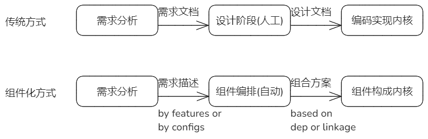
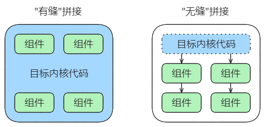
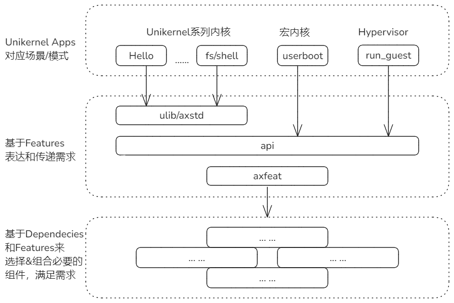
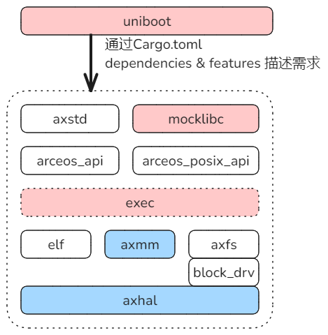
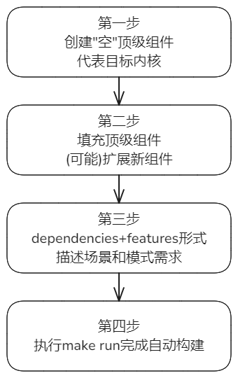

## 组件化内核的目标

面向场景或模式基于组件化**方便快速**的构建内核，这是项目设定的一个主要目标。


## 组件化与传统内核开发方式的区别



组件化内核构建方式，必须能够突出体现它相对于传统方式的显著优势。

即组件化方式下，通过对场景和模型进行某种形式的描述后，后续内核的构成工作全部自动化。即不只是有组件仓库的基础，还有自动化的辅助构建体系，使得人工成本和难度降到最低，构建效率得以提升，而形成的目标内核又能够很好的匹配需求。


## 需要解决的问题

达到上面的目标，需要解决三个方面的问题：

1. 对场景模式**需求**的表达形式以及这些形式的表达能力

2. 需求表达形式是否能够自动指导对组件的选择和组合（可以成为编排），以构成符合需求的内核

3. 组件间的组合是否可以主要依靠“无缝”方式，减少“粘合“代码

   * “有缝”：额外写代码把各个相互之间无关联的组件组织起来。类似于应用开发，需要有代码调用各种库并且组织在一起。

   * “无缝”：组件间的**接口契合**，可以直接拼接。只需要写少量代码调用顶层组件，其余组件根据依赖关系链自组织。

     

     现实中很难直接做到完全“无缝”，可以通过改善设计逐步提升“无缝”程度。


此外，新内核通常意味着具有新的特性，对于具有复用性的新特性应当封装为独立组件以扩展组件仓库，对于不具有复用性特性封装到顶级组件，顶级组件代表新内核自身，是必须存在的。这些工作属于正常预备工作，不归入影响构建便捷性的问题。


## 评价组件化内核便捷性的标准

针对上述三方面问题的解决程度重新描述，作为评价组件化内核便捷性的标准。

1. 对于新内核的场景模式需求，用features/config等形式的描述能力是充分完备的
2. 有编排工具能够根据第1点的需求描述，自动选择最小必要组件集合，构建出符合需求的内核
3. 内核个性需求相关的代码封装为顶层组件，新增的通用功能代码封装为功能组件，组件间基于接口直接拼接，不需要额外零散代码进行拼接

我们的构建方法的当前状况距离该标准越接近，便捷程度越高。


## 当前情况

按照目前的设计，所有场景和模式都是基于Unikernel模式扩展，即每个内核/Hypervisor模式其实都是Unikernel App，该App负责通过features的方式，表达自己的需求给ulib和api层，然后到axfeat这个features的汇聚点。

因此features是需求的表达形式，然后axfeat基于features选择必要的组件来组合成为符合需要的内核。



> 注：设计如上图，但其实目前宏内核和Hypervisor对features的描述和传递并未达到上述的理想状态，它们对部分组件的选择是直接在Cargo.toml中通过dependies和features指定的，绕过了api和axfeat这一层。将来是继续强化features作为统一的方式，还是采用Menuconfig之类的配置方式，又或是其它描述方法，是需要进一步考虑的问题。


## 案例分析

我们目前已经有了Unikernel层面积累的一系列组件，也建立了面向宏内核和Hypervisor的一些领域组件。

**那么基于现有的组件基础，能否面向场景模式快速构建一种新内核？构建成本、难度、效率如何？**

以项目1的题目1 - 在Unikernel模式下支持原始的二进制的LinuxApp直接运行，作为目标案例进行分析。

这个属于新的内核模式，又具有一定的组件基础，正好作为案例分析。

### 1. 需求分析

新模式内核必须具备的功能：

* (a) 能够加载外部应用的Image文件，所以必须有文件系统支持，隐含还需要块设备支持
* (b) 能够支持BIN格式或ELF格式解析应用文件
* (C) 适合于应用的地址空间管理，但是需要能够配置page_table_entry的属性，即不是用户页，却又区别于内核区域
* (D) 从应用入口启动的功能，与宏内核不同，这个没有特权级切换
* (E) 能够整合贯穿上述四项，完成应用加载、解析、启动全过程的一个高层逻辑组件。（有作为单独组件和直接作为unikernel-app逻辑两个方案，后面讨论）
* (F) 新的ulib组件，兼容libc接口但内部是函数调用，隐含依赖arceos_posix_api
* (G) 由于应用也在内核态，有可能处理异常的代码逻辑在返回时与宏内核有不同，有可能需要扩展异常处理逻辑

大写字母标记的是需要新增的组件或者可能需要修改的。

### 2. 需求描述形式

通过Cargo.toml对组件的直接引用依赖dependencies和指定features来描述需求：

```toml
[dependencies]
axstd = { workspace = true, features = ["fs"] }    # a
elf = { workspace = true }                         # b
axmm = { workspace = true, features = ["XXX"] }    # C
新组件-内核态跳转应用入口启动                           # D
顶层应用组件或者单独功能组件-整合                        # E
新组件-mocklibc（内部依赖arceos_posix_api）           # F
axhal = { workspace = true, features = ["XXX"] }   # G
```

### 3. 工作量和构建方法评估

Cargo.toml中的5，6，7三项（对应CDE需求）是针对新内核的特定需求新增的组件，这属于正常的开发工作量，新的内核模式一般伴随着对新功能组件的补充。需要考虑的是新功能的通用性，其中5可能是需要对用于宏内核启动的功能模块做条件编译扩展，第7项应当是具备复用价值的新组件。第6项即对应需求E，有两个处理方案。如果判断它有复用价值，就封装为单独的高级组件，该组件可以作为exec组件；如果认为它无复用价值，直接合并入顶层应用组件。第4和第8，基于features条件编译做轻微扩展。

最后，Unikernel形态支持Linux应用的新内核构成如下：



#### 新增组件

* UniBoot组件

  代表新内核的顶级组件，它通过Cargo.toml中指定的dependencies & features，描述了对基础组件功能的需求。

  在采取新增exec组件的情况下，它的核心实现逻辑：

  ```rust
  exec::execve(LINUX_APP_PATH, ...)
  ```

  基本就需要实现这一句调用。

  如果采取不实现exec组件的方案，把exec组件内部逻辑直接实现在UniBoot组件中。

* MockLibc

  接口与musl-libc兼容，向下依赖arceos_posix_api组件，用函数调用代替系统调用。

* Exec组件（按复用性方案可选）

  核心方法execve，主要接受应用路径参数。它的功能：

  整合加载应用、动态链接、执行启动的工作。

#### 修改组件

* axmm

  在内核态处理应用地址空间的扩展。

* axhal

  针对内核态运行应用，对异常返回处理的扩展。


#### 当前的组件化构建方法评估

假如在增加和修改上述必要组件之后，构建新内核的工作可以完全依赖在Cargo.toml描述需求（上节的描述形式）就可以完成，应该可以认为：**目前的组件化构建方法相对传统方式具备了较好的便捷性**。

换一种描述方式，良好的组件化构建内核的方法包含以下四步：

1. 新建一个空的顶级组件，代表希望构建的目标内核。
2. 为满足场景或模式需求，可能需要增加新的代码逻辑。具备复用性的代码封装为功能组件，扩充组件仓库；不具备复用性的代码封装到顶级组件中。
3. 在顶级组件的Cargo.toml中，以dependencies+features的形式描述场景模式对功能的需求，dependencies和features来自当前组件仓库的规格说明。
4. 执行make run编译并启动目标内核。预期目标内核在满足场景或模式需求的前提下，由最小的功能组件集合构成。




## 后续实践工作

基于项目1的题目1，验证上述想法，发现潜在问题。


## 扩展组件方式的想法

扩展组件有两种方式：

1. 通过features条件编译扩展
2. 新建父组件包含原组件，在父级组件扩展

第二种方式在组件化内核构建方式中可能更适合。


## 需求表达形式的想法

目前是基于features来描述场景和模式需求，但之前一直讨论features的局限性。所以有可能将来通过config的方式描述需求更合适。


